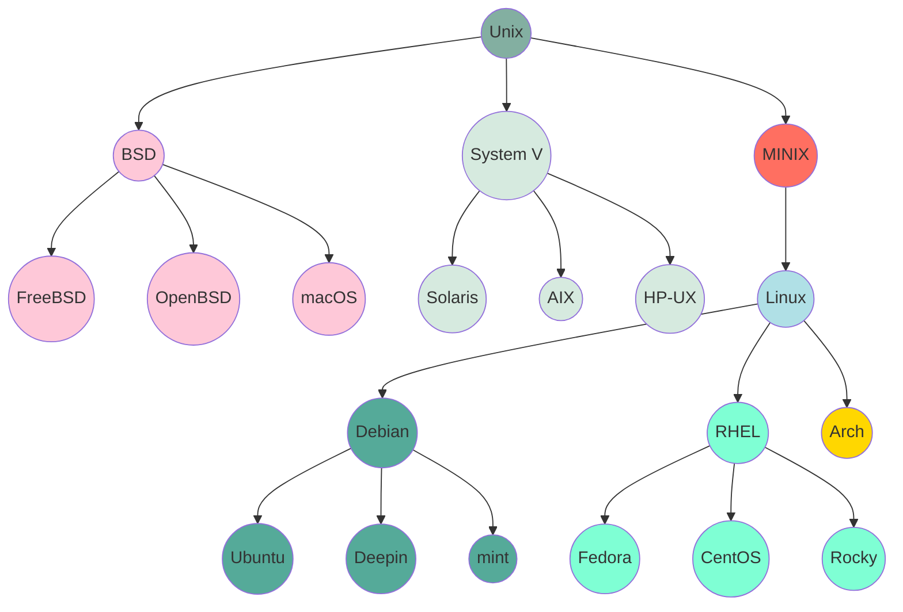

# 介绍

与 Windows 类似，Linux 也是一款能管理计算机硬件资源、运行软件程序的操作系统，能完成文件存储、设备连接、多任务调度等基础功能，满足日常办公、专业开发等需求。但二者的核心逻辑与生态定位截然不同。

Linux 的核心是**开源内核**，遵循 GPL 协议，任何人可自由获取、修改源代码，全球数百万开发者共同迭代优化；它不绑定硬件架构（既支持 x86，也适配 ARM、PowerPC 等），可按需裁剪内核（小到智能手表，大到服务器集群都能适配），且衍生出 Ubuntu、Red Hat 等多样发行版，覆盖企业服务器、嵌入式设备、移动终端（Android 基于 Linux 内核）等场景。

不同于 Windows 的闭源授权与桌面端主导，Linux 以自由协作打破垄断，凭借高稳定性、强定制性，成为支撑云计算、金融交易、物联网等数字基建的核心底座，重塑了操作系统的发展格局。

如今，Linux 在服务器领域占据主导地位，大量的网站服务器、数据库服务器等都采用 Linux 系统。在嵌入式系统方面，Linux 也广泛应用于智能家电、工业控制设备等众多设备中。并且在云计算、容器技术（如 Docker 和 Kubernetes）等新兴领域，Linux 也是核心操作系统。

## Linux 发展

::: timeline 1969.12 | Unix 起源（贝尔实验室）

- **诞生背景**：由肯・汤普森（Ken Thompson）在 AT&T 贝尔实验室开发，初衷是为解决 Multics 大型分时系统过于复杂的问题，首个版本基于 PDP-7 小型机编写，核心目标是「简洁、高效的分时操作系统」
- **核心技术奠基**：采用「一切皆文件」的设计哲学，引入进程管理、管道（Pipe）通信机制，使用汇编语言实现（1973 年改用 C 语言重写，成为首个可移植操作系统），为后续跨硬件架构适配奠定基础
- **早期传播**：1975 年 Unix V6 版本发布，因源码开放（需支付少量授权费）被高校、科研机构广泛采用，加州大学伯克利分校在此基础上开发出 BSD（Berkeley Software Distribution）分支，成为 Unix 重要衍生体系
:::

::: timeline 1983.09 | GNU 项目启动（开源生态雏形）

- **发起目标**：由理查德・斯托曼（Richard Stallman）发起，旨在开发一套完全自由的类 Unix 操作系统，解决 AT&T 逐步闭源 Unix 导致的软件自由受限问题，核心理念是「用户可自由获取、修改、分发软件」。
- **关键成果**：陆续开发出 GCC 编译器、Bash 终端、GNU 工具链（如 `ls`、`cp` 等命令工具）、GPL 开源协议，构建了类 Unix 系统的用户态软件生态，但始终缺乏稳定的内核组件。
- **与 Linux 的关联**：GNU 项目为后续 Linux 内核提供了关键的上层工具链，Linux+GNU 工具链的组合，才形成完整的 GNU/Linux 操作系统，二者共同构成开源系统的核心生态。
:::

::: timeline 1984.01 | AT&T Unix 闭源与商业化（Linux 诞生的直接诱因）

- **闭源动作**：AT&T 基于 Unix System V 版本启动商业化，停止向非授权用户提供源码，大幅提高授权费用，同时对 BSD 分支发起版权诉讼，导致高校、中小机构难以获取低成本 Unix 系统
- **市场空缺**：闭源后的 Unix 仅能运行于小型机 / 大型机（如 DEC VAX），价格昂贵且无法适配 PC；同期 DOS 功能简陋、MacOS 硬件绑定，全球开发者急需一款低成本、开源、适配 PC 的类 Unix 系统
:::

::: timeline 1991.08 | Linux 内核首次公开（项目启动）

- **发起背景**：芬兰大学生林纳斯・托瓦兹（Linus Torvalds）因无法负担 Unix 授权费，基于 Intel 386 架构（PC 主流架构）开发简易内核，8 月 25 日在 Usenet 新闻组发布邮件，征求开发者反馈，核心诉求是开发一个免费的类 Unix 内核
- **早期版本**：1991 年 10 月发布 Linux 0.01 版本，代码量仅 1 万行，支持 x86 架构、基本进程管理、FAT 文件系统，需依赖 GNU 工具链才能运行，本质是可与 GNU 生态适配的内核原型
- **社区形成**：邮件引发全球开发者响应，陆续有开发者贡献代码（如添加串口驱动、网络支持），1992 年 Linux 内核采用 GPLv2 协议，正式融入 GNU 开源生态，社区协作模式初步确立
:::

::: timeline 1993.03 | Slackware 发布（首个成熟 Linux 发行版）

- **核心价值**：由帕特里克・沃尔夫（Patrick Volkerding）开发，首次将 Linux 内核与 GNU 工具链、X Window 图形界面整合，打包为可直接安装的完整系统，解决此前内核 + 工具链需手动编译的门槛问题
- **技术特性**：支持 x86 PC，提供基础桌面环境（如 xterm 终端、简易窗口管理器），包含数百个开源软件包，成为高校教学、开发者实验的主流选择，标志 Linux 从「内核原型」走向「可用系统」
:::

::: timeline 1994.03 | Linux 1.0 正式发布

- **核心协议与定位**：由 Linus Torvalds 主导发布，基于 **GPLv2 开源协议**（奠定 Linux 开源协作的核心原则），标志 Linux 从个人实验项目升级为可用的完整操作系统，代码量约 17 万行
- **功能完备性**：实现进程调度（支持多进程并发执行，确保程序互不干扰）、内存管理（分页机制，高效利用内存空间）、EXT2 文件系统（首个稳定的 Linux 原生文件系统，支持文件读写、删除、移动等基础操作），可满足早期服务器与桌面端基础需求
- **硬件适配**：内核紧凑高效，仅支持 x86 架构 PC，资源占用低，能适配当时主流的个人计算机硬件，无过多性能冗余
- **行业影响**：首次吸引全球开发者参与贡献，为后续整合 GNU 工具链（如 GCC 编译器、Bash 终端）铺路，打破闭源系统对操作系统领域的垄断
:::

::: timeline 1996.06 | Linux 2.0 内核发布

- **代码量与核心突破**：代码量增至约 40 万行，核心升级为首次支持 **对称多处理（SMP）**，可同时利用多 CPU 资源，突破单 CPU 性能瓶颈
- **生态扩展**：新增完整 TCP/IP v4 协议栈（支持网络连接）、NFS 网络文件系统（可接入企业局域网，实现文件共享），具备企业级应用基础能力
- **用户规模**：全球用户达 350 万人，覆盖技术爱好者、高校科研场景及小型企业，用户群体从小众开发者向实用型用户扩展
- **行业影响**：吸引 IBM、DEC 等硬件厂商关注，为 Linux 后续进入服务器领域埋下伏笔，印证开源模式的商业潜力
:::

::: timeline 1998.09 | Oracle 宣布支持 Linux

- **关键动作**：Oracle 推出 **Oracle 8i for Linux**，成为首个支持 Linux 的企业级数据库，适配 Red Hat、SuSE 等主流 Linux 发行版；同期 IBM、HP、Sun 相继跟进，宣布为 Linux 提供硬件与软件支持，形成 Linux 商业联盟
- **行业背景**：1998 年被称为 Linux 商业元年，开源企业 Red Hat 完成首轮融资，Linux 从免费工具向商业产品转型起步
- **商业意义**：打破 Linux 仅用于个人 / 科研 的认知，标志 Linux 正式进入 **企业级商业市场**；Linux+Oracle 组合为企业提供低成本、高稳定的 IT 解决方案，推动 Linux 在金融、电信等关键领域初步渗透
:::

::: timeline 2001.01 | Linux 2.4 内核发布

- **代码量与系统扩展性**：代码量达 100 万行，优化 **SMP 系统扩展性**，支持 16 路 CPU，可满足中大型服务器的多任务处理需求（如同时运行数据库、Web 服务）
- **硬件兼容性升级**：完善 USB 1.1、PCMCIA（笔记本扩展卡）支持，新增即插即用（PnP）功能，解决外设手动配置的痛点，适配更多个人设备（如笔记本电脑、USB 存储设备）
- **功能新增**：支持 ATA-100 硬盘（提升存储读写速度）、IPv6 协议（为后续互联网升级预留空间）、LVM 逻辑卷管理（方便企业级存储扩容）
- **行业影响**：硬件兼容性提升推动 Linux 在桌面端的普及尝试；2002 年 Red Hat Enterprise Linux（RHEL）基于该内核发布，Linux 企业级市场份额突破 15%
:::

::: timeline 2003.12 | Linux 2.6 内核发布

- **代码量与核心特性**：初始代码量约 650 万行（后续版本逐步增至 1000 万 +），首次支持抢占式内核（Preemptive Kernel），大幅提升桌面端多任务响应速度（解决此前后台进程卡顿前台操作问题）
- **架构与生态适配**：新增 x86_64、PowerPC 等 64 位架构支持，满足企业大数据处理需求；兼容 SAP、Oracle 10g 等主流企业软件，内置 Apache Web 服务器、MySQL 数据库，形成完整应用生态
- **行业影响**：64 位支持让 Linux 成为 Unix 的低成本替代方案；抢占式内核优化推动桌面端体验升级，2004 年全球服务器 OS 市场份额达 23%
:::

::: timeline 2004.10 | Ubuntu Linux 发布

- **核心定位**：由 Canonical 公司（创始人 Mark Shuttleworth）推出，首个版本为 Ubuntu 4.10 Warty Warthog，定位 Linux for Human Beings，主打新手易用性
- **易用性设计**：提供图形化安装向导（无需命令行操作）、内置软件中心（一键安装应用，类似 Windows 软件商店），系统设置界面简洁明了（支持网络、显示、声音等可视化配置）
- **社区与更新支持**：提供免费长期支持（后续推出 5 年 LTS 版本），搭建官方论坛、问答社区及新手教程，用户问题可快速获取解决方案
- **行业影响**：解决 Linux 入门难痛点，成为桌面端开源系统标杆，吸引大量 Windows/macOS 用户尝试；衍生出 Linux Mint、Zorin OS 等易用性发行版，推动桌面 Linux 生态标准化
:::

::: timeline 2005.06 | Linux 商业化里程碑

- **标志性事件**：Linus Torvalds 登上《商业周刊》封面，标题为 Linux 的胜利，象征 Linux 在商业领域获得主流认可
- **商业化落地**：企业级市场中，全球 500 强企业 70% 采用 Linux 服务器；嵌入式领域，三星、索尼将 Linux 用于智能电视、路由器开发
- **模式确立**：Red Hat、SUSE 推出免费开源 + 付费支持模式，解决企业无售后保障顾虑，奠定 Linux 商业化的核心盈利逻辑
:::

::: timeline 2007.11 | Google 发布 Android 预览版（基于 Linux）

- **技术定制**：基于 Linux 2.6 内核开发，新增移动专属模块 ——Binder IPC（进程间通信优化，适配多应用同时运行）、Ashmem（匿名共享内存，节省移动设备内存）、电源管理模块（延长手机续航）
- **生态落地**：2008 年 9 月发布 Android 1.0，搭载于 HTC G1 手机，支持触屏操作、移动网络及 Android Market（早期应用商店），开放开发者平台吸引应用开发
- **行业影响**：开拓 Linux 在移动设备领域的全新场景，打破 Symbian、iOS 的垄断；截至 2010 年，Android 全球智能手机市场份额超 30%，带动 Linux 内核在嵌入式领域普及（后续智能手表、车载系统均基于 Android/Linux）
:::

::: timeline 2008.11 | 纽约证券交易所（NYSE）全面迁移至 Linux

- **技术支撑**：替代原 Unix 系统，核心交易系统基于 Red Hat Enterprise Linux 构建，采用 Linux 实时补丁（RT_PREEMPT），确保交易指令处理延迟低于 1ms，满足金融交易实时性需求
- **行业跟进**：纳斯达克、伦敦证券交易所、东京证券交易所相继迁移至 Linux
- **行业意义**：验证 Linux 在高并发、高可靠场景下的稳定性（全年无宕机），打破闭源系统更安全的偏见，推动金融行业 IT 架构去 Unix 化
:::

::: timeline 2011.07 | Linux 3.0 内核发布

- **版本号意义**：Linus Torvalds 称 3.0 仅为纪念意义，无架构重构，代码量约 1500 万行
- **核心优化**：虚拟化方面，KVM（内核虚拟机）性能提升 30%，支持 PCI 设备直通（虚拟机可直接调用物理硬件，降低性能损耗）；文件系统方面，Btrfs 稳定性升级，支持快照、数据校验，开始用于企业级存储场景
- **行业影响**：虚拟化优化为 2012 年 OpenStack 云计算平台落地铺路；Btrfs 填补 Linux 企业级存储文件系统空白，替代 EXT3/4 用于大数据存储
:::

::: timeline 2019.11 | Linux 5.4 内核发布（LTS 版）

- **版本特性**：长期支持版本（支持至 2025 年 12 月），代码量超 2500 万行
- **安全强化**：新增 Landlock LSM（应用沙箱机制，限制恶意程序权限）、优化 KASLR（内核地址随机化，抵御内存攻击），提升系统抗风险能力
- **兼容性与硬件适配**：首次原生支持 exFAT 文件系统（微软 2019 年开放专利），无需第三方驱动即可读写 Windows/macOS 格式文件；优化 AMD Ryzen、Intel Ice Lake 处理器支持，提升笔记本续航与性能
- **行业影响**：exFAT 原生支持解决跨系统文件共享痛点；安全特性使 Linux 成为物联网设备（智能家居、工业控制）首选 OS，2020 年全球 70% 物联网设备采用 Linux 内核
:::

::: timeline 2024.05 | Linux 6.9 内核发布

- **发布信息**：2024 年 5 月 26 日正式发布，代码量超 3500 万行
- **语言与安全升级**：aarch64 架构下新增 Rust 编写的内核模块（如 gpiochip-generic），利用 Rust 内存安全特性减少缓冲区溢出漏洞
- **硬件适配**：支持 Intel FRED（CPU 异常处理优化，提升系统稳定性）、AMD SNP 客户（虚拟机隐私保护，防止数据泄露）、dm-vdo（数据去重与压缩，节省存储空间）
- **性能优化**：f2fs/ext4/btrfs 文件系统读写速度提升 10%-15%，内存页缓存优化使大文件传输效率提升 20%；perf 工具支持更多硬件事件采样，方便性能调试
- **安全与工具增强**：为 systemd 等特权系统级守护程序添加 BPF 令牌，限制非法 BPF 操作，防范内核层面攻击
- **行业影响**：适配 ARM 服务器、AI 训练集群等新兴场景，2024 年全球服务器 OS 市场份额超 70%，进一步巩固 Linux 在服务器、嵌入式、边缘计算领域的垄断地位
:::

## Linux 与 Unix 的区别

Linux 是一个类似 Unix 的操作系统，所以也被称作 类 Unix 系统。Unix 要早于 Linux，Linux 的初衷就是要替代 Unix，并在功能和用户体验上进行优化，所以 Linux 模仿了 Unix（但并没有抄袭 Unix 的源码），使得 Linux 在外观和交互上与 Unix 非常类似。

Linux 和 Unix 之间有一些主要区别，包括：

| 区别     | Linux                                                                                              | Unix                                                                              |
| -------- | -------------------------------------------------------------------------------------------------- | --------------------------------------------------------------------------------- |
| 硬件支持 | Linux 可以运行在多种硬件平台上，包括 x86 的个人计算机                                              | Linux 可以运行在多种硬件平台上，包括 x86 的个人计算机                             |
| 源代码   | Linux 是开源的，这意味着它的源代码是公开的，可以被任何人查看和修改                                 | Unix 系统通常是闭源的，这意味着它们的源代码是保密的，只有特定的人员才能查看和修改 |
| 成本     | Linux 是免费的，可以从互联网上免费下载和使用                                                       | Unix 系统通常需要付费使用                                                         |
| 开发模式 | Linux 是由全球志愿者社区开发和维护的                                                               | Unix 系统通常由商业公司开发和维护                                                 |
| 目标用户 | Linux 既适用于个人用户，也适用于企业用户。它可以运行在桌面计算机、笔记本电脑、服务器和嵌入式设备上 | Unix 系统通常主要面向企业用户，用于运行在大型服务器和工作站上                     |
| 支持     | 由于 Linux 是开源的，它拥有庞大的社区支持。用户可以在互联网上找到大量的文档、教程和支持论坛        | Unix 系统通常由商业公司提供支持，用户需要付费获得技术支持                         |

