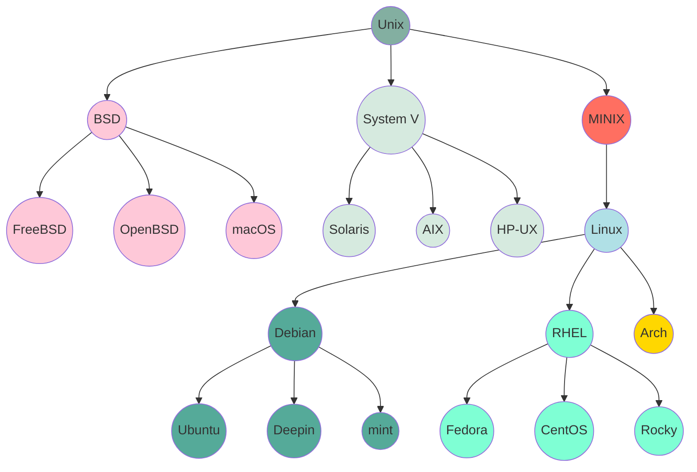

# 发展经历

> Linux 官网介绍：[https://www.linux.com/what-is-linux/](https://www.linux.com/what-is-linux/)
>
> 维基百科：[https://zh.wikipedia.org/wiki/Unix](https://zh.wikipedia.org/wiki/Unix)

20 世纪 60 年代末，肯・汤普森设计了一个适合自己工作环境的小型文件系统，这是最早期 Unix 的源头。1973 年，贝尔实验室的丹尼斯・里奇等人以 C 语言将这个系统核心大幅改写，并将其命名为 Unix，随后 Unix 操作系统逐步盛行。

20 世纪 70 年代末，美国电话电报公司试图对 Unix 系统的版权进行回收，引发了商业纠纷。1984 年，理查德・斯托曼发起了开发自由软件的运动，并成立了自由软件基金会和 GNU 项目，为后来 Linux 的发展奠定了基础。

## Unix

Unix 最初受到 Multics 计划的启发。Multics 是由麻省理工学院、通用电气和 AT&T 底下的贝尔实验室合作进行的操作系统项目，被设计运行在 GE-645 大型主机上。但是由于整个目标过于庞大，糅合了太多的特性，Multics 虽然发布了一些产品，但是性能都很低，AT&T 最终撤出了投入 Multics 项目的资源，退出这项合作计划。

贝尔实验室最初参与 Multics 计划的部门为计算器技术研发部门，为了 Multics 计划，部门又召募了肯・汤普森加入其中。肯・汤普森进入 Multics 计划不久，计划就中止了，但因为机器仍然保留在贝尔实验室，他继续在 GE-645 上开发软件。肯・汤普森在 GE-645 上，写出了一个仿真器，可以让一个文件系统与内存分页机制运作起来。他同时也写了一个程序语言 Bon，编写了一个太空旅行游戏。经过实际运行后，他发现游戏速度很慢而且耗费昂贵，每次运行会花费 75 美元。在 GE-645 被搬走后，肯・汤普森在实验室中寻找没人使用的机器，找到了几台 PDP-7。在 丹尼斯・里奇的帮助下，汤普逊用 PDP-7 的汇编语言重写了这个游戏，并使其在 DEC PDP-7 上运行起来。这次经历加上 Multics 项目的经验，促使汤普逊开始在 DEC PDP-7 上研究如何开发操作系统。

1969 年，肯・汤普森提议在 PDP-7 上开发一个新的阶层式操作系统的计划。Multics 的原有成员，都投入这个计划。肯・汤普森发现要编写驱动程序来驱动文件系统，进行测试，并不容易，于是开发了一个壳层（shell）与一些驱动程序，做出一个操作系统的雏形。在团队合作下，Multics 的许多功能都被采纳，重新实现，最终做出了一个分时多任务操作系统，成为第一版 Unix。

因为 PDP-7 的性能不佳，肯・汤普森与丹尼斯·里奇决定把第一版 Unix 移植到 PDP-11/20 的机器上，开发第二版 Unix。在性能提升后，真正可以提供多人同时使用，布莱恩·柯林汉提议将它的名称改为 Unix。

第一版 Unix 是用 PDP-7 汇编语言编写的，一些应用是由叫做 B 语言的解释型语言和汇编语言混合编写的。在进行系统编程时不够强大，所以汤普逊和里奇对其进行了改造，并于 1971 年共同发明了 C 语言。1973 年汤普逊和里奇用 C 语言重写了 Unix，形成第三版 Unix。在当时，为了实现最高效率，系统程序都是由汇编语言编写，所以汤普逊和里奇此举是极具大胆创新和革命意义的。用 C 语言编写的 Unix 代码简洁紧凑、易移植、易读、易修改，为此后 Unix 的发展奠定了坚实基础。

1974 年，汤普逊和里奇合作在 ACM 通信上发表了一篇关于 Unix 的文章，这是 Unix 第一次出现在贝尔实验室以外。此后 Unix 被政府机关，研究机构，企业和大学注意到，并逐渐流行开来。1975 年，Unix 发布了 4、5、6 三个版本。1978 年，已经有大约 600 台计算机在运行 Unix。1979 年，版本 7 发布，这是最后一个广泛发布的研究型 Unix 版本。20 世纪 80 年代相继发布的 8、9、10 版本只授权给了少数大学。

随着时间的推移，Unix 不断发展壮大，并衍生出许多不同版本和变种。例如，在 1978 年柏克利大学推出了一份以第六版为基础，加上一些改进和新功能而成的 Unix。这就是著名的「1 BSD（1st Berkeley Software Distribution）」，开创了 Unix 的另一个分支：BSD 系列。

后来 AT&T 意识到了 Unix 的商业价值，不再将 Unix 源码授权给学术机构，并对之前的 Unix 及其变种声明了版权权利。变种 BSD Unix 在 Unix 的历史发展中具有相当大的影响力，被很多商业厂家采用，成为很多商用 Unix 的基础。BSD 使用主版本加次版本的方法标识，如 4.2BSD，4.3BSD，在原始版本的基础上还有派生版本，这些版本通常有自己的名字，如 4.3BSD-Net/1，4.3BSD-Net/2 等。其不断增大的影响力终于引起了 AT&T 的关注，于是开始了一场旷日持久的版权官司，这场官司一直打到 AT&T 将自己的 Unix 系统实验室卖掉，新接手的 Novell 公司采取了一种比较开明的做法，允许柏克莱分校自由发布自己的 BSD，但是前提是必须将来自于 AT&T 的代码完全删除，于是诞生了 4.4 BSD Lite 版，由于这个版本不存在法律问题，4.4BSD Lite 成为了现代 BSD 系统的基础版本。尽管后来，非商业版的 Unix 系统又经过了很多演变，但其最终都是创建在 BSD 版本上（Linux 除外）。所以从这个角度上，4.4 BSD 又是所有自由版本 Unix 的基础，它们和 System V 及 Linux 等共同构成 Unix 操作系统这片璀璨的星空。

BSD 在发展中也逐渐派生出 3 个主要的分支：FreeBSD、OpenBSD 和 NetBSD。

此后的几十年中，Unix 仍在不断变化，其版权所有者不断变更，授权者的数量也在增加。Unix 的版权曾经为 AT&T 所有，之后 Novell 拥有了 Unix，再之后 Novell 又将版权出售给了 SCO，但不包括知识产权和专利权（这一事实双方尚存在争议）。有很多大公司在取得了 Unix 的授权之后，开发了自己的 Unix 产品，比如 IBM 的 AIX、HP 的 HP-UX 和 SUN 的 Solaris。

## Linux

时间来到了 80 年代，随着 AT&T 公司闭源 Unix 系统，在学校里给学生用的操作系统很，当时可供计算机选用的操作系统主要有 Unix、DOS 和 MacOS 这几种：

- Unix 价格昂贵，不能运行于 PC。
- DOS 显得简陋，且源代码被软件厂商严格保密。
- MacOS 是一种专门用于苹果计算机的操作系统。

此时，计算机科学领域迫切需要一个更加完善、强大、廉价和完全开放的操作系统。由于供教学使用的典型操作系统很少，因此当时在荷兰当教授的美国人安德鲁·斯图尔特·特南鲍姆编写了一个操作系统，名为 **MINIX**，为了向学生讲述操作系统内部工作原理。MINIX 虽然很好，但只是一个用于教学目的的简单操作系统，而不是一个强有力的实用操作系统，然而最大的好处就是**公开源代码**。

1991 年，林纳斯·托瓦兹在赫尔辛基大学上学时，对操作系统很好奇。他对 MINIX 只允许在教育上使用很不满（在当时 MINIX 不允许被用作任何商业使用），于是他便开始写他自己的操作系统，同时也为了方便读写和下载文件，他开始写属于自己的类 Unix 系统，最终开发出了 Linux 的第一个内核（0.02 版），并取名 Linus' Minix，后来改名为 Linux。这就是后来的 Linux 内核。

1991 年 10 月 Linus 在 Minix 新闻组发布消息，对外宣布 Linux 内核的诞生，并公开了内核源码；公开后 Linux 因为结构清晰、功能简洁，一经发布立即收受好评；后来在很多热心支持者的帮助下，经过多次版本升级迭代，终于在 1994 年 3 月，Linux1.0 正式发布。

> [!NOTE]
> Linux 只是一个系统内核，系统启动之后使用的仍然是 gcc 和 bash 等软件。Linus 在发布 Linux 的时候选择了 GPL，因此符合 GNU 的宗旨。

1983 年，理查德·马修·斯托曼创立 GNU 计划。这个计划有一个目标，是为了发展一个完全自由的类 Unix 操作系统。自 1984 年发起这个计划以来，在 1985 年，理查德·马修·斯托曼发起自由软件基金会并且在 1989 年撰写 GPL。1990 年代早期，GNU 开始大量地产生或收集各种系统所必备的组件，像是——库、编译器、调试工具、文本编辑器，以及一个 Unix 的用户界面（Unix shell）——但是像一些底层环境，如硬件驱动、守护进程、系统内核（kernel）仍然不完整和陷于停顿，GNU 计划中是在 Mach 微内核的架构之上开发系统内核，也就是所谓的 GNU Hurd，但是这个基于 Mach 的设计异常复杂，发展进度则相对缓慢。

尽管 GNU 计划开发了许多重要的软件，但它一直缺少一个关键部分：**操作系统内核**。原定的内核叫做 Hurd，但它一直未能完成。然而，在 1991 年，Linus Torvalds 开发了 Linux 内核，并选择了 GNU 通用公共许可证（GPL）作为其许可证。这使得 Linux 内核能够与 GNU 软件结合在一起，形成一个完整的自由操作系统。这个操作系统通常被称为 GNU/Linux。

## 区别

Linux 是一个类似 Unix 的操作系统，所以也被称作 类 Unix 系统。Unix 要早于 Linux，Linux 的初衷就是要替代 Unix，并在功能和用户体验上进行优化，所以 Linux 模仿了 Unix（但并没有抄袭 Unix 的源码），使得 Linux 在外观和交互上与 Unix 非常类似。

Linux 和 Unix 之间有一些主要区别，包括：

| 区别     | Linux                                                                                                | Unix                                                                                |
| -------- | ---------------------------------------------------------------------------------------------------- | ----------------------------------------------------------------------------------- |
| 硬件支持 | Linux 可以运行在多种硬件平台上，包括 x86 的个人计算机。                                              | Linux 可以运行在多种硬件平台上，包括 x86 的个人计算机。                             |
| 源代码   | Linux 是开源的，这意味着它的源代码是公开的，可以被任何人查看和修改。                                 | Unix 系统通常是闭源的，这意味着它们的源代码是保密的，只有特定的人员才能查看和修改。 |
| 成本     | Linux 是免费的，可以从互联网上免费下载和使用。                                                       | Unix 系统通常需要付费使用。                                                         |
| 开发模式 | Linux 是由全球志愿者社区开发和维护的。                                                               | Unix 系统通常由商业公司开发和维护。                                                 |
| 目标用户 | Linux 既适用于个人用户，也适用于企业用户。它可以运行在桌面计算机、笔记本电脑、服务器和嵌入式设备上。 | Unix 系统通常主要面向企业用户，用于运行在大型服务器和工作站上。                     |
| 支持     | 由于 Linux 是开源的，它拥有庞大的社区支持。用户可以在互联网上找到大量的文档、教程和支持论坛。        | Unix 系统通常由商业公司提供支持，用户需要付费获得技术支持。                         |

## 商业化与发展

Linux 1.0（1994 年 3 月）

- **功能完备性**：Linux 1.0 标志着 Linux 从一个有潜力的项目转变为一个功能完备的操作系统。它拥有基本的操作系统功能，如进程管理、内存管理、文件系统操作等核心功能。在进程管理方面，能够有效地创建、调度和终止进程，支持多进程并发执行，使得多个程序可以同时运行而互不干扰。在文件系统方面，有了较为成熟的文件存储和访问机制，用户可以方便地进行文件的读写、删除和移动等操作。
- **硬件性能发挥**：其内核紧凑高效，这意味着它在资源利用上非常出色。能够很好地适配当时的硬件环境，充分利用硬件资源，例如 CPU 的运算能力和内存空间，不会造成过多的资源浪费。这使得 Linux 1.0 在当时的计算机硬件条件下能够稳定、高效地运行，为后续的应用提供了良好的基础。

Linux 2.0（1996 年 6 月）

- **代码量与多处理器支持**：代码量达到约 40 万行，这表明 Linux 内核在功能和复杂性上有了显著的增长。支持多个处理器是一个重大的进步，这使得 Linux 可以在多处理器的服务器等硬件平台上发挥作用。在服务器领域，多处理器支持意味着可以同时处理更多的任务，大大提高了服务器的处理能力和响应速度，能够更好地应对高并发的网络请求，如处理大量的网页访问或数据库查询等任务。
- **用户增长**：全球用户数达 350 万人，这反映出 Linux 在全球范围内的影响力逐渐扩大。越来越多的技术爱好者、开发者和企业开始关注和使用 Linux，其用户群体涵盖了从个人开发者用于学习和实验，到企业用于服务器搭建和软件开发等多个领域。

Oracle 支持 Linux（1998 年）

- **商业数据库支持的意义**：Oracle 公司作为全球著名的数据库软件供应商，其对 Linux 的支持是 Linux 商业化进程中的一个重要里程碑。Oracle 数据库在企业级应用中占据重要地位，它与 Linux 的结合意味着企业可以在 Linux 平台上构建强大的数据库应用。这不仅提高了 Linux 在商业领域的认可度，也为企业提供了一种更经济、高效的选择，因为 Linux 本身的开源特性和较低的成本与 Oracle 数据库的强大功能相结合，可以为企业节省大量的软件许可费用和硬件资源。

Linux 2.4（2001 年 1 月）

- **代码量与系统扩展性**：代码量约为 100 万行，表明内核功能进一步增强。提升了 SMP（对称多处理）系统的扩展性，这使得 Linux 在处理多处理器架构的能力上更上一层楼。对于大型服务器和高性能计算环境，更好的 SMP 扩展性意味着可以添加更多的处理器来提高系统的整体性能，以满足不断增长的计算需求，如科学计算、大型数据处理等领域。
- **集成新功能**：集成了 USB、PC 卡、内置即插即用等应用功能，这使得 Linux 在硬件兼容性方面有了很大的进步。USB 接口的支持使得各种 USB 设备，如打印机、存储设备等可以方便地连接到 Linux 系统上使用。PC 卡支持对于笔记本电脑等移动设备的应用非常重要，而即插即用功能则提高了用户使用各种外部设备的便利性，不再需要复杂的手动配置。

Linux 2.6（2003 年 12 月）

- **代码量与系统性能**：代码量超过 1000 万行，这显示出 Linux 内核在功能上的巨大扩展。其灵活性、扩展性和易操作性更强，这使得 Linux 可以适应更广泛的应用场景。在灵活性方面，系统管理员可以根据不同的需求对系统进行定制，例如调整系统参数、安装不同的软件包组合等。扩展性使得 Linux 可以用于构建大规模的服务器集群或复杂的嵌入式系统。易操作性则方便了用户和管理员进行系统的安装、配置和维护。
- **应用程序集成**：各种应用程序集成意味着 Linux 不仅仅是一个操作系统内核，还包括了大量的实用软件。这些软件涵盖了从服务器软件（如 Web 服务器、邮件服务器）到桌面应用（如办公软件、图形处理软件）等多个领域，使得 Linux 成为一个完整的软件生态系统，用户可以在 Linux 平台上完成各种任务，而不需要频繁地切换到其他操作系统。

Ubuntu Linux 发布（2004 年）

- **易用性和友好性**：Ubuntu 以其易用性在 Linux 桌面系统中脱颖而出。它采用了直观的图形用户界面（GUI），对于初次接触 Linux 的用户来说，更容易上手。例如，在软件安装方面，Ubuntu 提供了简单的软件中心，用户可以通过搜索和点击安装的方式轻松获取各种软件，就像在 Windows 系统中使用软件商店一样方便。在系统设置方面，也有简洁明了的界面，方便用户进行网络、显示、声音等各种设置。
- **社区支持**：Ubuntu 拥有强大的社区支持。社区成员积极参与 Ubuntu 的开发、测试和文档编写等工作。对于用户遇到的问题，社区提供了丰富的论坛、问答网站和教程，用户可以快速地找到解决问题的方法。这种社区支持也促进了 Ubuntu 的不断更新和改进，使得它能够更好地满足用户的需求。

Linux 商业化（2005 年）

- **商业认可**：Linux 成功商业化的标志是 Linus Torvalds 出现在《商业周刊》的封面上。这表明 Linux 在商业领域已经得到了广泛的认可，不再仅仅是一个技术爱好者的玩具。商业公司开始看到 Linux 的商业价值，不仅在服务器领域，还包括桌面系统、嵌入式系统等多个领域。例如，许多企业开始采用 Linux 作为其内部办公系统的操作系统，以降低成本并提高系统的安全性和稳定性。

Google 与 Android（2007 年 11 月 5 日）

- **移动领域的开拓**：Google 基于 Linux 开发的 Android 平台开启了 Linux 在移动设备领域的新时代。Android 继承了 Linux 内核的诸多优点，如稳定性、安全性和高效的资源管理。它为移动设备提供了一个开放的软件平台，使得开发者可以开发各种类型的移动应用。在智能手机和平板电脑市场，Android 的出现打破了以往操作系统的垄断局面，凭借其开源的特性和丰富的应用生态系统，迅速占领了全球大部分市场份额。

股票交易系统采用 Linux（2008 年）

- **金融领域的应用**：纽约证券交易所改用 Linux 作为核心操作系统，这是 Linux 在金融领域可靠性和稳定性的重要体现。股票交易系统需要高度的稳定性和实时性，Linux 能够满足这些要求。在交易高峰期，大量的交易指令需要在短时间内处理，Linux 系统可以稳定地运行，确保交易数据的准确处理和传输。其他主要证券交易所的效仿进一步证明了 Linux 在金融关键系统中的优势，这也使得 Linux 在金融行业的应用得到了广泛的推广。

Linux 2.6.34（2010 年 5 月 17 日）

- **显卡驱动更新与显示功能改进**：带来了大量开源显卡驱动更新，这对于图形处理和显示性能有很大的提升。在桌面系统中，更好的显卡驱动可以提供更清晰的图像显示、更流畅的视频播放和更好的 3D 图形处理能力。笔记本集显独显切换支持也是一个重要的功能改进，这使得笔记本电脑用户可以根据不同的使用场景（如办公或游戏）灵活地切换显卡，以达到节能或高性能的目的。

Linux 3.0（2011 年）

- **虚拟化和文件系统改进**：改进了对虚拟化的支持，这对于云计算和服务器整合等领域非常重要。通过虚拟化技术，一台物理服务器可以被划分为多个虚拟服务器，每个虚拟服务器可以运行不同的操作系统和应用程序。Linux 3.0 的改进使得这种虚拟化更加高效和稳定，降低了企业的硬件成本和能源消耗。在文件系统方面，新的支持和改进可以提高文件存储和访问的效率，例如更快的文件读写速度和更好的文件系统容错能力。

Linux 5.4（2019 年 11 月）

- **安全强化与功能更新**：强化了安全功能，这在当前网络安全形势日益严峻的情况下至关重要。可能包括加强用户认证机制、加密算法的更新、防止恶意软件入侵等方面的改进。更新硬件驱动使得 Linux 能够更好地适配最新的硬件设备，如新型的存储设备、网络设备等。支持微软 exFAT 文件格式扩展了 Linux 在文件存储和交换方面的兼容性，使得 Linux 系统与其他操作系统（如 Windows）之间的文件共享和交换更加方便。

Linux 5.10（2020 年 12 月）

- **长期支持与功能更新**：作为一个至少要维护五年的长期支持内核，这为企业和用户提供了稳定的操作系统核心。在这五年内，用户可以放心地使用 Linux 5.10，不用担心内核的频繁更新和兼容性问题。在功能上，大范围的内核更新和改进意味着它在性能、安全性、兼容性等多个方面都有了进一步的提升，能够更好地满足用户在不同领域的应用需求，如服务器、桌面、嵌入式系统等。

Linux 6.9（2024 年 5 月）

- **Linux 6.9 内核**：于 2024 年 5 月发布，带来了一系列新特性和改进，包括在 aarch64 架构上增加 rust 语言支持；增强了硬件支持，如对 intel fred 机制、amd snp 客户、dm-vdo 目标的支持等；对 f2fs、exfat、ext4 和 btrfs 文件系统均进行了性能优化和特性添加；还提升了内存管理性能、perf 工具特性，为 systemd 等特权系统级守护程序添加了 bpf 令牌支持等。

如今，Linux 在服务器领域占据主导地位，大量的网站服务器、邮件服务器、数据库服务器等都采用 Linux 系统。在嵌入式系统方面，Linux 也广泛应用于智能家电、工业控制设备等众多设备中。并且在云计算、容器技术（如 Docker 和 Kubernetes）等新兴领域，Linux 也是核心操作系统。
