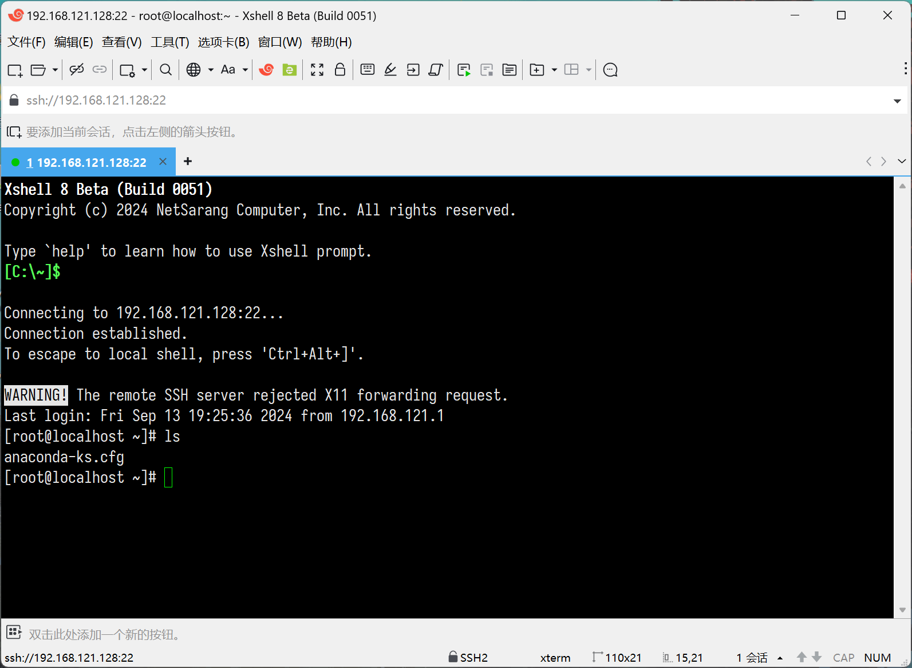
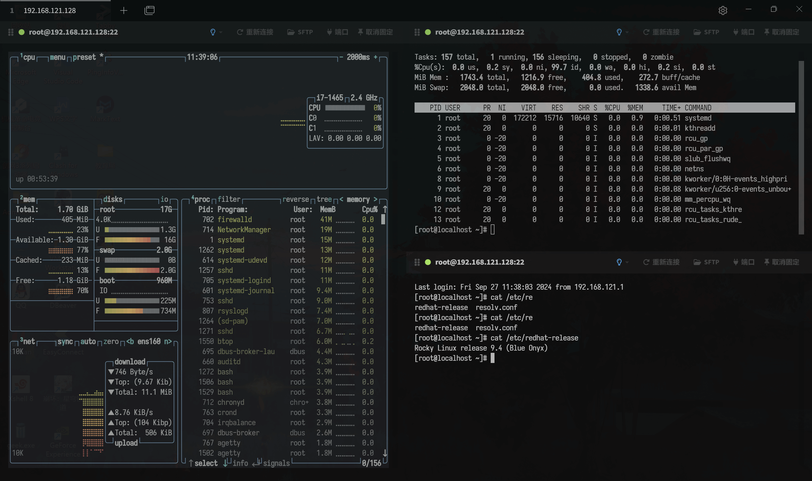

# 终端

在 Linux 系统中，终端（Terminal）是一个非常重要的组件，它提供了一个用户与操作系统交互的文本界面。终端是一个程序，它允许用户通过键盘输入命令，这些命令会被发送到操作系统进行处理，然后返回结果给用户。终端是基于文本的，与图形用户界面（GUI）相比，它更依赖于命令行界面（CLI）。

终端的概念起源于早期的计算机系统，当时的计算机没有图形界面，用户通过打字机式的终端设备与计算机交互。随着技术的发展，现代计算机系统已经集成了图形用户界面，但终端仍然被广泛使用，因为它提供了一种高效、灵活的操作方式。

> [!NOTE]
> 在没有图形化界面的系统（如服务器或最小化安装的 Linux 系统）中，默认就是终端界面。用户可以通过本地或远程终端直接与系统交互。

## 终端分类

终端的分类可以根据其使用方式和接入方式来区分：

- 本地终端（Local Terminal）
- 远程终端（Remote Terminal）

本地终端是指直接运行在你正在使用的物理计算机上的终端​​。和系统内核之间没有网络隔阂。在图形用户界面（GUI）操作系统中，用户可以通过启动终端仿真器（如 Windows 的命令提示符或 PowerShell，macOS 的 Terminal.app）来访问本地终端。

例如，在 Windows 系统中，可以通过「命令提示符」（cmd）或 PowerShell 来访问类似的界面：

```cmd
Microsoft Windows [版本 10.0.26100.6584]
(c) Microsoft Corporation。保留所有权利。

C:\Users\Administrator>dir
 驱动器 C 中的卷没有标签。
 卷的序列号是 5496-13B9

 C:\Users\Administrator 的目录
 
2025/09/29  08:28    <DIR>          .
2025/06/19  08:21    <DIR>          ..
2025/09/29  08:28    <DIR>          .config
……
```

> [!TIP] 终端仿真器
> 终端仿真器（Terminal Emulator）是一种软件程序，它模拟了物理终端的行为，提供了一个用户与计算机操作系统交互的文本界面。

远程终端是指通过网络连接，从一台计算机（客户端）登录和操作另一台计算机（服务器）的终端​​。本地的终端窗口只负责显示和输入，所有命令都在远程服务器上执行。一般远程 Linux 服务器都是通过 SSH（Secure Shell）远程连接的，SSH 协议允许用户从本地计算机（客户端）安全地访问远程计算机（服务器）的命令行界面：



无论是本地终端还是远程终端，它们最根本的共同点是：​​为用户提供了一个与操作系统内核交互的命令行界面​​。

## 远程终端工具

远程终端工具，通常也称为 ​​SSH 客户端​​，是一类专门用于通过网络连接（主要是通过 ​​SSH 协议​​）远程登录和管理其他计算机的软件。

服务器通常放置在机房中，用户无法直接接触到服务器硬件，只能采用远程管理的方式。通常在远程连接 Linux 系统时，使用 SSH 是最普遍和推荐的方式，Linux 远程管理服务器多基于 SSH 协议。

常见的 SSH 客户端：

| 终端软件  | 简介                                                                                                                                                                                                                                                    |
| --------- | ------------------------------------------------------------------------------------------------------------------------------------------------------------------------------------------------------------------------------------------------------- |
| Xshell    | XShell 是最知名终端模拟软件，是国内比较流行的 SSH 管理软件，和其他的 SSH 客户端相比，Xshell 更加注重用户体验的一些东西，比如其现代化的界面，多种语言包括简体中文支持，代码高亮等，对于新手非常友好。对于个人是免费的，但如果需要上传下载需要再安装 Xftp |
| Mobaxterm | 是一个非常强大的终端增强工具，除了支持基本的 SSH 终端管理外，还有非常多的增强和扩展功能。有绿色版本软件，使用方便；支持 RDP 远程连接 Windows；图形化 SFTP 管理，可上传下载文件；分为免费版和收费版，免费版功能足够使用，但是不支持中文                  |
| Tabby     | 原名 Terminus，是一个高度可配置的终端模拟器、SSH 和串行客户端，适用于 Windows、macOS 和 Linux。自带 SFTP 功能，能够与 Linux 系统传输文件；炫酷的终端页面，简单易用，以及各种插件支持等                                                                  |
| WindTerm  | 是一款免费、跨平台 SSH/Sftp/Shell/Telnet/Serial 客户端，完全免费（不开源），支持文件管理器、会话管理器、资源管理器、大纲视图等多种功能的窗格，支持 SCP、SFTP 等                                                                                         |

> [!NOTE] 下载地址
> Xshell：[https://www.xshell.com/zh/free-for-home-school/](https://www.xshell.com/zh/free-for-home-school/)
>
> Mobaxterm：[https://mobaxterm.mobatek.net/download.html](https://mobaxterm.mobatek.net/download.html)
>
> Tabby：[https://github.com/Eugeny/Tabby](https://github.com/Eugeny/Tabby)
>
> WindTerm：[https://github.com/kingToolbox/WindTerm](https://github.com/kingToolbox/WindTerm)

## 多端访问

Linux 支持多终端访问，这意味着可以在同一台 Linux 系统上同时打开和使用多个终端会话。这种能力提供了极大的灵活性和效率，尤其适合需要同时执行多个任务或监控多个进程的用户。



而且 Linux 是一个多用户操作系统，多个用户可以同时登录并使用系统。每个用户可以有自己的终端会话，系统为每个会话分配独立的进程组、控制终端等资源，会话之间相互隔离，互不干扰。

## 命令行快捷键

~~Linux 中终端内置了很多快捷键，从而方便操作。Linux 命令行终端的快捷键大概可以分为以下几类，即：调用历史命令、移动、复制粘贴、剪切、删除、转换和其他快捷键。~~

> [!WARNING]
> 快捷键属于 ​​Shell（如Bash、Zsh等）的快捷键​​，而不是终端程序，后续删除，更新至 Shell 章节。

| 历史命令快捷键                                       | 说明                                                                                                                                      |
| ---------------------------------------------------- | ----------------------------------------------------------------------------------------------------------------------------------------- |
| <kbd>Ctrl</kbd> + <kbd>r</kbd>                       | 开始增量历史命令搜索，可以按照关键字查自己用过哪些命令，输入若干字符，开始向上搜索包含该字符的命令，继续按 Ctrl + r，搜索上一条匹配的命令 |
| !num                                                 | 执行命令历史列表的第 num 条命令。                                                                                                         |
| <kbd>!</kbd> + <kbd>!</kbd>                          | 执行上一条命令                                                                                                                            |
| <kbd>!</kbd> + `str`                                 | 执行最近的一条以 str 开始的命令                                                                                                           |
| <kbd>!</kbd> + <kbd>?</kbd> + `string` +<kbd>?</kbd> | 执行含有 string 字符串的最新命令                                                                                                          |
| `ls` + <kbd>!</kbd> + <kbd>$</kbd>                   | 执行命令 ls，并以上一条命令的参数为其参数                                                                                                 |
| <kbd>↑</kbd> (<kbd>Ctrl</kbd> + <kbd>p</kbd>)        | 显示上一条命令                                                                                                                            |
| <kbd>↓</kbd> (<kbd>Ctrl</kbd> + <kbd>n</kbd>)        | 显示下一条命令                                                                                                                            |
| <kbd>esc</kbd> + <kbd>.</kbd>                        | 上次输入的最后一个单词                                                                                                                    |

| 复制粘贴快捷键                                    | 说明     |
| ------------------------------------------------- | -------- |
| <kbd>Ctrl</kbd> + <kbd>Shift</kbd> + <kbd>C</kbd> | 复制命令 |
| <kbd>Ctrl</kbd> + <kbd>Shift</kbd> + <kbd>V</kbd> | 粘贴命令 |
| <kbd>Ctrl</kbd> + <kbd>Insert</kbd>               | 复制命令 |
| <kbd>Shift</kbd> + <kbd>Insert</kbd>              | 粘贴命令 |

| 剪切快捷键                     | 说明                                                 |
| ------------------------------ | ---------------------------------------------------- |
| <kbd>Ctrl</kbd> + <kbd>k</kbd> | 剪切命令行中光标所在处之后的所有字符（包括自身）     |
| <kbd>Ctrl</kbd> + <kbd>u</kbd> | 剪切命令行中光标所在处之前的所有字符（不包括自身）   |
| <kbd>Ctrl</kbd> + <kbd>w</kbd> | 剪切光标所在处之前的一个词（以空格、标点等为分隔符） |
| <kbd>Alt</kbd> + <kbd>d</kbd>  | 剪切光标之后的词                                     |

| 删除快捷键                     | 说明                                                         |
| ------------------------------ | ------------------------------------------------------------ |
| <kbd>Ctrl</kbd> + <kbd>l</kbd> | 清屏                                                         |
| <kbd>Ctrl</kbd> + <kbd>W</kbd> | 清除光标之前一个单词                                         |
| <kbd>Ctrl</kbd> + <kbd>K</kbd> | 清除光标到行尾的字符                                         |
| <kbd>Ctrl</kbd> + <kbd>U</kbd> | 删除光标前面的部分                                           |
| <kbd>Ctrl</kbd> + <kbd>y</kbd> | 粘贴刚才所删除的字符                                         |
| <kbd>Ctrl</kbd> + <kbd>d</kbd> | 删除光标所在处字符                                           |
| <kbd>Ctrl</kbd> + <kbd>h</kbd> | 删除光标所在处前一个字符                                     |
| <kbd>Esc</kbd> + <kbd>w</kbd>  | 删除光标所在处之前的字符至其单词尾（以空格、标点等为分隔符） |

| 转换快捷键                                    | 说明                                                                                        |
| --------------------------------------------- | ------------------------------------------------------------------------------------------- |
| <kbd>Ctrl</kbd> + <kbd>t</kbd>                | 颠倒光标所在处及其之前的字符位置，并将光标移动到下一个字符                                  |
| <kbd>Alt</kbd> + <kbd>t</kbd>                 | 交换当前与以前单词的位置                                                                    |
| <kbd>Alt</kbd> + <kbd>u</kbd>                 | 把当前词转化为大写                                                                          |
| <kbd>Alt</kbd> + <kbd>l</kbd>                 | 把当前词转化为小写                                                                          |
| <kbd>Alt</kbd> + <kbd>c</kbd>                 | 把当前词汇变成首字符大写                                                                    |
| <kbd>Ctrl</kbd> + <kbd>v</kbd>                | 插入特殊字符，如 <kbd>Ctrl</kbd> + <kbd>v</kbd> + <kbd>Tab</kbd> 加入 <kbd>Tab</kbd> 字符键 |
| <kbd>Esc</kbd> + <kbd>t</kbd>                 | 颠倒光标所在处及其相邻单词的位置                                                            |
| <kbd>Ctrl</kbd> + <kbd>x</kbd> + <kbd>u</kbd> | 按住 <kbd>Ctrl</kbd> 的同时再先后按 <kbd>x</kbd> 和 <kbd>u</kbd>，撤销刚才的操作            |

| 其他快捷键                     | 说明                                                                   |
| ------------------------------ | ---------------------------------------------------------------------- |
| <kbd>Ctrl</kbd> + <kbd>d</kbd> | 从 shell 提示中注销（并关闭）。使用该快捷键，就不必键入 exit 或 logout |
| <kbd>Ctrl</kbd> + <kbd>c</kbd> | 终止当前正在运行的程序                                                 |
| <kbd>Ctrl</kbd> + <kbd>s</kbd> | 停止向屏幕输出，挂起当前 shell                                         |
| <kbd>Ctrl</kbd> + <kbd>q</kbd> | 重新激活向屏幕输出，重新启用挂起的 shell                               |
| <kbd>Ctrl</kbd> + <kbd>Z</kbd> | 暂停程序                                                               |
