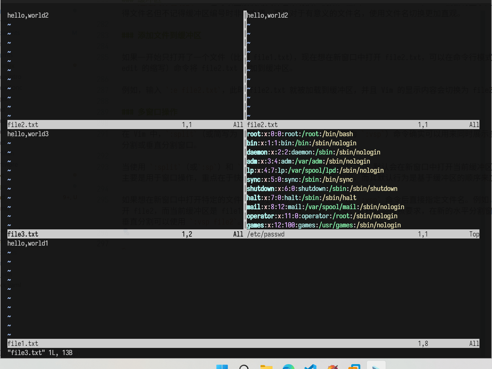

# Vim 文本编辑器

在 Linux 系统中，Vi 几乎是默认安装的文本编辑器。无论是在最小化安装的服务器环境，还是各种 Linux 发行版的桌面环境中，都能找到 Vi。这使得 Linux 运维人员在任何情况下都可以使用它来编辑文本文件，而不需要担心是否有其他更合适的文本编辑工具。例如，当通过 SSH 远程连接到服务器进行配置文件修改时，Vi 是最可靠的选择，因为服务器通常不会安装复杂的图形化文本编辑器。

但有的操作系统默认只有 Vi 编辑器，例如 Rocky Linux 最小化安装是没有 Vim 编辑器，可以通过 `dnf` 进行下载：

```bash
dnf -y install vim
```

## Vi 和 Vim

Vi 是 Unix 系统上经典的文本编辑器，它诞生于 1976 年。最初，Vi 的设计目的是为了在当时的终端设备上提供一个高效的文本编辑工具，它的操作方式和功能适应了早期 Unix 系统的环境和用户需求。

Vim（Vi IMproved）是在 Vi 的基础上开发而来的。它继承了 Vi 的基本操作模式和功能，并且增加了大量的新特性和功能扩展。由于 Vi 编辑器的广泛使用，开发人员希望在保留其优点的基础上，对其进行改进以满足现代用户对于文本编辑更复杂和多样化的需求，Vim 应运而生。

| 区别               | Vi                                                                                                                                                                                           | Vim                                                                                                                                                                                                                                                                                                                                   |
| ------------------ | -------------------------------------------------------------------------------------------------------------------------------------------------------------------------------------------- | ------------------------------------------------------------------------------------------------------------------------------------------------------------------------------------------------------------------------------------------------------------------------------------------------------------------------------------- |
| 语法高亮           | 传统的 Vi 编辑器通常没有语法高亮功能。这意味着在编辑代码或者配置文件等具有特定语法结构的文本时，所有的字符都是以相同的颜色显示，用户需要凭借自己的经验和对语法的熟悉程度来区分不同的语法元素 | Vim 默认或通过简单配置（在 `.vimrc` 文件中设置 `syntax on`）就可以开启语法高亮。例如，在编辑一个 Python 脚本时，Vim 会用不同的颜色显示关键字（如 `if`、`else`、`for` 等）、变量名、字符串、注释等内容，这样可以使代码结构更加清晰，有助于用户快速发现语法错误或不规范的代码格式                                                       |
| 插件支持           | Vi 的插件支持相对较少。由于其设计较早，插件机制不够完善，很难像 Vim 那样方便地通过安装插件来扩展功能                                                                                         | Vim 拥有丰富的插件系统。用户可以通过安装插件来实现各种功能，如代码自动补全（YouCompleteMe 插件）、文件浏览器（NERDTree 插件）、代码格式化（如 `vim-beautify` 插件）等。这些插件极大地增强了 Vim 的功能，使其能够适应不同的编辑任务和场景                                                                                              |
| 多窗口和标签页支持 | 基本的 Vi 编辑器在多窗口和标签页方面的支持比较有限。它主要侧重于单文档的编辑，在同时处理多个文件或者在文件的不同部分进行对比和编辑时不够方便                                                 | Vim 支持多窗口和标签页操作。用户可以通过命令（如 `:split` 用于水平分割窗口，`:vsplit` 用于垂直分割窗口，`:tabnew` 用于创建新的标签页）同时打开多个文件或者同一文件的不同部分，方便在文件之间进行复制、对比等操作。例如，在修改一个 Web 应用的配置文件和对应的代码文件时，可以将它们分别放在不同的窗口或者标签页中，便于同时查看和编辑 |

## Vim 工作模式

Vim 的工作模式是一种基于不同操作状态的工作方式，它通过不同的模式来实现高效的文本编辑和操作。

这种工作模式的核心在于将文本编辑的不同任务划分到特定的模式中。比如，在一种模式下主要进行文本浏览和基础操作，在另一种模式下进行文本输入，还有一种模式用于执行如文件保存、查找替换等复杂的命令。这种划分使得用户在进行不同类型的操作时，可以更精准地控制编辑过程，避免因操作混乱而产生错误。

它有点像多功能工具，不同的模式就像是工具的不同功能模块。例如，普通模式就像是工具的操作模块，用于快速地对文本进行如切割（删除）、搬运（复制粘贴）等操作；插入模式像是添加模块，专门用于往文本里添加新的内容；命令行模式则像是管理模块，负责对文件整体和编辑环境进行管理，像保存文件、退出编辑环境以及对文件内容进行批量修改（查找替换）这些操作。这样的模式化工作方式可以极大地提高文本编辑的效率，尤其是对于复杂的文本编辑任务。


### 普通模式

普通模式也称为一般指令模式，是在启动 Vi 编辑器后默认进入的工作模式，它是整个编辑操作的核心基础，即便后续进入了插入模式或者命令行模式，都能通过按下 <kbd>Esc</kbd> 键快速回到这个模式。在该模式下，并不会直接进行文本内容的输入，比如此时按下 <kbd>i</kbd>，并不会输入一个字符，<kbd>i</kbd> 被当作了一个命令。

普通模式是着重于对已有文本进行浏览、定位以及执行各种高效的编辑操作，比如快速移动光标、批量处理文本行等，为后续的文本修改、保存等步骤做准备。

> [!TIP]
> 在 Vim 的普通模式下，快捷键通常是逐个按键的，而不是组合键。不需要同时按下多个键，而是按照顺序依次按下每个键即可触发相应的命令或操作。

#### 光标移动操作

逐字符移动：

| 按键                         | 说明                  |
| ---------------------------- | --------------------- |
| <kbd>h</kbd> 或 <kbd>←</kbd> | 光标向左移动 1 个字符 |
| <kbd>j</kbd> 或 <kbd>↓</kbd> | 光标向下移动 1 个字符 |
| <kbd>k</kbd> 或 <kbd>↑</kbd> | 光标向上移动 1 个字符 |
| <kbd>l</kbd> 或 <kbd>→</kbd> | 光标向右移动 1 个字符 |

逐词移动：

| 按键         | 说明                                           |
| ------------ | ---------------------------------------------- |
| <kbd>w</kbd> | 光标跳转到下一个单词的开头（含单词间空白字符） |
| <kbd>b</kbd> | 光标跳转到上一个单词的开头                     |
| <kbd>e</kbd> | 光标跳转到当前/下一个单词的结尾                |

行内快速移动：

| 按键         | 说明                                     |
| ------------ | ---------------------------------------- |
| <kbd>0</kbd> | 光标定位到当前行的行首（第 1 列）        |
| <kbd>$</kbd> | 光标定位到当前行的行尾（最后一个字符后） |

跨行移动：

| 按键                                 | 说明                              |
| ------------------------------------ | --------------------------------- |
| <kbd>G</kbd>                         | 光标跳转到文件最后一行            |
| <kbd>g</kbd><kbd>g</kbd>             | 光标跳转到文件第一行              |
| <kbd>n</kbd><kbd>G</kbd>（n 为数字） | 光标跳转到文件的第 n 行        SS |

#### 文本编辑操作

删除操作：

| 按键                     | 说明                                                             |
| ------------------------ | ---------------------------------------------------------------- |
| <kbd>x</kbd>             | 删除光标所在位置的 1 个字符（向后删）                            |
| <kbd>X</kbd>             | 删除光标前一个位置的 1 个字符（向前删）                          |
| <kbd>d</kbd><kbd>w</kbd> | 删除从光标到下一个单词开头的所有字符（含空格）                   |
| <kbd>d</kbd><kbd>d</kbd> | 删除当前整行；<kbd>n</kbd><kbd>d</kbd><kbd>d</kbd> 删除连续 n 行 |

复制操作：

| 按键                     | 说明                                                             |
| ------------------------ | ---------------------------------------------------------------- |
| <kbd>y</kbd><kbd>y</kbd> | 复制当前整行；<kbd>n</kbd><kbd>y</kbd><kbd>y</kbd> 复制连续 n 行 |
| <kbd>y</kbd><kbd>w</kbd> | 复制从光标到下一个单词开头的所有字符（含空格）                   |

粘贴操作：

| 按键         | 说明                                                     |
| ------------ | -------------------------------------------------------- |
| <kbd>p</kbd> | 将复制/删除内容粘贴到光标之后（单行在下，字符/单词在后） |
| <kbd>P</kbd> | 将复制/删除内容粘贴到光标之前（单行在上，字符/单词在前） |

撤销和恢复操作：

| 按键                | 说明                                         |
| ------------------- | -------------------------------------------- |
| <kbd>u</kbd>        | 撤销上一步操作，可多次撤销                   |
| <kbd>Ctrl + r</kbd> | 恢复被撤销的操作（重做），与<kbd>u</kbd>相反 |

#### 其他操作

历史记录：

| 按键                     | 说明                                                      |
| ------------------------ | --------------------------------------------------------- |
| <kbd>q</kbd><kbd>:</kbd> | 打开命令行历史窗口，按<kbd>q</kbd>或<kbd>Ctrl+c</kbd>关闭 |

### 插入模式

插入模式是 Vim 编辑器中用于直接输入和修改文本内容的模式。它是在普通模式（一般指令模式）的基础上进入的，是进行文本创作和细致修改的主要工作模式。在插入模式下，就像在普通的文本编辑器中一样，可以自由地输入文字、删除字符等操作，是实现文本内容更新的关键环节。

#### 进入插入模式

| 按键         | 说明                                                 |
| ------------ | ---------------------------------------------------- |
| <kbd>i</kbd> | 进入插入模式，光标位置不变，文本插入到光标前         |
| <kbd>a</kbd> | 进入插入模式，光标右移 1 位，文本插入到光标后        |
| <kbd>o</kbd> | 进入插入模式，在当前行下方新开一行，光标定位到新行首 |
| <kbd>O</kbd> | 进入插入模式，在当前行上方新开一行，光标定位到新行首 |
| <kbd>I</kbd> | 进入插入模式，光标跳转到当前行第一个非空白字符前     |
| <kbd>A</kbd> | 进入插入模式，光标跳转到当前行行尾                   |

#### 文本输入

在进入插入模式下后，就可以像使用普通的文本编辑器一样输入文本内容。可以使用键盘上的字母、数字、标点符号等来添加新的文字、数字序列或者标点信息。

#### 文本删除

| 按键                 | 说明                   |
| -------------------- | ---------------------- |
| <kbd>Backspace</kbd> | 删除光标之前的字符     |
| <kbd>Delete</kbd>    | 删除光标所在位置的字符 |

#### 特殊字符输入和编辑

在插入模式下，除了可以使用键盘上的字符键来输入普通字符外，还可以使用一些特殊字符来输入特殊字符。

| 按键             | 说明                                                    |
| ---------------- | ------------------------------------------------------- |
| <kbd>Enter</kbd> | 换行符，光标跳转至新行开头                              |
| <kbd>Tab</kbd>   | 制表符，常用于代码缩进（默认等价于 4 个空格，可自定义） |

#### 退出插入模式

在插入模式下完成文本输入或者修改后，需要退出插入模式回到普通模式（一般指令模式），才能进行其他操作，如复制粘贴文本等。退出插入模式通过按下 <kbd>ESC</kbd> 来实现。这是一个非常重要的操作习惯，因为在插入模式下无法使用普通模式下的快捷键和功能，只有回到普通模式后才能充分利用 Vim 编辑器的高效操作功能。

例如，在插入一段内容后，想要复制这部分内容并移动到其他位置，就需要先按下 <kbd>ESC</kbd> 键回到普通模式，然后使用复制和粘贴的快捷键来完成操作。

> [!NOTE]
> 默认的 Vim 编辑器具有基本的自动补全功能，但它相对简单，主要依赖于 Vim 的内置机制。自动补全功能可以通过键入字符后按 <kbd>Ctrl + n</kbd> 或 <kbd>Ctrl + p</kbd> 组合键来触发。<kbd>Ctrl + n</kbd> 用于选择下一个匹配项，而 <kbd>Ctrl + p</kbd> 用于选择上一个匹配项。

### 命令行模式

命令行模式是 Vim 编辑器中用于执行复杂命令的工作模式。它也被称为末行模式，因为在这个模式下输入的命令会显示在窗口的最后一行。通过这个模式，可以对文件进行整体操作，如保存文件、退出编辑器，还可以进行文本的查找和替换等操作，是对文本文件进行管理和批量修改的重要模式。

在普通模式（一般指令模式）下，按 <kbd>:</kbd> 键即可进入命令行模式。此时，光标会自动跳到屏幕的最后一行，等待输入命令。

#### 文件操作命令

保存文件：

| 命令            | 说明                                   |
| --------------- | -------------------------------------- |
| `:w`            | 保存当前文件的修改                     |
| `:w [filename]` | 将当前内容另存为指定文件名（filename） |
| `:wq`           | 保存修改并退出 Vim                     |
| `:x`            | 保存修改并退出 Vim（同`:wq`）          |
| `:wq!`          | 强制保存修改并退出（用于权限受限场景） |

退出文件：

| 命令  | 说明                             |
| ----- | -------------------------------- |
| `:q`  | 退出 Vim，未保存修改时会提示     |
| `:q!` | 强制退出 Vim，放弃所有未保存修改 |

#### 文本查找和替换命令

查找操作：

| 命令       | 说明                                               |
| ---------- | -------------------------------------------------- |
| `/关键词`  | 向下查找指定关键词，按 <kbd>n</kbd> 跳至下一个匹配 |
| `? 关键词` | 向上查找指定关键词，按 <kbd>n</kbd> 跳至上一个匹配 |

查找操作：

| 命令                     | 说明                                             |
| ------------------------ | ------------------------------------------------ |
| `:%s/旧文本/新文本/g`    | 全局替换（整个文件）所有「旧文本」为「新文本」   |
| `:n,m s/旧文本/新文本/g` | 替换第 n 行到第 m 行内所有「旧文本」为「新文本」 |

#### 设置和环境命令

显示设置：

| 命令              | 说明                 |
| ----------------- | -------------------- |
| `:set number`     | 显示行号             |
| `:set nonumber`   | 隐藏行号             |
| `:set hlsearch`   | 开启搜索结果高亮显示 |
| `:set nohlsearch` | 关闭搜索结果高亮显示 |

语法高亮设置：

| 命令          | 说明             |
| ------------- | ---------------- |
| `:syntax on`  | 开启语法高亮功能 |
| `:syntax off` | 关闭语法高亮功能 |

缩进设置：

| 命令                | 说明                               |
| ------------------- | ---------------------------------- |
| `:set autoindent`   | 开启自动缩进（新行继承上一行缩进） |
| `:set noautoindent` | 关闭自动缩进                       |

执行外部命令和脚本（扩展功能）：

| 命令      | 说明                                                |
| --------- | --------------------------------------------------- |
| `:! 命令` | 执行系统外部命令（如 `ls`、`pwd`），按任意键返回Vim |

## 多文件操作

多文件操作是指在 Vim 编辑器中同时处理多个文件的一系列操作。这包括同时打开多个文件、在这些文件之间进行切换、查看文件内容、复制粘贴文件之间的内容等操作。当需要处理多个相关的文本文件（如多个代码文件、文档及其参考资料等）时，多文件操作功能可以极大地提高工作效率。

在命令行中启动 Vim 时，可以通过在命令后面依次列出文件名来同时打开多个文件。例如，在系统的终端中，使用

```bash
echo "hello,vim1" > file1.txt; echo "hello,vim2" > file2.txt; echo "hello,vim3" > file3.txt
```

Vim 就会按照列出的顺序打开这三个文件。此时，Vim 会首先显示第一个文件（file1.txt）的内容，可以通过相关命令来切换和查看其他文件：

```bash
vim file1.txt file2.txt file3.txt
```

```console
hello,vim1

……
"file1.txt" 1L, 11B           1,1           All
```

如果要切换到列表中的另一个文件，可以使用下面的命令：

- `:next` 或 `:n`：切换到列表中的下一个文件
- `:previous` 或 `:N`：切换到列表中的上一个文件
- `:first`：切换到列表中的第一个文件
- `:last`：切换到列表中的最后一个文件

除此之外，还可以使用 `:args` 命令查看文件列表，`:args` 命令用于列出所有传递给 Vim 的文件参数。通常使用 Vim 命令同时打开多个文件时使用：

```vim
hello,vim1

……
file1.txt   [file2.txt] file3.txt
```

在这个列表中，`[file2.txt]` 表示 file2.txt 是当前正在编辑的文件。

### 缓冲区

在 Vim 中，缓冲区（buffer）是内存中的一块区域，用于存储文件的内容。当打开一个文件时，Vim 会将文件的内容读取到一个缓冲区中进行操作。可以把缓冲区想象成一个「暂存仓库」，文件的文本内容、光标位置、编辑状态等信息都存放在这里。

缓冲区的作用：

- **方便文件操作**：由于文件内容存储在缓冲区，这使得 Vim 在编辑过程中能够快速地对文本进行处理。例如，在普通模式下进行光标移动、删除、复制和粘贴等操作时，实际上是在缓冲区中的文本内容上进行操作。这样可以避免频繁地从磁盘读取和写入文件，提高了编辑效率
- **支持多文件操作**：当同时打开多个文件时，每个文件都有自己对应的缓冲区。这使得 Vim 能够轻松地在多个文件之间切换和处理。例如，可以在不同的缓冲区中分别打开一个代码文件和一个文档文件，然后在它们之间复制和粘贴内容，或者对比不同文件中的文本

缓冲区就像是文件在 Vim 内部的一个代理。对缓冲区内容进行的修改，在保存之前不会直接影响到磁盘上的原文件。只有当使用如 `:w`（保存）这样的命令时，Vim 才会将缓冲区中的内容写回到磁盘上对应的文件中。而且，一个缓冲区不一定只对应一个磁盘上的文件，也可以是一些临时的、未保存到文件的编辑内容，比如在 Vim 中新建一个文件但还没保存时，它也在一个缓冲区中。

例如，使用了了 Vim 打开多个文件，就可以使用当使用 `:ls` 命令查看缓冲区列表时，会看到一些关于缓冲区状态的标识：

```vim
:ls
  1      "file1.txt"                    line 1
  2 #    "file2.txt"                    line 1
  3 %a   "file3.txt"                    line 1
Press ENTER or type command to continue
```

`%a` 表示当前活动（正在查看）的缓冲区且文件已被修改（`a` 表示已修改），`#` 表示上一个活动的缓冲区。这些状态信息可以了解各个缓冲区的情况，以便更好地进行文件切换和管理。

也通过缓冲区操作切换文件，在命令行模式下输入 `:b [缓冲区编号或文件名]` 即可切换缓冲区（即文件）：

- **通过编号切换**：如果想切换到特定的文件，可以根据 `:ls` 命令查看的缓冲区编号来切换。例如，看到 file2.txt 对应的缓冲区编号是 2，在命令行模式下输入 `:b 2`，Vim 就会切换显示 file2.txt 的内容
- **通过文件名切换**：也可以直接使用文件名来切换。例如，输入 `:b file3.txt`，Vim 就会将显示内容切换到 file3.txt。这种方式在记得文件名但不记得缓冲区编号时非常方便，而且对于有意义的文件名，使用文件名切换更加直观

### 添加文件到缓冲区

如果一开始只打开了一个文件（比如 file1.txt），现在想在新窗口中打开 file2.txt，可以在命令行模式下使用 `:e [文件名]`（e 是 edit 的缩写）命令将 file2.txt 添加到缓冲区。

例如，输入 `:e file2.txt`，此时 file2.txt 就被加载到缓冲区，并且 Vim 的显示内容会切换为 file2.txt。

### 多窗口操作

在 Vim 中，`:split`（或简写为 `:sp`）和 `:vsplit`（或简写为 `:vsp`）命令可以用来同时展示多个文件或缓冲区的内容，通过水平分割或垂直分割窗口。

当使用 `:split`（或`:sp`）和 `:vsplit`（或 `:vsp`）命令时，Vim 默认会在新窗口中打开当前缓冲区的下一个缓冲区。这是因为这些命令主要是用于窗口操作，重点在于快速创建新的窗口并展示相关内容，而其默认行为是基于缓冲区的顺序来加载内容。

如果想在新窗口中打开特定的文件（如 file2），可以在 `:sp` 和 `:vsp` 命令后直接指定文件名。例如，如果想在水平分割的新窗口中打开 file2，而当前缓冲区是 file1，可以使用 `:sp file2` 命令。这样就会按照要求，在新的水平分割窗口中打开 file2 文件。同样，对于垂直分割可以使用 `:vsp file2`。



在 Vim 中，如果已经分割了窗口，可以使用下面的快捷键在不同窗口之间切换：

- <kbd>Ctrl + w + h(←)</kbd>：切换到左侧的窗口
- <kbd>Ctrl + w + j(→)</kbd>：切换到下方的窗口
- <kbd>Ctrl + w + k(↑)</kbd>：切换到上方的窗口
- <kbd>Ctrl + w + l(↓)</kbd>：切换到右侧的窗口
- <kbd>Ctrl + w + w</kbd>：在分割的窗口中循环切换
- <kbd>Ctrl + w + o</kbd>：关闭其他窗口，只保留当前窗口

如果 Vim 配置了支持鼠标操作，可以直接用鼠标点击想要切换到的窗口区域。这种方式比较直观，适合习惯使用鼠标的用户。不过，在一些纯命令行环境或者没有开启鼠标支持的 Vim 中，这种方法就不可用了。

这些窗口切换的方法可以让在分割的多个窗口之间灵活地移动光标，方便地对不同窗口中的文件（缓冲区）进行各种编辑操作，比如在一个窗口参考文件内容，在另一个窗口进行实际的文本创作或修改。

### 从缓冲区删除文件

当打开多个大型文件或者长时间使用 Vim 并积累了许多缓冲区后，这些缓冲区会占用内存。如果某些文件已经不再需要编辑或者参考，删除其对应的缓冲区可以释放内存空间，提高 Vim 的性能和系统资源的利用率。

可以使用 `:bd [缓冲区编号或文件名]` 命令来删除缓冲区。

例如，要删除缓冲区编号为 3 的缓冲区，先使用 `:ls` 命令查看缓冲区列表找到对应的缓冲区编号，然后在命令行模式下输入 `:bd 3`。如果要通过文件名来删除缓冲区，假设要删除名为 file3.txt 的缓冲区，可以输入 `:bd file3.txt`。这种方式适用于删除非当前活动的缓冲区。

如果要删除当前正在显示的活动缓冲区，Vim 会默认阻止这个操作，因为这可能会导致数据丢失等问题。但是如果确定要删除当前活动缓冲区，可以在命令后添加 `!` 符号来强制删除。例如，当前活动缓冲区是编号为 2 的缓冲区，要删除它可以输入 `:bd! 2`。不过要谨慎使用这种方式，因为一旦删除，缓冲区中的内容如果没有保存到文件中就会丢失。

## 可视模式

可视模式是 Vim 编辑器中的一种操作模式，它允许用户直观地选择文本内容，然后对选中的文本进行各种操作。这种模式与普通模式和插入模式有所不同，普通模式主要用于光标移动和基本的文本操作命令，插入模式用于文本输入，而可视模式侧重于文本选择和基于选择的操作。

在可视模式下，被选中的文本会以高亮显示，清晰地表明操作的范围，就像在图形化文本编辑器中用鼠标拖动选择文本一样，但 Vim 的可视模式是通过键盘命令来完成选择的。

可视模式的三种类型及进入方式：

| 类型         | 进入方式                                                        | 选择方式                                                                             | 示例                                                                                                                                                           |
| ------------ | --------------------------------------------------------------- | ------------------------------------------------------------------------------------ | -------------------------------------------------------------------------------------------------------------------------------------------------------------- |
| 字符可视模式 | 在 Vim 的普通模式下，按下 <kbd>v</kbd> 键即可进入字符可视模式。 | 进入该模式后，通过使用光标移动键来选择单个字符或者连续的字符序列                     | 在编辑一个文本文件时，若想选择一个单词，可以进入字符可视模式，然后将光标移动到单词的开头，通过方向键键逐个字符地选择整个单词，选中的单词会高亮显示             |
| 行可视模式   | 在普通模式下按下 <kbd>V</kbd> 键进入行可视模式。                | 移动光标会以行为单位进行选择                                                         | 要选择一段连续的几行文本，如文档中的一个段落，按下 <kbd>V</kbd> 键后，通过 <kbd>↑</kbd> 和 <kbd>↓</kbd> 键就能轻松选中这些行，选中的行以高亮显示，方便后续操作 |
| 块可视模式   | 在普通模式下按下 <kbd>Ctrl + v</kbd> 组合键进入块可视模式       | 这种模式用于选择一个矩形区域的文本。进入块可视模式后，移动光标时，它会选择一个矩形块 | 向右移动光标会选中当前行及下面行的同一列位置的字符，形成一个矩形的高亮区域。这在处理表格、代码块（如对代码中的某几列进行操作）等具有行列结构的文本时非常有用   |

在进入可视模式并选中文本后，可以使用诸如 <kbd>d</kbd>（删除选中的文本）、<kbd>y</kbd>（复制选中的文本）、<kbd>></kbd> 键（对选中的文本进行缩进）、<kbd><</kbd>（对选中的文本进行反缩进）等操作来批量处理选中的文本内容。

如果需要对这个文本的特定行都进行添加 `#` 注释，就可以使用可视化模式：

1. 按下 <kbd>Ctrl + v</kbd> 组合键进入块可视模式，选择需要开始注释的行
2. 接着按 <kbd>Shift + i</kbd> 组合键进入插入模式，此时光标会出现在每行的行首
3. 输入 `#` 后，按 <kbd>ESC</kbd> 键，Vim 会自动将 `#` 添加到所选行的行首，实现批量添加行注释


如果需要批量删除 `#` 注释，也可以使用可视化模式：

1. 选择需要删除注释的行
2. 按下 <kbd>Ctrl + v</kbd> 组合键进入块可视模式
3. 选中一个矩形区域（如某几列），然后按 <kbd>d</kbd> 键，就可以批量删除这个矩形区域内的文本


## 标签页

在 Vim 中，标签页（Tabs）是一种用于组织和管理多个文件或缓冲区的方式，类似于浏览器中的标签页。每个标签页可以包含一个独立的文件或者一组相关的文件，这使得用户可以方便地在不同的编辑任务之间进行切换。


在创建、关闭、移动、查看列表这类操作，需要在命令行模式下执行，切换标签页则可以在普通模式下使用快捷键。

创建标签页：

| 命令                 | 说明                                                 |
| -------------------- | ---------------------------------------------------- |
| `:tabnew` 或 `:tabe` | 创建新标签页                                         |
| `:tabe filename`     | 在新标签页中打开指定文件                             |
| `:tab split`         | 将当前窗口的文件单独移至新标签页（原窗口保留该文件） |

标签页导航：

| 命令           | 快捷键         | 说明                                                        |
| -------------- | -------------- | ----------------------------------------------------------- |
| `:tabnext`     | <kbd>gt</kbd>  | 切换到下一个标签页                                          |
| `:tabprevious` | <kbd>gT</kbd>  | 切换到上一个标签页                                          |
| `:tabfirst`    | <kbd>1gt</kbd> | 切换到第一个标签页                                          |
| `:tablast`     | <kbd>Ngt</kbd> | 切换到最后一个标签页（N 为标签页总数，可通过 `:tabs` 查看） |
| `:tabnext N`   | <kbd>Ngt</kbd> | 跳转到第 N 个标签页（标签页从 1 开始编号）                  |

关闭标签页：

| 命令          | 说明                                               |
| ------------- | -------------------------------------------------- |
| `:tabclose`   | 关闭当前标签页（未保存文件会提示）                 |
| `:tabclose N` | 关闭第 N 个标签页（无需切换到该标签页）            |
| `:tabonly`    | 关闭当前标签页之外的所有标签页（仅保留当前标签页） |

标签页管理：

| 命令      | 说明                                                       |
| --------- | ---------------------------------------------------------- |
| `:tabs`   | 显示所有标签页列表（含编号、当前标签页标记及对应文件）     |
| `:tabm N` | 将当前标签页移动到第 N 个位置（位置从 0 开始，0 为最左侧） |
| `:tabm`   | 将当前标签页移动到最右侧（末尾位置）                       |

## 交换文件

在 Vim 中，交换文件（swap file），也称为临时文件或未命名文件，是一个特殊的文件，用于保存当前编辑文件的临时状态。当在 Vim 中打开一个文件进行编辑，但没有保存更改时，Vim 会创建一个交换文件。

交换文件（通常以 `.swp` 为扩展名）是一种用于数据恢复和防止数据丢失的机制。当在 Vim 中打开一个文件进行编辑时，Vim 会在后台创建一个对应的交换文件。这个交换文件就像是文件编辑过程中的一个「备份」，它记录了文件的原始内容以及编辑过程中的修改信息。其主要目的是应对意外情况，比如系统崩溃、Vim 异常退出（如终端突然关闭、编辑器崩溃等）。在这些情况下，交换文件能够保存在意外发生前对文件所做的修改，为恢复文件内容提供了可能。

例如，在终端中使用 Vim 编辑一个文本文件。编辑完成后，将不执行保存操作而直接断开终端连接。之后，将重新打开终端，并使用 Vim 来查看该文本文件的状态，可以看到如下提示：

```shell
E325: ATTENTION
Found a swap file by the name "/etc/.passwd.swp"
          owned by: root   dated: Mon Oct 27 12:34:36 2025
         file name: /etc/passwd
          modified: YES
         user name: root   host name: localhost.localdomain
        process ID: 2101
While opening file "/etc/passwd"
             dated: Mon Oct 27 12:33:38 2025

(1) Another program may be editing the same file.  If this is the case,
    be careful not to end up with two different instances of the same
    file when making changes.  Quit, or continue with caution.
(2) An edit session for this file crashed.
    If this is the case, use ":recover" or "vim -r /etc/passwd"
    to recover the changes (see ":help recovery").
    If you did this already, delete the swap file "/etc/.passwd.swp"
    to avoid this message.

Swap file "/etc/.passwd.swp" already exists!
[O]pen Read-Only, (E)dit anyway, (R)ecover, (D)elete it, (Q)uit, (A)bort: 
```

在例子中，终端突然中断导致 Vim 非正常关闭。当再次尝试打开文件时，Vim 检测到了之前为该文件创建的交换文件（`.passwd.swp`）。Vim 会检查交换文件的信息，包括文件所有者、日期、修改状态等。它发现交换文件中的内容可能包含了上次编辑未保存的修改，所以会给出提示，询问如何处理这种情况。

| 选项               | 含义                                         | 对交换文件的处理                                                 |
| ------------------ | -------------------------------------------- | ---------------------------------------------------------------- |
| `[O]pen Read-Only` | 只读打开文件，不可编辑                       | 交换文件保留，下次打开仍会提示                                   |
| `(E)dit anyway`    | 忽略交换文件，直接编辑原文件                 | 交换文件保留（可能导致原交换文件中的修改丢失），下次打开仍会提示 |
| `(R)ecover`        | 从交换文件恢复未保存修改（恢复到中断前状态） | 恢复后交换文件暂时保留                                           |
| `(D)elete it`      | 直接删除交换文件                             | 交换文件被立即删除，下次打开文件不会再提示                       |
| `(Q)uit`           | 退出 Vim，不打开文件                         | 交换文件保留，下次打开仍会提示                                   |
| `(A)bort`          | 终止打开文件的尝试，返回终端                 | 交换文件保留，下次打开仍会提示                                   |

> [!TIP]
> Vim 的交换文件是二进制格式文件，主要是用于 Vim 内部的恢复机制，其设计初衷不是为了让用户直接查看内容，所以无法使用查看。

当看到交换文件相关提示时，如 E325 提示信息中的 `(2) An edit session for this file crashed. If this is the case, use ":recover" or "vim -r [文件名]"`，可以在 Vim 命令行模式下输入 `:recover`（如果已经打开文件），或者在终端中使用 `-r` 选项来恢复文件：

```bash
ls -al /etc/.passwd.swp /etc/passwd
```

```console
-rw-r--r--. 1 root root  1177 Sep 18 21:31 /etc/passwd
-rw-r--r--. 1 root root 12288 Oct 27 11:56 /etc/.passwd.swp
```

```bash
vim -r passwd
```

```console
Using swap file "/etc/.passwd.swp"
Original file "/etc/passwd"
Recovery completed. You should check if everything is OK.
(You might want to write out this file under another name
and run diff with the original file to check for changes)
You may want to delete the .swp file now.

Press ENTER or type command to continue
```

这个提示了交换文件已经恢复，并且可以查看恢复后的内容。用户可以根据提示检查恢复后的内容是否符合预期，然后决定是否保存并退出 Vim。

在 Vim 在恢复交换文件（`.swp` 文件）后通常不会自动删除它。只要交换文件（`.swp` 文件）存在，那么 Vim 检测到它与正在打开的文件相关联，通常就会显示提示信息：

```shell
Swap file "/etc/.passwd.swp" already exists!
"/etc/passwd" 23L, 1178B
Using swap file "/etc/.passwd.swp"
Original file "/etc/passwd"
E308: Warning: Original file may have been changed
Recovery completed. Buffer contents equals file contents.
You may want to delete the .swp file now.


Press ENTER or type command to continue
```

这里提示 `Buffer contents equals file contents`，说明内容无差异，无需额外检查，所以 Vim 会主动提示 `You may want to delete the .swp file now`，建议删除无用的交换文件。

可以在目录下找到交换文件（通常在与被编辑文件相同的目录下），然后使用 `rm` 命令删除它。不过在删除之前，要确保已经成功恢复并保存了需要的内容：

```bash
rm /etc/.passwd.swp 
```

```console
rm: remove regular file '/etc/.passwd.swp'? y
```

## 配置文件

vimrc 是 Vim 编辑器的配置文件，它用于存储用户自定义的配置和设置。通过编辑 vimrc 文件，用户可以定制 Vim 的行为，包括但不限于键位映射、插件管理、颜色方案、文件类型特定的设置、自动命令等。

vimrc 配置文件位于 `/etc/vimrc`：

::: code-group
```vim [/etc/vimrc]
" When started as "evim", evim.vim will already have done these settings.
if v:progname =~? "evim"
  finish
endif

" Use Vim settings, rather than Vi settings (much better!).
" This must be first, because it changes other options as a side effect.
" Avoid side effects when it was already reset.
if &compatible
  set nocompatible
endif
……
```
:::

在 vimrc 文件中，以双引号 `"` 开头的行是注释。这用于对配置选项进行解释说明，或者暂时禁用某些配置行。

`/etc/vimrc` 这是系统级别的 Vim 配置文件。它的设置会应用到系统中的所有用户（在某些系统中可能需要管理员权限才能修改这个文件）。当 Vim 启动时，会先读取这个系统级配置文件。它主要用于为整个系统提供一个通用的、基本的 Vim 配置环境。

但是其优先级相对较低。如果用户在自己的家目录下创建了 `.vimrc` 文件，用户自定义的配置会覆盖 `/etc/vimrc` 中的相同配置选项。这是为了让用户能够根据自己的需求对 Vim 进行个性化定制，而不受系统默认配置的过多限制。

例如，可以在家目录下创建 `.vimrc` 文件，添加一些外观设置：

::: code-group
```vim [~/.vimrc]
set number
set cursorline
set showmatch
set nohlsearch
```
:::

- `set number`：显示每行的行号
- `set cursorline`：高亮显示当前光标所在的行
- `set showmatch`：高亮显示匹配的括号
- `set nohlsearch`：取消搜索高亮

还有很多的 vimrc 配置设置，这些设置可以提升 Vim 的用户体验和编辑效率，例如：

| 配置                                | 作用             |
| ----------------------------------- | ---------------- |
| `set list`                          | 显示空白字符     |
| `set tabstop=4`，`set shiftwidth=4` | 设置制表符宽度   |
| `set autoindent`                    | 自动缩进         |
| `set autowrite`                     | 自动保存         |
| `set incsearch`                     | 增量搜索         |
| `set showcmd`                       | 显示命令输入提示 |

`~/.vimrc` 是用户级别的 Vim 配置文件，位于用户的主目录下。它仅对当前用户有效，用于用户根据自己的编辑习惯和具体需求来定制 Vim 的工作环境。可以在自己的 `.vimrc` 文件中设置特定编程语言的缩进规则、代码补全插件的配置、自定义快捷键等，这些设置只在该用户使用 Vim 时生效，不会影响其他用户。

## 按键映射

按键映射是指在 Vim 中，用户可以通过自定义的方式将一个或一组按键操作重新定义为执行其他的命令或按键序列。这就像是为 Vim 创建快捷键，能够让用户根据自己的编辑习惯和工作流程来优化操作方式，提高编辑效率。

Vim 本身有许多默认的命令和操作方式，但这些可能不符合每个用户的需求。通过按键映射，用户可以将复杂的命令序列简化为一个或几个按键操作，或者将不常用的按键重新定义为执行更频繁使用的命令。

在 Vim 中，`map` 命令用于定义键盘映射：

```vim
map [模式] [键序列 1] [命令序列 2]
```

- `[模式]` 可以是 `n`（普通模式）、`i`（插入模式）、`v`（可视模式）、`c`（命令行模式）等，用来指定映射生效的模式。如果不指定模式，通常默认是在普通模式下生效。例如，`map n <F5> :source %<CR>` 表示在普通模式下将 <kbd>F5</kbd> 键映射为重新加载当前文件的命令
- `[键序列 1]` 是要进行映射的按键组合，比如单个按键（如 <kbd>F5</kbd>）、多个按键组合（如 <kbd>Ctrl + a</kbd> 可以写成 `<C-a>`）等
- `[命令序列 2]` 是对应的要执行的 Vim 命令，最后以 `<CR>`（回车键）结束来执行命令

但是并不推荐，这是因为：

- **递归映射**：`map` 命令会递归地应用映射，这意味着如果映射了一个键，然后在这个映射中又按下了另一个已经被映射的键，Vim 会再次查找并应用新的映射。这可能导致无限递归和意外的行为
- **覆盖内置映射**：使用 `map` 可能会无意中覆盖 Vim 的内置映射或者其他插件的映射，这可能会导致 Vim 的某些功能无法正常工作
- **难以调试**：由于递归的特性，当映射变得复杂时，可能会很难追踪和调试映射的行为，特别是当多个映射相互影响时
- **性能问题**：递归映射可能会影响 Vim 的性能，尤其是在快速连续按键时，Vim 需要不断地解析和应用映射

为了避免这些问题，Vim 提供了 `noremap`、`unmap` 和 `nunmap` 等命令，它们不会递归地应用映射。

### 普通模式映射

`nnoremap` 命令关键字，表示在 Vim 的普通模式下进行非递归的按键映射。非递归映射很重要，它可以避免一些潜在的循环映射问题。例如：

::: code-group
```vim [~/.vimrc]
set number
set cursorline
set showmatch
set nohlsearch

noremap <C-s> :wq<CR> " [!code ++]
```
:::

这里 `<C-s>` 表示 <kbd>Ctrl + S </kbd> 组合键，这个映射表示在普通模式下，当按下 <kbd>Ctrl + S </kbd> 组合键后，会执行保存文件并退出的命令 `:wq`，`<CR>` 代表回车键，用于执行前面的命令。

普通模式是 Vim 中用于执行各种文本操作命令的主要模式，如移动光标、删除文本、复制粘贴等。通过在这个模式下定义按键映射，可以方便地执行一些常用的命令组合。比如，定义一个快速关闭当前文件的映射，使得用户可以通过按下自定义的组合键快速退出文件编辑

### 插入模式映射

`inoremap` 用于插入模式下的非递归映射。插入模式主要用于输入文本内容，通过 `inoremap` 可以在这个模式下定义方便的快捷键。例如：

```vim
inoremap <C-j> <Esc>o
```

其中 `<C-j>` 表示按下 <kbd>Ctrl + j</kbd> 组合键，这个映射表示在插入模式下，当按下 <kbd>Ctrl + j</kbd> 组合键时，会先退出插入模式，然后在当前行下方插入一个新行。

插入模式主要用于输入文本内容。在这个模式下定义按键映射可以方便用户在输入过程中进行一些特殊的操作，比如快速插入特定的文本片段或者执行一些与文本输入相关的命令。例如，可以将某个组合键映射为插入当前日期和时间的命令，方便记录文档的编辑时间。

### 可视模式映射

`vnoremap` 用于可视模式下的非递归映射。可视模式用于选择文本块，`vnoremap` 可以定义对选中文本进行操作的快捷键。例如：

```vim
vnoremap <C-q > :s/^/"/<CR>:s/$/"/<CR>
```

在可视模式下，当按下 <kbd>Ctrl + Alt + q</kbd> 组合键后，会将选中的文本添加双引号包裹。

- `:s/^/"/<CR>`：`:s` 是 Vim 中的替换命令，`^` 表示每行的开头，这个命令的意思是将选中文本每一行的开头添加一个双引号，`<CR>` 用于执行这个替换操作
- `:s/$/"/<CR>`：同理，`$` 表示每行的结尾，此命令是在选中文本每一行的结尾再添加一个双引号

通过这两个替换命令的先后执行，就能实现给选中的文本添加双引号包裹的功能。

可视模式下的按键映射主要用于对选中的文本进行操作，如复制、剪切、格式化等。例如，可以将一个组合键映射为对选中的文本进行缩进调整的命令，方便代码格式化。

### 命令行模式映射

cnoremap 用于命令行模式下的按键映射。命令行模式是通过按下 <kbd>:</kbd> 键进入的，用于执行各种 Vim 命令。但是映射相对较少使用。例如：

```vim
cnoremap <C-a> <Home>
```

在命令行模式下将 <kbd>Ctrl + a</kbd> 映射为将光标移到命令行开头，相当于 <kbd>Home</kbd> 键的操作。

在 Vim 中，与基本插入模式紧密相关的主要有四种 `map` 衍生命令，即 `nnoremap`、`inoremap`、`vnoremap` 和 `cnoremap`，这些命令用于在不同的主要插入模式下定义按键映射，使得用户可以根据在各个模式下的操作需求定制快捷键，以提高编辑效率并且避免不同模式之间的按键映射冲突。

除此自外还有 `omap`、`xmap`、`lmap`、`tmap` 等其他其他相关的 `map` 命令和映射类型。这些不同的 map 命令和模式为 Vim 提供了非常灵活的按键映射功能，但同时也需要用户对 Vim 的各种模式和操作有比较深入的理解，才能合理地定义和使用这些按键映射，避免产生混乱和操作冲突。

## 前缀键 (leader)

Vim 预置了许多快捷键，而各类插件又会引入更多快捷键。当这些快捷键都位于同一层空间时，难免会出现冲突。为了缓解这一问题，Vim 引入了前缀键 `<leader>`。通过使用 `<leader>` 作为前缀，可以衍生出更多的快捷键命名空间（namespace）。默认情况下，`<leader>` 键是反斜杠 `\`，但可以根据个人喜好将其更改为其他键。

可以在 `~/.vimrc` 配置文件中重新定义 `<leader>` 键。例如，如果想将 `<leader>` 键设置为逗号 `,`，可以在 ~/.vimrc 中添加以下行：

::: code-group
```vim [~/.vimrc]
let mapleader = ","
```
:::

这样，原来需要使用 `\` 作为前缀的快捷键，现在就可以用 `,` 来代替了。