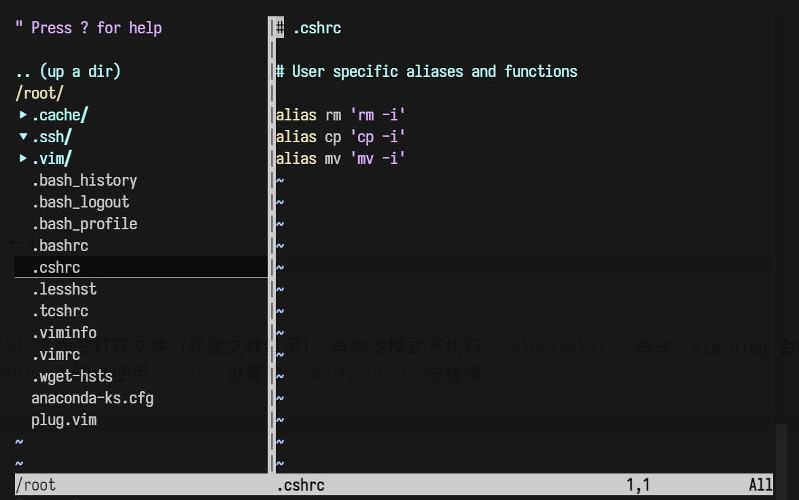
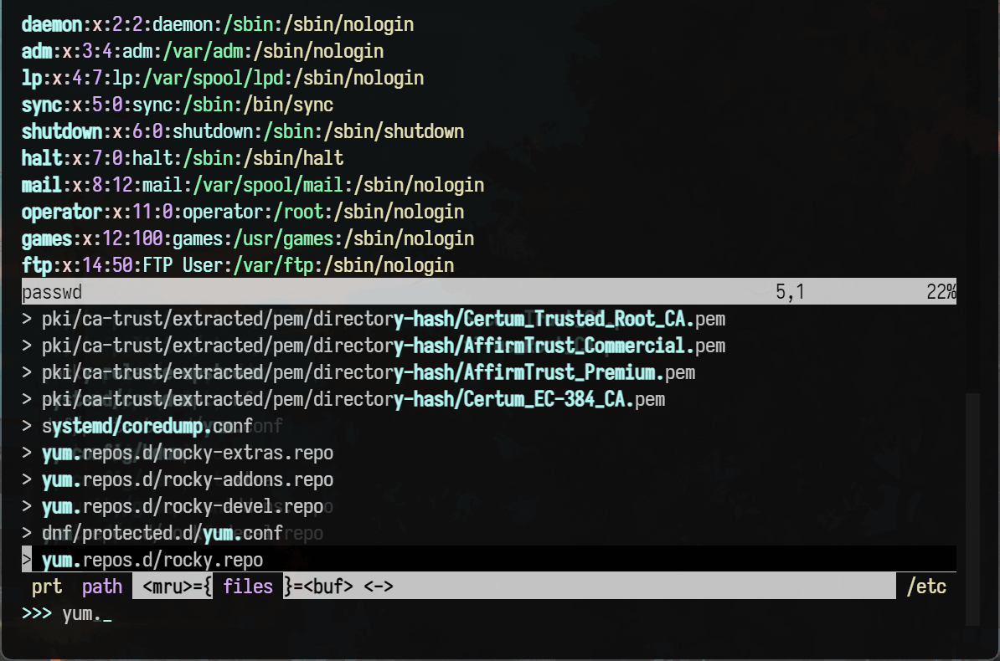
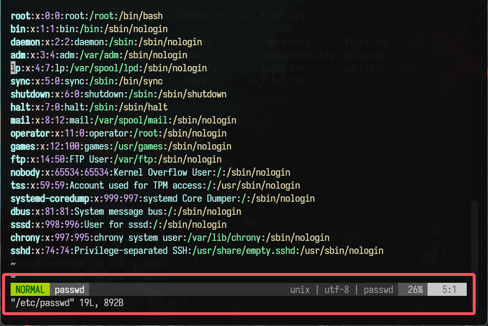
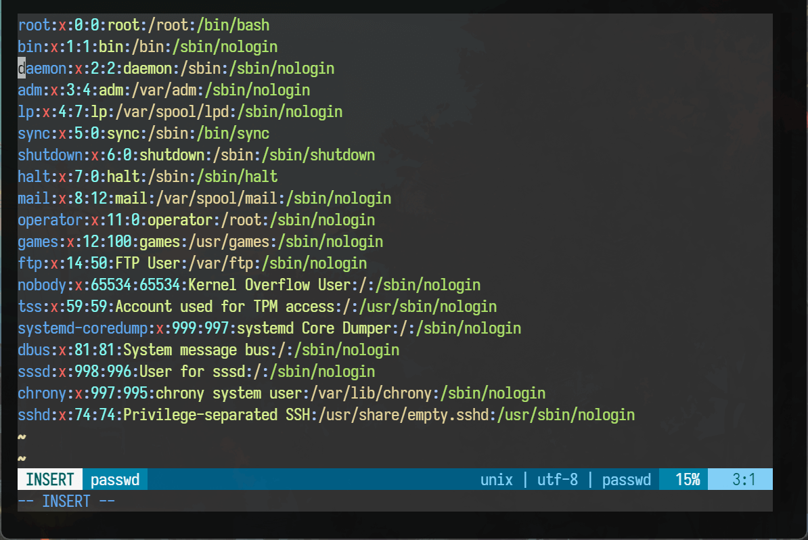

# Vim 插件

Vim 本身是一个功能强大的文本编辑器，但插件可以进一步增强其功能，以满足特定用户群体的需求。例如，对于程序员来说，代码补全插件可以提高编码速度，语法检查插件可以帮助发现代码错误；对于文档编辑者，目录导航插件可以方便地管理文档结构。

每个用户的编辑习惯和工作场景不同，插件系统允许用户根据自己的喜好定制 Vim。用户可以选择安装适合自己编程语言、工作流程或审美需求的插件，打造独一无二的编辑环境。通过自动化重复性任务、提供便捷的导航和操作方式等，插件能够显著提高编辑效率。比如，快速切换文件的插件可以让用户在多个文件之间快速切换，节省时间。

> 插件列表：https://github.com/altermo/vim-plugin-list

## 插件管理器 (vim-plug)

> https://github.com/junegunn/vim-plug

vim-plug 是一个 Vim 插件管理器，它的主要目的是方便用户安装、更新和管理 Vim 插件。通过简单的配置文件中的指令，就能够轻松地获取和维护各种 Vim 插件。

功能特性：

- **异步安装**：vim-plug 支持异步安装插件，这意味着它可以同时下载多个插件，大大提高了插件安装的效率。与顺序安装相比，减少了用户等待插件逐个安装的时间，特别是在安装多个插件时，这种优势更加明显。
- **懒加载机制**：具有懒加载的功能。也就是说，只有当插件被实际使用时，才会被加载到 Vim 环境中。这有助于提高 Vim 的启动速度，因为在启动时不需要加载所有的插件，对于安装了大量插件的用户来说，这个特性可以显著减少 Vim 启动所需的时间。

工作原理

- **基于 Git 仓库**：vim-plug 主要通过 Git 来获取插件。它从插件开发者在 GitHub 等平台上提供的 Git 仓库中下载插件文件。例如，当想要安装一个名为 preservim/nerdtree 的插件时，vim-plug 会使用 Git 命令从对应的仓库中克隆代码到本地指定的插件目录（通常是 `~/.vim/plugged/`）。
- **配置文件驱动**：其工作过程是由 `~/.vimrc` 文件中的配置指令驱动的。在 `~/.vimrc` 中，用户通过特定的语法（如 `Plug '插件名称'`）来指定要安装的插件。当执行安装命令（如 `:PlugInstall`）时，vim-plug 会解析 `~/.vimrc` 中的插件配置，然后依次执行下载和安装操作。

与其他插件管理器的比较优势：

- **简洁的语法**：vim-plug 的配置语法相对简洁明了。在 `.vimrc` 文件中，只需简单地使用 Plug 关键字加上插件的名称或仓库路径，就可以指定要安装的插件，相比其他一些插件管理器，更容易理解和使用。
- **高效的性能**：如前面提到的异步安装和懒加载机制，使得 vim-plug 在安装速度和 Vim 启动速度方面表现出色。这对于提高工作效率和用户体验非常重要，特别是在处理大量插件或者对 Vim 启动速度有要求的场景下。
- **良好的社区支持**：由于其受欢迎程度，vim-plug 有一个活跃的社区。这意味着用户在遇到问题时可以更容易地找到解决方案，并且有更多的资源（如教程、示例配置等）可供参考，有助于用户更好地使用和定制插件管理方案。

在安装 vim-plug 之前需要确保系统中已经安装了 `git`，因为 vim-plug 会使用 `git` 来下载插件：

```shell
dnf -y install git
```

然后可以下载 vim-plug 管理器，在终端执行：

```shell
[root@localhost ~]# mkdir  ~/.vim/autoload -p
[root@localhost ~]# cd  ~/.vim/autoload
[root@localhost autoload]# wget https://raw.githubusercontent.com/junegunn/vim-plug/master/plug.vim
```

如果遇到网络问题无法使用 `curl` 命令在线安装 vim-plug，可以从 vim-plug 的 GitHub 仓库手动下载 [`plug.vim` 文件](https://github.com/junegunn/vim-plug/blob/master/plug.vim)，并将其放置到  Vim 配置目录中：

```shell
[root@localhost ~]# tree -a 
├── .vim
│   └── autoload
│       └── plug.vim
```

然后在 `~/.vimrc` 文件中，添加 vim-plug 的配置，如下所示：

::: code-group
```vim [~/.vimrc]
call plug#begin('~/.vim/plugged')
Plug 'junegunn/vim-plug'            " 让 Vim-Plug 管理 Vim-Plug

call plug#end()                     " 插件结束的位置，插件全部放在此行上面
```
:::

保存并关闭 `~/.vimrc` 文件，然后重新使用 `vim` 命令打开文件（任意文件皆可），再命令模式下执行 `:PlugInstall` 命令，vim-plug 会根据 `~/.vimrc` 中的 Plug 声明来安装插件，应该能看到一个类似于以下的输出：

```vim
 [Plugins]  .vimrc                                                     X
Updated. Elapsed time: 17.970165 sec.                                   
[=]

- Finishing ... Done!
- vim-plug: Already up to date.
```

在 Vim 中，可以执行 `:PlugStatus` 命令来查看已安装插件的状态。这将显示一个列表，其中包含每个插件的名称、源（即插件的 Git 仓库），以及插件是否已就绪（loaded）。

执行 `:PlugStatus` 后，将看到一个类似于以下的输出：

```vim
 [Plugins]  .vimrc                                                                         X
Finished. 0 error(s).                                                                       
[=]

- vim-plug: OK
```

它表明 vim-plug 已经完成了插件的安装或更新过程，并且没有发生任何错误。以下是输出内容的解释：

- `[Plugins] .vimrc`：这表示 vim-plug 正在处理的 `~/.vimrc` 文件中列出的插件。
- `Finished. 0 error(s).`：这表示插件安装或更新过程已经完成，并且没有遇到任何错误。
- `[=]`：这表示插件安装或更新的进度条，[=] 表示进度已经完成。
- `- vim-plug: OK`：这表示 vim-plug 本身的状态是 OK，没有错误。

vim-plug 插件管理器的还有些常用命令：

| 命令               | 作用说明                                                       |
| ------------------ | -------------------------------------------------------------- |
| `:PlugInstall`     | 安装所有在 `~/.vimrc` 文件中配置的插件                         |
| `:PlugUpdate`      | 更新所有已安装的插件                                           |
| `:PlugStatus`      | 列出所有插件的状态，包括哪些插件有更新可用                     |
| `:PlugClean`       | 删除 `~/.vim/plugged` 目录中不再在 `~/.vimrc` 文件中配置的插件 |
| `:PlugUpgrade`     | 更新 vim-plug 插件管理器自身                                   |
| `:source ~/.vimrc` | 如果修改了 .vimrc 文件，可以使用此命令重新加载配置             |

## NERDTree

> https://github.com/preservim/nerdtree

这是一个非常实用的文件浏览器插件。对于运维人员来说，经常需要在服务器的文件系统中穿梭，查找配置文件、日志文件等各种文件。NERDTree 可以在 Vim 界面中以树形结构展示文件目录，方便快速定位文件。例如，当需要查看某个服务的配置文件时，通过 NERDTree 可以迅速找到文件路径并打开。

同样，只需要编辑 `~/.vimrc` 配置文件，新增一个 Plug：

::: code-group
```vim [~/.vimrc]
call plug#begin('~/.vim/plugged')
Plug 'junegunn/vim-plug'            " 让 Vim-Plug 管理 Vim-Plug
Plug 'preservim/nerdtree'           " nerdtree 插件 // [!code ++]

call plug#end()                     " 插件结束的位置，插件全部放在此行上面

nmap <F2> :NERDTreeToggle<CR>       " 设置 nerdtree 快捷键 // [!code ++]
```
:::

保存并关闭 `~/.vimrc` 文件，然后重新使用 `vim` 命令打开文件（任意文件皆可），再命令模式下执行 `:PlugInstall` 命令，vim-plug 会根据 `~/.vimrc` 中的 Plug 声明来安装插件，安装完成后就可以在命令行模式下使用 `:NERDTree` 或者直接在普通模式下使用 `nmap` 设置的 <kbd>F2</kbd> 快捷键。



NERDTree 默认情况下不会显示隐藏文件。要显示隐藏文件，可以在 NERDTree 窗口中按下 <kbd>I</kbd> 键。这样就会切换隐藏文件的显示状态，使隐藏文件可见。

## CtrlP

> https://github.com/kien/ctrlp.vim

Ctrlp 这是一个非常实用的插件，支持模糊搜索查询文件名，可以通过快捷键快速跳转到文件。

同样，只需要编辑 `~/.vimrc` 配置文件，新增一个 Plug：

::: code-group
```vim [~/.vimrc]
call plug#begin('~/.vim/plugged')
Plug 'junegunn/vim-plug'        " 让 Vim-Plug 管理 Vim-Plug
Plug 'preservim/nerdtree'       " nerdtree 插件
Plug 'kien/ctrlp.vim'           " CtrlP 插件 // [!code ++]

call plug#end()

nmap <F2> :NERDTreeToggle<CR>   " 设置 nerdtree 快捷键
let g:ctrlp_show_hidden = 1     " CtrlP 显示隐藏文件  // [!code ++]
```
:::

CtrlP 和 NERDTree 类似，默认情况下都不会显示隐藏文件。这是为了避免在文件列表中出现过多可能不需要关注的文件，如果想要让 CtrlP 显示隐藏文件，要在 `~/.vimrc` 文件中添加配置 `let g:ctrlp_show_hidden = 1`。设置这个选项后，CtrlP 在进行文件搜索时就会把隐藏文件也包含在结果中，这样就可以找到那些以 `.` 开头的隐藏文件了。

安装 CtrlP 完成后就可以在命令行模式下使用 `:CtrlP` 或者直接在普通模式下使用 <kbd>Ctrl + P</kbd> 组合键：



CtrlP 默认的查找范围是基于当前的工作目录，也就是在 Vim 中打开文件时所在的目录。不过可以通过在命令行模式下启动 CtrlP 时指定路径来改变查找范围，例如 `:CtrlP /` 这样就可以从根目录开始查找了。

下面是 CtrlP 一些基本使用方法：

模式导航：

- <kbd>Ctrl + f</kbd> 和 <kbd>Ctrl + b</kbd> 组合键可在查找文件模式、查找缓冲区模式、查找 MRU 文件几种模式间进行切换。
- <kbd>Ctrl + d</kbd> 组合键可在路径匹配和文件名匹配之间切换，也可以通过设置 `let g:ctrlp_by_filename = 1` 来设置默认使用文件名匹配模式进行模糊搜索。
- <kbd>Ctrl + r</kbd>可在字符串模式和正则表达式模式之间切换。

打开文件：

- <kbd>Enter</kbd> 回车键直接在当前窗口打开文件。
- <kbd>Ctrl + t</kbd> 组合键可在新的 Vim 标签页中打开文件。
- <kbd>Ctrl + v</kbd> 组合键可垂直分割窗口打开文件。
- <kbd>Ctrl + x</kbd> 组合键可水平分割窗口打开文件。
- <kbd>Ctrl + o</kbd> 组合键可选择以何种方式打开文件，包括在新标签页、水平分割、垂直分割或替换当前缓冲区等方式。

其他操作：

- <kbd>F5</kbd> 用于刷新当前操作路径下的文件缓存，可以使用命令 `let g:ctrlp_cache_dir = $HOME.'/.cache/ctrlp'` 设置缓存文件存放路径。
- <kbd>Ctrl + p</kbd> 或 <kbd>Ctrl + n</kbd> 选择前或后一条历史记录。
- <kbd>Ctrl + y</kbd> 用于当搜索的目标文件不存在时创建文件及父目录。
- <kbd>Ctrl + z</kbd> 标记或取消标记多个文件，标记多个文件后可以使用<kbd>Ctrl + o</kbd> 同时打开多个文件 。
- 输入两个或多个点 `..` 可向上一级或多级目录树跳转。

## lightline

> https://github.com/itchyny/lightline.vim

这是一个状态栏增强插件，可以让 Vim 状态栏非常美观，同时包括了 buffer 显示条扩展 smart tab line 以及集成了一些插件。

同样，只需要编辑 `~/.vimrc` 配置文件，新增一个 Plug：

::: code-group
```vim [~/.vimrc]
call plug#begin('~/.vim/plugged')
Plug 'junegunn/vim-plug'        " 让 Vim-Plug 管理 Vim-Plug
Plug 'preservim/nerdtree'       " nerdtree 插件
Plug 'kien/ctrlp.vim'           " CtrlP 插件
Plug 'itchyny/lightline.vim'    " lightline 插件 // [!code ++]

call plug#end()

nmap <F2> :NERDTreeToggle<CR>   " 设置 nerdtree 快捷键
let g:ctrlp_show_hidden = 1     " CtrlP 显示隐藏文件
set laststatus=2                " 设置状态栏始终显示 // [!code ++]
```
:::



`laststatus` 选项用于控制状态栏的显示。当 `laststatus = 0` 时，状态栏不会显示；当 `laststatus = 1` 时，只有在多个窗口（例如通过分割窗口打开多个文件）时才会显示状态栏；当 `laststatus = 2` 时，无论窗口数量是多少，状态栏都会显示。

## vim-colors-solarized

vim-colors-solarized 插件，它提供了 Solarized 颜色方案，该方案由 Ethan Schoonover 设计。Solarized 是一种颜色方案，旨在为用户提供对眼睛友好的配色，同时在不同的设备和显示设置下保持一致的外观。它有两种主要的变体：

- Solarized Dark：深色背景，适合在低光环境下工作。
- Solarized Light：浅色背景，适合在明亮环境下工作。

vim-colors-solarized 插件允许 Vim 用户在他们的编辑器中使用这两种颜色方案，以提高代码的可读性和编辑体验。这个插件特别受欢迎，因为它的颜色经过精心挑选，以减少眼睛疲劳，并且可以在不同的显示设备上保持相对一致的外观。

::: code-group
```vim [~/.vimrc]
call plug#begin('~/.vim/plugged')
Plug 'junegunn/vim-plug'                " 让 Vim-Plug 管理 Vim-Plug
Plug 'preservim/nerdtree'               " nerdtree 插件
Plug 'kien/ctrlp.vim'                   " CtrlP 插件
Plug 'itchyny/lightline.vim'            " lightline 插件
Plug 'altercation/vim-colors-solarized' " vim-colors-solarized 插件 // [!code ++]

call plug#end()

nmap <F2> :NERDTreeToggle<CR>       " 设置 nerdtree 快捷键
let g:ctrlp_show_hidden = 1         " CtrlP 显示隐藏文件
set laststatus=2                    " 设置状态栏始终显示
syntax enable                       " 开启 Vim 语法高亮功能  // [!code ++]
set background=dark                 " 设置 Vim 的背景颜色模式为深色  // [!code ++]
colorscheme solarized               " 应用 Solarized 颜色方案  // [!code ++]
```
:::

注意，确保 `syntax enable` 等命令在插件加载之后（`call plug#end()`）执行。



## NERD Commenter

> https://github.com/preservim/nerdcommenter

NERD Commenter 是一个强大的 Vim 插件，用于快速高效地注释和取消注释代码。它支持多种编程语言，并且提供了丰富的快捷键和配置选项，以满足不同开发者的需要。

同样，只需要编辑 `~/.vimrc` 配置文件，新增一个 Plug：

::: code-group
```vim [~/.vimrc]
call plug#begin('~/.vim/plugged')
Plug 'junegunn/vim-plug'                " 让 Vim-Plug 管理 Vim-Plug
Plug 'preservim/nerdtree'               " nerdtree 插件
Plug 'kien/ctrlp.vim'                   " CtrlP 插件
Plug 'itchyny/lightline.vim'            " lightline 插件
Plug 'altercation/vim-colors-solarized' " vim-colors-solarized 插件
Plug 'preservim/nerdcommenter'          " NERD Commenter 插件  // [!code ++]

call plug#end()

nmap <F2> :NERDTreeToggle<CR>       " 设置 nerdtree 快捷键
let g:ctrlp_show_hidden = 1         " CtrlP 显示隐藏文件
set laststatus=2                    " 设置状态栏始终显示
syntax enable                       " 开启 Vim 语法高亮功能
set background=dark                 " 设置 Vim 的背景颜色模式为深色
colorscheme solarized               " 应用 Solarized 颜色方案
filetype plugin on                  " 启用文件类型检测  // [!code ++]
```
:::

NERD Commenter 插件会根据当前文件的类型自动使用相应的注释符号，因此可以直接使用来注释当前行。

使用方法：

- <kbd>leader</kbd> + <kbd>c</kbd> + <kbd>c</kbd> 注释当前行。
- <kbd>leader</kbd> + <kbd>c</kbd> + <kbd>u</kbd> 取消注释当前行。
- <kbd>leader</kbd> + <kbd>c</kbd> + <kbd>y</kbd> 先复制再注释。
- <kbd>leader</kbd> + <kbd>c</kbd> + <kbd>A</kbd> 在当前行尾添加注释符并进入插入模式。

> [!NOTE]
> `leader` 是前缀键，如果没有修改那么默认键就是反斜杠 `\`。

如果要注释多行，需要先进入可视模式来选择多行文本，然后使用 NERD Commenter 的快捷键进行注释。具体步骤如下：

1. 进入普通模式（按 Esc 键确保退出其他模式）。
2. 按 <kbd>Ctrl + v</kbd> 组合键进入可视块模式，可以选择列块范围。
3. 使用方向键或文本对象选择多行文本。
4. 在选中多行文本后，使用 NERD Commenter 的快捷键来注释选中的多行。

## vim-visual-multi

> https://github.com/mg979/vim-visual-multi

vim-visual-multi 是一个用于 Vim 编辑器的插件，主要功能是实现多光标编辑。它允许用户在 Vim 中同时操作多个光标，极大地提高了批量编辑文本的效率，尤其适用于处理具有相似结构或重复模式的文本内容。

同样，只需要编辑 `~/.vimrc` 配置文件，新增一个 Plug：

::: code-group
```vim [~/.vimrc]
call plug#begin('~/.vim/plugged')
Plug 'junegunn/vim-plug'                " 让 Vim-Plug 管理 Vim-Plug
Plug 'preservim/nerdtree'               " nerdtree 插件
Plug 'kien/ctrlp.vim'                   " CtrlP 插件
Plug 'itchyny/lightline.vim'            " lightline 插件
Plug 'altercation/vim-colors-solarized' " vim-colors-solarized 插件
Plug 'preservim/nerdcommenter'          " NERD Commenter 插件
Plug 'mg979/vim-visual-multi'           " vim-visual-multi 插件  // [!code ++]

call plug#end()

nmap <F2> :NERDTreeToggle<CR>       " 设置 nerdtree 快捷键
let g:ctrlp_show_hidden = 1         " CtrlP 显示隐藏文件
set laststatus=2                    " 设置状态栏始终显示
syntax enable                       " 开启 Vim 语法高亮功能
set background=dark                 " 设置 Vim 的背景颜色模式为深色
colorscheme solarized               " 应用 Solarized 颜色方案
filetype plugin on                  " 启用文件类型检测
```
:::

启动多光标模式：

- **选择单词**：在普通模式下，按下 <kbd>Ctrl-N</kbd> 选择当前光标下的单词。
- **垂直创建光标**：在普通模式下，按下 <kbd>Ctrl-↓</kbd> 或 <kbd>Ctrl-↑</kbd> 在当前行的下方或上方创建光标。
- **逐字符选择**：在普通模式下，使用 <kbd>Shift-Arrows</kbd>逐字符选择文本（Arrows 就是方向键）。

导航和操作：

- **下一个/上一个出现**：按下 <kbd>n</kbd> 跳到下一个匹配项，按下 <kbd>N</kbd> 跳到上一个匹配项。
- **选择下一个/上一个光标**：按下 <kbd>[</kbd> 选择下一个光标，按下 <kbd>]</kbd> 选择上一个光标。
- **跳过当前并选择下一个**：按下 <kbd>q</kbd> 跳过当前匹配项并选择下一个。
- **移除当前光标/选择**：按下 <kbd>Q</kbd> 移除当前光标或选择。

插入模式：

- 在多光标模式下，可以使用 <kbd>i</kbd>、<kbd>a</kbd>、<kbd>c</kbd> 等命令进入插入模式。此时，所有光标处都会进入插入模式，允许同时在多个位置输入文本。
