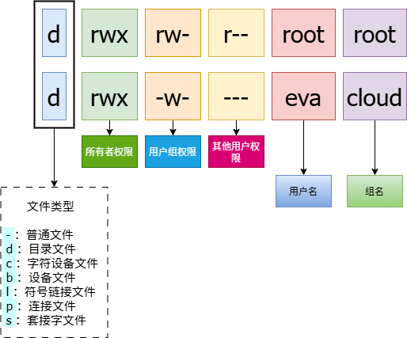

# 权限管理

在 Linux 系统中，权限是用来控制用户对文件、目录以及其他系统资源访问能力的机制。权限决定了用户可以对文件或目录进行哪些操作，例如查看内容、修改内容或执行文件等。它的核心作用是：

- 保护系统安全：防止未授权的用户访问敏感数据。
- 避免误操作：限制用户对关键资源的修改或删除。
- 资源隔离：确保不同用户/组之间的文件互不干扰。

## 权限主体

权限主体是指权限适用的对象范围，它们是权限设置的核心部分，决定了不同范围的用户可以对文件或目录进行哪些操作。权限主体分为以下三类：

| 主体              | 定义                                                                                                                                               | 权限范围                                                                                     | 举例                                                                                                                                                                |
| ----------------- | -------------------------------------------------------------------------------------------------------------------------------------------------- | -------------------------------------------------------------------------------------------- | ------------------------------------------------------------------------------------------------------------------------------------------------------------------- |
| 用户（User）      | 用户是指在 Linux 系统中注册的个体用户，每个用户都有一个唯一的用户名和用户 ID（UID）。                                                              | 用户权限决定了文件或目录的所有者（即创建该文件或目录的用户）可以对该文件或目录进行哪些操作。 | 假设用户 `alice` 创建了一个文件 `file.txt`，那么 `alice` 对这个文件的访问权限就是用户权限。                                                                         |
| 用户组（Group）   | 用户组是一组用户的集合，每个用户可以属于一个或多个用户组。用户组的设置可以简化权限管理，因为对用户组设置权限后，该组内的所有用户都会继承这些权限。 | 用户组权限决定了属于该用户组的所有用户可以对文件或目录进行哪些操作。                         | 假设有一个用户组 `developers`，用户 `alice` 和用户 `bob` 都属于这个组。如果文件 `file.txt` 的用户组权限被设置为可读可写，那么 `alice` 和 `bob` 都可以读写这个文件。 |
| 其他用户（Other） | 其他用户是指除了文件所有者和所属用户组成员之外的其他所有用户。                                                                                     | 其他用户权限决定了不属于文件所有者和用户组的用户可以对文件或目录进行哪些操作。               | 如果文件 `file.txt` 的其他用户权限被设置为只读，那么除了文件所有者和所属用户组成员之外的其他用户只能查看文件内容，而不能修改或删除文件。                            |

## 权限类型

权限类型是指权限主体可以对文件或目录进行的具体操作，分为以下三种：

| 权限            | 对文件的影响                                                            | 对目录的影响                                                                   |
| --------------- | ----------------------------------------------------------------------- | ------------------------------------------------------------------------------ |
| `r`（ 读权限）  | 允许用户查看文件的内容。例如 `cat`、`more`、`less`、`head`、`tail` 等。 | 允许用户查看目录中的文件列表，包括文件名、大小、修改时间等信息。例如 `ls` 等。 |
| `w`（写权限）   | 允许用户修改文件的内容。例如 `vim`、`echo`、`sed`、`awk` 等。           | 允许用户在目录中创建、删除和重命名文件或子目录。例如 `touch`、`rm`、`mv` 等。  |
| `x`（执行权限） | 允许用户将文件作为可执行程序运行。例如 `bash`、`./script.sh` 等。       | 允许用户进入目录。例如 `cd` 等。                                               |



在 Linux 系统中，权限由 3 个字符表示，分别表示用户、用户组和其他用户的权限。例如，`-drwxrw-r--` 表示一个文件，它的权限是：

- `-` 表示这是一个文件（如果是 `d` 则表示目录）。
- `rwx` 表示所有者有读、写和执行权限。
- `r-x` 表示用户组成员有读和执行权限，但没有写权限。
- `r--` 表示其他用户只有读权限。

1. 目录权限与访问限制

    某目录的权限如下所示：

    ```shell
    drwxr--r--. 3 root root 4096 Jun 25 08:35 data_dir
    ```

    系统中有一个账号名称为 `user1`，该账号并不包含在 `root` 用户组中。请问 `user1` 对这个目录有何权限？是否可以切换到此目录中？

    ::: details 点我查看
    - `user1` 对此目录仅具有读权限（`r`），因此 `user1` 可以查看目录中的文件列表（也就是可以执行 `ls` 命令）。

    - 但是由于 `user1` 不具有执行权限（`x`），因此 `user1` 无法进入该目录。
    :::

2. 文件权限与删除操作

    假设有一个账号名称为 `user2`，其家目录在 `/home/user2/`，`user2` 对此目录具有 `rwx` 的权限。若在此目录下有一个名为 `admin_file.txt` 的文件，该文件的权限如下：

    ```shell
    -rwx------. 1 root root 4365 Sep 19 23:20 admin_file.txt
    ```

    请问 `user2` 对此文件的权限为何？是否可以删除此文件？

    ::: details 点我查看

    - 由于 `user2` 对此文件来说属于「其他用户」的身份，因此 `user2` 无法读取、编辑或执行该文件。

    - 在 Linux 系统中，删除文件的权限主要取决于对父目录的权限，而不是文件本身的权限。所以，尽管 `user2` 对文件 `admin_file.txt` 没有直接的读、写或执行权限，由于 `user2` 对目录 `/home/user2/` 有写权限（`w`）和执行权限（`x`），`user2` 可以删除该目录中的文件 `admin_file.txt`。
    :::

3. 目录权限限制文件访问

    某目录的权限如下所示：

    ```shell
    drw-r--r--. 3 root root 4096 Jun 25 08:35 shared_dir
    ```

    在该目录下有一个文件 `secret_file.txt`，其权限如下：

    ```shell
    -rwxrwxrwx. 1 root root 1234 Sep 20 14:00 shared_dir/secret_file.txt
    ```

    系统中有一个账号名称为 `alice`，此账户并不包含在 `root` 群组中。请问 `alice` 对此目录和文件有何权限？是否可以读取、写入或删除此文件？

    ::: details 点我查看

    - `alice` 对此目录仅有读权限（`r`），因此她可以查看目录中的文件列表。

    - 但是由于 `alice` 没有对目录的执行权限（`x`），她无法进入该目录。即使文件 `secret_file.txt` 有 `rwx` 权限，`alice` 也无法读取、写入或删除该文件，因为她无法进入目录。
    :::

## 默认权限

Linux 的权限管理以安全隔离为核心，其默认权限机制与 Windows 的继承模式有本质区别。新建文件和目录的初始权限并非直接继承上级目录，而是通过 `umask`（权限掩码） 动态计算生成，这种设计赋予系统更高的灵活性和一致性。

### umask 的组成

`umask`是 Linux 中控制新建文件/目录默认权限的核心机制。它的本质是一个权限过滤器，从预设的「最大宽松权限」中剔除某些权限位，最终生成实际权限。

可以通过 `umask` 命令查看当前默认权限的值：

```shell
[root@localhost ~]# umask
0022
```

`umask` 是一个 4 位八进制数（如 `0022`），其中：

- 第 1 位：控制特殊权限（SetUID、SetGID、Sticky Bit），通常为 0（后续章节详述）。
- 后 3 位：分别对应用户（Owner）、组（Group）、其他用户（Others）的权限屏蔽规则。

将 `umask` 值 `0022` 转换为字母形式表示的话：

1. `0`：无特殊权限（`---`）。
2. `0`：所有者（U）没有权限 (`---`)。
3. `2`：用户组（G）写权限 (`-w-`)。
4. `2`：其他用户（O）写权限 (`-w-`)。

完整结果就是：`----w--w-`。

### umask 的计算

尽管 `umask` 用于设定文件和目录的初始权限，但其工作方式并非直接将 `umask` 权限值应用于新建的文件或目录。实际上，`umask` 的作用更像是一个「减法器」，它从系统预设的最大权限中减去相应的值，从而确定最终的初始权限。这一过程可以概括为以下公式：

```text
实际权限 = 最大默认权限 - umask 权限
```

显然，如果想最终得到文件或目录的初始权限值，那么还需要了解文件和目录的最大默认权限值。在 Linux 系统中，文件和目录的最大默认权限是不一样的：

- 文件的最大默认权限：`666`，即所有用户默认拥有读写权限，但没有执行权限。这是因为文件通常不需要执行权限，而执行权限的赋予需要谨慎处理，以防止潜在的安全风险。
- 目录的最大默认权限：`777`，即所有用户默认拥有读、写和执行权限。这是因为目录需要执行权限（`x`），以便用户能够进入并访问其中的内容。

对于文件来说：

- 文件最大默认权限是 `666`，换算成字母就是 `-rw-rw-rw-`。
- `umask` 的值是 `022`，换算成字母为 `-----w--w-`，也就是需屏蔽 `-----w--w-`（组和其他用户的 `w`）。

```text
最大权限： rw-  rw-  rw-
屏蔽位：   ---  -w-  -w-
--------------------------
实际权限： rw-  r--  r--
```

对于目录来说：

- 目录最大默认权限是 `777`，换算成字母就是 `-rwxrwxrwx`。
- `umask` 的值是 `022`，换算成字母为 `-----w--w-`，也就是需屏蔽 `-----w--w-`（组和其他用户的 `w`）。

```text
最大权限： rwx  rwx  rwx
屏蔽位：   ---  -w-  -w-
--------------------------
实际权限： rwx  r-x  r-x
```

可以分别创建文件和目录查看权限是否与计算的一致：

```shell
[root@localhost ~]# touch test_file
[root@localhost ~]# mkdir test_dir
```

```shell
[root@localhost ~]# ll test_file 
-rw-r--r--. 1 root root 0 Apr 10 10:13 test_file
```

```shell
[root@localhost ~]# ll -d  test_dir/
drwxr-xr-x. 2 root root 6 Apr 10 10:13 test_dir/
```

> [!NOTE]
> 在计算文件或目录的初始权限时，重要的是要记住，不能直接使用最大默认权限和 `umask` 权限的数字形式进行简单的减法运算。这种直接的数字减法可能会导致错误的结果。
>
> 这里的「减法」实际上是一种「遮盖」机制。具体来说，最大默认权限中与 `umask` 权限重叠的部分会被「遮盖」，即从最大默认权限中移除。最终剩下的权限，才是实际赋予文件或目录的初始权限。

### 修改 umask

umask 的修改是 Linux 系统管理中常见且必要的操作。关键在于明确使用场景并遵循安全原则。

避免全局过度宽松：

- 反例：`umask=000`（文件权限 `666`，目录权限 `777`）
- 风险：新建文件全局可写，易被恶意篡改。
- 建议：普通用户默认至少保留 `umask=002`，敏感场景使用 `umask=077`。

区分用户类型：

- Root 用户：保持 `umask=022` 或更严格（如 `027`），防止误操作泄露系统文件。
- 普通用户：根据需求选择：
  - 个人环境：`umask=077`（完全私有）。
  - 共享环境：`umask=002`（同组可协作）。

使用配置文件而非临时修改：

- 可以通过命令行直接修改 `umask` 的值。这种修改是临时的，只对当前会话有效。一旦退出当前会话或重新登录，`umask` 的值将恢复为系统默认值：

    ```shell
    [root@localhost ~]# umask 0002
    [root@localhost ~]# umask
    0002
    ```

- 如果希望修改 `umask` 的值并使其永久生效，需要编辑系统的环境变量配置文件，`umask` 的默认值通常在 `/etc/profile` 文件中设置：

    :::code-group
    ```shell [/etc/profile]
    ……
    umask 0002
    ```
    :::

    为了使更改立即生效，可以重新加载配置文件：

    ```shell
    [root@localhost ~]# source /etc/profile
    ```
