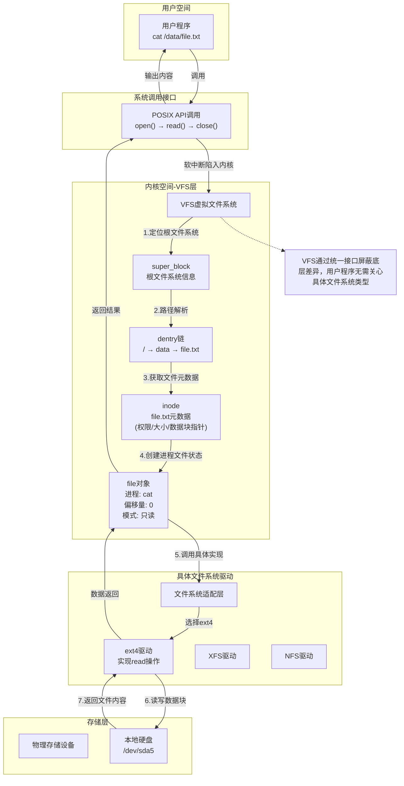

# 文件系统基础与 VFS

文件系统是操作系统用于管理存储设备（如硬盘、SSD、U 盘等）上数据的一套机制，它规定了数据的存储方式、组织结构、命名规则以及访问方式。简单来说将物理硬盘的存储空间抽象为文件和目录，让用户无需直接操作硬件即可管理数据。

文件系统的核心功能：

- **管理存储空间**：将物理存储设备（如硬盘）划分为可管理的单元（如分区、块），高效分配和回收空间
- **组织数据**：通过目录结构（树形结构）将文件分类存储，方便用户和程序查找
- **维护元数据**：记录文件的属性（如名称、大小、权限、创建时间、存储位置等），确保数据可被正确访问
- **提供访问接口**：通过系统调用（如 `open()`、`read()`、`write()`）允许用户 `/` 程序操作文件

Linux 文件系统的特点：

- **一切皆文件**：硬件设备（如 `/dev/sda`）、进程、网络接口等都被抽象为文件，统一通过文件系统接口管理。
- **树形目录结构**：以根目录（`/`）为起点，所有文件和目录都挂载在这一结构下（即使存储设备不同）。

## 文件系统类型

Linux 支持的文件系统类型非常丰富，不同类型适用于不同场景（本地存储、网络共享、特殊功能等）。

> [!WARNING] 文件系统类型与文件类型
> 文件系统类型指的是用于组织和存储数据在存储设备（如硬盘、SSD、USB 驱动器等）上的一套规则和方法。不同的文件系统类型支持不同的特性，如文件大小限制、性能优化、数据完整性、文件和目录的权限管理等。
>
> 文件类型则是指文件在操作系统中的数据格式和用途。文件类型通常由文件扩展名来标识，它帮助操作系统和用户识别文件的内容和如何打开或处理这些文件。

**本地磁盘文件系统**：

这类文件系统直接管理本地硬盘、SSD 等存储设备，注重性能、可靠性和功能完整性。

|类型|特点与适用场景|典型应用|
|-|-|-|
|ext4|Linux 系统默认文件系统（主流发行版如 Ubuntu、CentOS），支持最大 1EB 分区、16TB 文件，日志型设计（减少断电数据丢失），兼容 ext2/ext3，支持延迟分配（提高写入性能），具备一定的碎片整理能力。|系统盘、普通数据存储（平衡性能与稳定性），个人计算机日常使用，中小规模服务器存储。|
|XFS|高性能日志文件系统，擅长处理大文件和高并发，支持动态扩展分区、在线碎片整理，最大支持 8EB 分区、9EB 文件，采用 B+ 树索引（快速查找大目录），支持实时快照和配额管理。|服务器数据盘（如数据库、视频存储），需要频繁读写大文件的场景，媒体处理服务器，高性能计算（HPC）存储。|
|Btrfs|新一代 Copy-on-Write（写时复制）文件系统，支持快照、压缩、RAID 整合、子卷管理，修复能力强（校验和检测损坏），支持在线扩容和平衡数据分布，可透明压缩数据（节省空间）。|需要快照功能的场景（如虚拟机镜像），对数据完整性要求高的存储，虚拟化平台存储，需要频繁备份 / 恢复的环境。|
|F2FS|专为 SSD 设计（优化闪存寿命和性能），减少写入放大效应，支持 TRIM 指令，适合小文件密集型操作，采用日志结构设计（减少随机写入），支持多级垃圾回收机制。|嵌入式设备（如安卓手机），SSD 作为系统盘的场景，移动设备存储，对 SSD 寿命有严格要求的环境。|

**网络文件系统**：

通过网络实现不同主机间的文件共享，VFS 层将网络操作抽象为本地文件操作。

|类型|特点与适用场景|典型应用|
|-|-|-|
|Ceph FS|统一存储（文件 / 块 / 对象一体化）；强一致性，基于 CRUSH 算法智能分配数据，容错性强，适合企业级高可靠场景，无单点故障设计，支持自动数据修复和负载均衡|混合云存储、容器平台持久化存储，企业级分布式存储集群，大规模虚拟化环境，多租户云平台。|
|HDFS|大数据优化，高吞吐量读写；按大文件块（128MB）分布式存储，主从架构（NameNode+DataNode），适合一次写入多次读取，数据多副本存储（默认 3 份），不适合大量小文件和随机写入。|Hadoop/Spark 大数据分析、日志存储，数据仓库存储，离线批处理任务，历史数据归档。|
|GlusterFS|分布式网络文件系统，可整合多台服务器存储为虚拟大磁盘，支持弹性扩展和冗余，无元数据服务器（避免单点瓶颈），支持多种卷类型（复制、分布式、条带化），可通过 Scale-Out 扩展存储容量。|大规模集群存储（如云计算平台、大数据存储），内容分发网络（CDN），媒体文件共享平台，弹性云存储服务。|

**特殊虚拟文件系统**：

这类文件系统不对应物理存储，而是用于内核与用户空间交互、临时存储等。

|类型|特点与适用场景|典型应用|
|-|-|-|
|tmpfs|基于内存的临时文件系统（数据存在 RAM 中），读写速度极快，断电后数据丢失，大小可动态调整（默认半系统内存），可挂载到任意目录。|存放临时文件（`/tmp` 目录）、缓存数据（如数据库临时表），应用程序临时缓存，减轻磁盘 I/O 压力，存放敏感临时数据。|
|sysfs|以文件形式展示内核设备树（硬件设备、驱动信息），配合 `udev` 管理设备节点，提供设备层级关系视图，支持动态监控设备状态变化。|查看硬件信息（`/sys/class/net` 看网卡、`/sys/block` 看磁盘），设备驱动开发调试，系统硬件状态监控，自动化设备管理脚本。|
|procfs|虚拟文件系统，暴露进程和内核状态（如 CPU 信息、内存使用），文件内容动态生成，无需磁盘空间（数据实时从内核获取），提供系统性能计数器。|查看系统信息（`/proc/cpuinfo`、`/proc/meminfo`），进程详情（`/proc/[pid]`），系统监控工具数据源，调试程序运行状态。|
|devtmpfs|内核启动时自动创建，管理设备文件（`/dev` 目录），替代传统的 devfs，设备节点在系统启动时自动创建，支持动态设备检测。|统一设备访问接口（如 `/dev/sda` 对应硬盘、`/dev/tty` 对应终端），即插即用设备支持，简化设备驱动开发，保证设备文件一致性。|
|overlayfs|分层文件系统，将多个目录合并为一个视图（上层覆盖下层），写操作仅修改上层，支持多层叠加（最多 128 层），节省空间（共享未修改的基础数据）。|Docker 容器镜像层（基础镜像 + 容器读写层），Live CD 系统，版本控制系统，只读文件系统的临时修改。|

不同的 Linux 发行版会选择不同的默认文件系统类型。选择哪种文件系统通常取决于多种因素，包括性能、稳定性、特性支持、目标用户群体以及发行版的特定需求。

例如，Ubuntu 通常使用 ext4 文件系统作为其默认选择。ext4 是广泛采用的日志文件系统，提供了良好的性能和可靠性，适合桌面和服务器环境。而 Rocky Linux 作为 CentOS 的替代品，选择了 XFS 作为其默认文件系统，以保持与 RHEL 的兼容性。

在 Linux 上可以通过 `df -Th` 命令输出中的 `Type` 列显示了挂载点的文件系统类型：

```shell
[root@localhost ~]# df -Th
Filesystem          Type      Size  Used Avail Use% Mounted on
devtmpfs            devtmpfs  4.0M     0  4.0M   0% /dev
tmpfs               tmpfs     872M     0  872M   0% /dev/shm
tmpfs               tmpfs     349M  5.1M  344M   2% /run
/dev/mapper/rl-root xfs        17G  1.3G   16G   8% /
/dev/nvme0n1p1      xfs       960M  226M  735M  24% /boot
tmpfs               tmpfs     175M     0  175M   0% /run/user/0
```

## Linux VFS（虚拟文件系统）

虚拟文件系统（Virtual File System，简称 VFS）是 Linux 内核中的​​抽象层（Abstraction Layer）​​，它定义了一套统一的接口（API），允许用户程序和内核其他模块通过一致的「文件操作方式」访问​​不同底层的文件系统​​（如 Ext4、XFS、NTFS、NFS 等）。VFS 的核心目标是​​解耦操作系统与具体文件系统的依赖​​，它解决了「不同文件系统如何被统一管理」的核心问题。

> [!TIP]
> 例如去一家国际餐厅，菜单上有中餐、西餐、日料等不同类型的食物（类比不同的文件系统：ext4、xfs、nfs 等）。作为顾客（类比用户程序），不需要知道中餐厨师和西餐厨师的烹饪方法有何不同，只需通过服务员（类比 VFS）点单即可。VFS 就扮演了这个「服务员」的角色，用统一的方式操作各种文件系统。

VFS 的三大核心作用：

- ​**​统一文件操作接口​**​：为应用程序提供一致的函数（如 `open()`、`read()`、`write()`、`close()`），无论底层是硬盘、网络存储还是内存文件系统（如 `/proc` 或 `/sys`）。
- ​**​动态挂载不同文件系统**​​：允许同时挂载多种文件系统（如硬盘用 Ext4，U 盘用 FAT32，网络目录用 NFS），所有操作经 VFS 路由至对应的底层驱动。
- ​**​内核与文件系统解耦​**​：文件系统开发者只需按 VFS 标准实现接口（如 `mount()`、`readdir()`），无需修改内核代码即可支持新文件系统。

简单来说，VFS 的核心作用是提供统一的文件操作接口，屏蔽底层不同文件系统的实现差异。具体表现为：

- **对用户程序**：无论底层是 ext4、xfs 还是 NFS 网络文件系统，用户都可以用相同的命令（如 `ls`、`cp`、`cat`）和系统调用（如 `open()`、`read()`）来操作文件。
- **对内核**：VFS 定义了一套标准的数据结构和函数接口，任何文件系统想要被 Linux 支持，只需实现这些接口，无需关心其他文件系统的细节。

## VFS 的工作原理

在 Linux 虚拟文件系统（VFS）中，​​4 个核心 **数据结构**​ ​扮演着承上启下的关键角色，这些核心数据结构是理解其工作原理的关键，这些结构就像标准化模板，定义了所有文件系统必须实现的基础功能和属性。它们之间相互关联，共同构成了 VFS 的抽象层。

|数据结构|核心作用|关键属性|特点|
|-|-|-|-|
|超级块 (`super_block`)|代表一个已挂载的完整文件系统（如整个 ext4 分区、一个 NFS 共享目录），存储该文件系统的全局信息。|文件系统类型（如 ext4、xfs）；总块数、空闲块数、块大小；挂载点（如 `/data`）；超级块操作函数集（定义对该文件系统的全局操作，如创建 inode、同步数据到磁盘）|每个已挂载的文件系统对应一个 `super_block`，由内核在挂载时创建。|
|索引节点 (`inode`)|代表一个具体的文件、目录或者设备（任何文件系统对象），存储其元数据（属性），但不包含文件名。|唯一编号（`inode` 号）；文件类型（普通文件、目录、设备文件等）；权限（所有者、所属组、读写执行权限）；大小、创建 / 修改 / 访问时间；数据块指针（指向存储文件内容的物理块）；`inode` 操作函数集（定义对该文件的操作，如创建子文件、删除、重命名）|每个文件对应唯一 `inode`，不同文件名可指向同一个 `inode`（硬链接）。|
|目录项 (`dentry`)|解析文件路径，建立文件名到 `inode` 的映射，是 VFS 中路径查找的核心。|文件名（如 `file.txt`、`test.docs`）；指向父目录的指针（形成路径层级）；指向对应 `inode` 的指针（名称→`inode` 的映射）；目录项操作函数集（定义路径解析相关操作，如查找子目录）|目录项是内存中的临时结构（不在磁盘上存储），VFS 会缓存常用目录项（`dentry cache`）加速路径查找。一个 `inode` 可对应多个 `dentry`（多个文件名指向同一个文件）。|
|文件对象 (`file`)|代表一个被进程打开的文件，记录进程操作文件的状态（与进程绑定）。|指向对应 `inode` 的指针（关联文件本身）；当前读写位置（偏移量）；打开模式（`O_RDONLY` 只读、`O_WRONLY` 只写等）；文件操作函数集（定义进程对文件的操作，如 `read`、`write`、`close`）|同一个文件被多个进程打开时，会产生多个 `file` 结构，但共享一个 `inode`。进程关闭文件后，`file` 结构被释放，但 `inode` 和 `dentry` 可能仍在缓存中。|

VFS 位于用户程序和具体文件系统之间，形成了一个中间翻译层，其工作流程如下：



当用户执行 `cat /data/file.txt` 时：

1. 当执行 `cat /a/b.txt` 时，VFS 先找到 `/` 对应的 `super_block`（根文件系统的总信息）。
2. 解析路径 `/a/b.txt`：通过 `dentry` 结构逐层查找（`/`→`a`→`b.txt`），最终找到 `b.txt` 对应的 `inode`。
3. 进程调用 `open()` 时，VFS 创建一个 `file` 结构，记录「当前进程打开了 `b.txt`，偏移量为 0，只读模式」。
4. 调用 `read()` 时，VFS 通过 `file` 找到 `inode`，再调用该文件系统（如 ext4）的 `read` 函数，读取数据并返回。
5. 整个过程中，`cat` 程序完全不知道底层是 ext4 还是其他文件系统，它只和 VFS 打交道。
