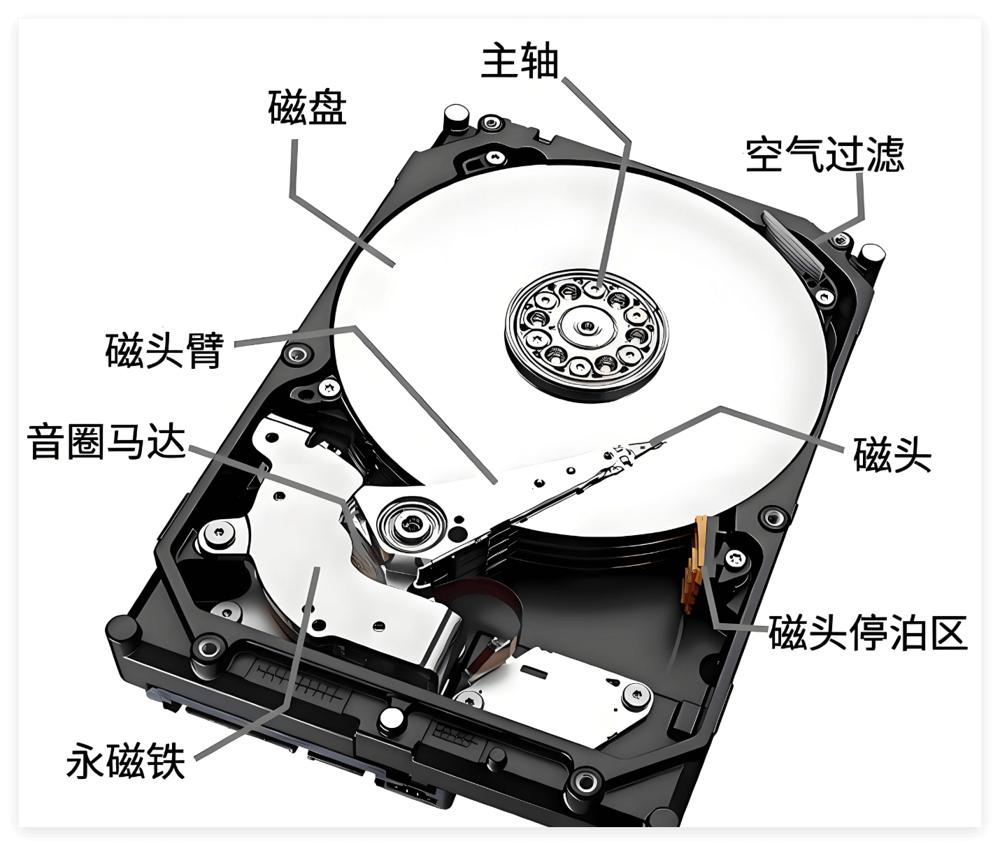

# 硬盘结构与工作原理

在 Linux 系统中，文件系统的构建与硬盘紧密相关。文件系统的管理机制依赖于硬盘的物理特性和存储结构，硬盘作为计算机存储数据的核心设备，承载着系统运行、应用程序安装以及用户数据存储等重要功能。

从存储介质的本质来看，硬盘可分为两大类别：

| 类型                              | 简介                                                                                                                                                   |
| --------------------------------- | ------------------------------------------------------------------------------------------------------------------------------------------------------ |
| 机械硬盘（HDD，Hard Disk Drive）  | 依赖磁性碟片存储数据，通过磁头感应碟片表面的磁场变化实现读写，其结构包含高速旋转的盘片、可移动的磁头臂等精密机械部件，数据的保存基于磁性材料的磁化状态 |
| 固态硬盘（SSD，Solid State Disk） | 则以闪存颗粒为存储介质，通过半导体电路中的电荷状态记录数据，内部没有机械运动部件，读写过程完全依赖电子信号的传输与转换                                 |

## 机械硬盘

机械硬盘（Hard Disk Drive，简称 HDD）是一种依赖 **机械结构** 和 **磁性** 存储原理工作的传统硬盘，也是计算机中最常见的外部存储设备之一。它的核心功能是通过磁性介质长期保存数据，即便断电后数据也不会丢失，这一点使其成为 Linux 等操作系统中存储系统文件、用户数据的关键载体。

> [机械硬盘是如何工作的？](https://www.bilibili.com/video/BV1ug411b7Wo/?spm_id_from=333.337.search-card.all.click)

### 硬件与物理结构

#### 硬件结构（实体硬件组件）

在 HDD 高度密封的无尘外壳内部，存在一系列可触摸的核心硬件组件，它们通过精密协作实现数据的机械读写，这些实体部件是硬盘物理形态的直接体现。

外部壳体：


| ​​组件名称​​ | ​​功能描述​​                       | ​​关键特性与原理​​                                                                                                           |
| ------------ | ---------------------------------- | ---------------------------------------------------------------------------------------------------------------------------- |
| 金属外壳     | 密封内部组件、防灰尘、提供物理保护 | 通常由铝合金或钢材制成；通过密封防止灰尘进入（灰尘可能导致磁头与盘片摩擦损坏），同时对内部精密部件形成物理防护，抵御外部冲击 |
| 接口面板     | 提供数据传输和电源连接接口         | 位于壳体侧面，包含数据接口（如 SATA、SAS，用于数据读写传输）和电源接口（提供 5V 和 12V 电压，为硬盘内部组件供电）            |

内部核心组件：



| ​​组件名称​​    | ​​功能描述​​                           | ​​关键特性与原理​​                                                                                                                                                                 |
| --------------- | -------------------------------------- | ---------------------------------------------------------------------------------------------------------------------------------------------------------------------------------- |
| ​主轴​​         | 带动盘片旋转的核心部件                 | 由无刷直流电机驱动，支持转速 5400/7200/10000/15000 RPM，转速越高，磁头在单位时间内扫描的磁道越多，数据读写速度越快。                                                               |
| ​磁盘（盘片）​​ | 存储数据的介质                         | 铝合金或玻璃陶瓷基板表面涂覆磁性层，数据以​ **​磁畴极性翻转**​ ​形式存储（不同磁化方向代表 0 和 1）；一块硬盘可能包含多个盘片，双面均有对应磁头，可双面存储数据                    |
| ​磁头​​         | 读取和写入磁盘数据                     | ​​每个盘片上下两面各对应一个，所有磁头通过磁头臂连接；工作时悬浮于盘片表面几纳米处（约头发丝直径万分之一），利用盘片旋转气流形成空气垫（空气动力学悬浮），避免与盘片摩擦造成磨损   |
| ​磁头臂​​       | 连接并固定所有磁头，带动磁头移动定位   | 为轻质合金悬臂结构，在音圈马达驱动下绕固定支点做弧形运动，带动磁头沿盘片径向移动，实现磁头对不同磁道的定位，完成不同位置数据的读写                                                 |
| ​音圈马达​​     | 驱动磁头臂运动，控制磁头寻道           | 利用通电线圈在磁场中受力原理（永磁铁提供强磁场，线圈通电产生洛伦兹力）；可快速、精确控制磁头臂摆动，使磁头迅速定位到指定磁道；性能直接影响寻道速度，寻道速度越快，数据读取效率越高 |
| ​磁头停泊区​​   | 硬盘非工作时磁头的安全停靠区域         | 位于盘片边缘，断电时由硬盘主控利用电机反激电压驱动音圈电机将磁头拉回此处，避免非工作状态下磁头意外接触数据存储区域，保护盘片和磁头，防止数据受损                                   |
| ​空气过滤​​     | 维持硬盘内部无尘环境                   | 硬盘为密封腔体，通过内部循环过滤（非持续进气），滤芯用分子筛材料拦截灰尘，防止微小颗粒导致磁头与盘片碰撞、划伤盘片及损坏数据                                                       |
| ​永磁铁​​       | 为音圈马达提供稳定磁场，辅助磁头臂移动 | 是音圈马达的重要组成，材质多为钕铁硼，磁场强度超 1 特斯拉；与音圈马达线圈配合，线圈通电时受磁场力作用，带动磁头臂精确移动，实现磁头在盘片上的寻道操作                              |

#### 物理存储结构（依赖硬件的物理划分）

物理存储布局指的是 HDD 中依赖磁片等实体硬件存在的、用于精确定位数据在盘片表面具体存储位置的物理划分规则。它是数据在硬件层面的「空间坐标系统」，通过对盘片表面进行标准化的磁性区域划分，确保数据能被磁头准确读写。


| 概念名称         | 物理形态与特性​                                                                                                                                                                         | ​​作用与工作原理​                                                                                                                                      |
| ---------------- | --------------------------------------------------------------------------------------------------------------------------------------------------------------------------------------- | ------------------------------------------------------------------------------------------------------------------------------------------------------ |
| 磁道（Track）    | 盘片高速旋转时，磁头在固定径向位置扫过的同心圆环轨迹。单盘片含数万条磁道。早期硬盘各磁道存储容量相同，现代采用​​区域位记录（ZBR）技术​​，因外圈磁道周长更大，可划分更多扇区提升存储效率 | 作为盘片空间划分的基础单位，将盘面分割为环形区域，为数据定位提供物理框架                                                                               |
| 扇区（Sector）   | 每条磁道被等分成的若干弧形段，是硬盘最小可寻址单元。传统大小为 512 字节，现代主流为 4096 字节（4K 扇区）。每个扇区除数据区外，包含校验码（ECC）用于错误检测与修复                       | 操作系统读写数据的基本单位。即使文件小于扇区大小，也需占用整扇区空间（可能造成空间浪费）；校验机制保障数据准确性，读写时通过 ECC 验证数据完整性        |
| 柱面（Cylinder） | 多盘片硬盘中所有相同半径磁道的集合，形成虚拟圆柱体结构。例如，3 盘片硬盘的所有第 2 号磁道共同构成第 2 号柱面。                                                                          | 磁头臂同步移动时，所有磁头同时定位到同一柱面。该设计大幅减少寻道时间——访问同一柱面内不同盘面数据只需切换磁头，无需重新移动磁头臂，显著提升连续读写效率 |

#### 逻辑结构（操作系统定义的逻辑划分）

逻辑结构（操作系统定义的逻辑划分）是操作系统为了简化数据管理、适配不同使用场景，在硬盘物理存储结构（磁道、扇区等）之上抽象出的一套「逻辑规则和单位」。它不直接对应硬盘的物理硬件形态，而是通过软件层面的定义，让用户和程序能更方便地存储、读取、管理文件。

| ​​概念​​                    | ​​定义​​                                                                                                                      | ​​作用与核心原理​​                                                                                                                                                                           |
| --------------------------- | ----------------------------------------------------------------------------------------------------------------------------- | -------------------------------------------------------------------------------------------------------------------------------------------------------------------------------------------- |
| ​簇 (Cluster)​​             | 操作系统分配文件时的最小逻辑单元，由一组连续的扇区构成。例如，一个簇可能包含 4 个扇区，总容量为 2048 字节                     | 通过将多个扇区组合成簇来减少操作系统管理文件时需处理的地址数量，从而提升效率。但文件会独占整个簇，即使其实际大小小于簇容量（如 1KB 文件占用 4KB 簇），也会导致剩余空间被锁定无法用于其他文件 |
| ​​分区 (Partition)​​        | 将物理硬盘的整个存储空间划分而成的独立逻辑区域。每个分区表现为一个独立驱动器（如 Windows 中的 C 盘、D 盘）                    | 实现数据隔离（例如操作系统文件与用户文档分属不同分区，便于重装系统而不影响数据），并允许在不同分区使用不同的文件系统（如 NTFS 和 FAT32）以满足兼容性或功能需求                               |
| ​分区表 (Partition Table)​​ | 位于硬盘起始区域（如 0 号扇区）的专用数据结构，用于记录硬盘分区布局的关键信息。主要有传统的 ​​MBR​​ 和现代的 ​​GPT​​ 两种标准 | 充当操作系统的分区导航地图。它明确记载了硬盘上每个分区的起始位置、结束位置、大小、活动状态以及使用的文件系统类型，使操作系统能够识别和访问各个分区                                           |
| ​​文件系统 (File System)​​  | 一套用于管理和组织分区内存储数据的软件规则与方法，常见类型包括 NTFS, FAT32, EXT4 等                                           | 负责管理磁盘空间：定义文件如何占用簇（通过索引表记录文件使用的簇地址链）、维护文件元数据（文件名、大小、创建时间、权限等）以及处理文件碎片（将物理不连续的数据块逻辑串联以提高读写效率）     |

### 寻址方式

机械硬盘（HDD）的寻址方式是指通过特定参数定位数据在物理存储介质上位置的方法，核心目标是让磁头准确找到需要读写的数据所在的物理区域。主要有两种经典方式：

- CHS 寻址（淘汰）
- LBA 寻址

二者本质是对同一物理位置的不同描述方式（前者基于硬件结构，后者基于逻辑编号）。

#### CHS（淘汰）

CHS 是早期硬盘广泛使用的寻址方式，它直接对应硬盘的物理结构，通过三个参数来定位数据：

- 柱面（Cylinder）
- 磁头号（Head）
- 扇区（Sector）

> [!TIP] 磁头号
> 磁头号是给这些实体磁头分配的唯一数字编号（通常从 0 开始），用于在逻辑层面区分不同的磁头。比如，硬盘若有 4 个磁头，它们的编号可能是 0、1、2、3，每个编号对应一个特定盘面的磁头。通过磁头号，硬盘控制器能快速确定应该调用哪个磁头，去读写对应盘面的数据。

硬盘控制器通过 CHS 三个参数的组合，精准定位数据位置：

1. 先通过 **柱面号** 移动磁头臂到对应径向位置（所有磁头同步移动，对准同一柱面的不同磁道）
2. 再通过 **磁头号** 选择对应的盘面（调用该磁头工作）
3. 最后通过 **扇区号** 等待磁盘旋转到目标扇区，完成数据读写

CHS 寻址是早期机械硬盘依赖物理结构的定位方式，其最大支持容量由三个核心参数的 **硬件限制** 共同决定：

- 磁头数：受限于 8 位二进制存储，最大支持 255 个（编号从 0 开始），对应硬盘中所有盘片的正反面读写磁头总数
- 柱面数：由 10 位二进制存储限制，最多支持 1023 个（编号从 0 开始），代表盘片上从外到内的磁道柱面总数
- 扇区数：通过 6 位二进制存储，单磁道最大支持 63 个扇区（编号从 1 开始），这是磁道上最小的物理存储分段单位

基于这些限制，CHS 寻址的最大理论容量可通过计算，若每个扇区容量为 512 字节（早期标准），则总容量为：

$$255（磁头）×1023（柱面）×63（扇区）×512 字节 $$

按计算机存储单位（1MB=1048576 字节）换算约为 **7.84GB**；而硬盘厂商常用的十进制单位（1MB=1000000 字节）则显示为约 **8.41GB**。

这一容量在早期足以满足需求，但随着硬盘技术发展很快成为瓶颈。

CHS 的设计基于「每个磁道扇区数固定」的假设，但硬盘物理特性决定了外圈磁道周长远大于内圈。若强制内外圈磁道划分相同数量的扇区，会导致外圈磁道的存储密度（单位长度存储的比特数）远低于内圈，造成大量物理空间浪费。例如，外圈磁道本可容纳 100 个扇区，却因 CHS 限制只能按内圈的 50 个扇区划分，直接损失一半存储潜力。

为突破这一限制，现代硬盘采用「等密度存储」原则（即单位长度存储的比特数相同），通过 ZBR（区域位记录）技术将盘片划分为多个区域，此时，硬盘不再具备实际的 CHS 物理参数，必须改用 LBA（逻辑块地址）这种线性寻址方式，将所有扇区按顺序编号，通过逻辑地址屏蔽物理结构差异，最终实现大容量存储的高效管理。因此，CHS 寻址逐渐被淘汰，成为硬盘技术发展中的历史产物。

> [!TIP] ZBR 技术
> ZBR 将硬盘盘片划分为多个同心的区域（Zones），每个区域内的磁道具有相同的扇区数量。由于外圈磁道周长更长，其扇区数量多于内圈区域，从而实现等线密度记录（即单位长度的磁道存储相同数据量），最大化利用盘片空间。
>
> 盘片从内到外被划分为多个环形区域（如 5-10 个），每个区域内的磁道扇区数相同。例如，内圈区域每磁道含 1000 个扇区，外圈区域可能含 2000 个扇区。外圈磁道因周长更长，每个扇区的物理长度更短，但数量更多，使得整个盘片的存储密度趋于一致，避免了传统硬盘中外圈磁道的空间浪费。硬盘控制器通过虚拟几何规格（如统一的柱面、磁头、扇区参数）向操作系统屏蔽物理区域差异，确保系统无需感知底层复杂结构即可正常读写。

#### LBA

LBA（Logical Block Addressing，逻辑块地址）是硬盘从物理寻址（CHS）过渡到逻辑管理的核心技术，其核心思想是用 **连续的线性编号** 替代复杂的物理参数（柱面、磁头、扇区），让硬盘的寻址和管理更适配大容量存储需求。

在 LBA 模式下，硬盘的所有扇区（存储的最小物理单位）被视为一个连续的「逻辑块序列」，从 0 开始按顺序编号（例如 0、1、2、…、N-1，N 为总扇区数）。

对操作系统和用户来说，访问硬盘时只需指定一个 LBA 编号，无需关心这个扇区具体在哪个柱面、由哪个磁头读取，物理位置的定位完全由硬盘内部的控制器（固件）完成。这种「逻辑-物理」的映射关系由硬盘厂商在出厂前写入固件，会根据盘片的物理结构（如 ZBR 划分的不同区域）动态调整，上层系统无需干预。

LBA 的最大支持容量取决于其编号的位数，随着存储技术发展，LBA 标准也在不断升级：

| LBA 标准 | 编号位数 | 最大支持扇区数             | 单扇区 512 字节时的最大容量 | 应用场景                          |
| -------- | -------- | -------------------------- | --------------------------- | --------------------------------- |
| LBA28    | 28 位    | 2^28 = 268,435,456         | 268,435,456 × 512B ≈ 137GB  | 早期 IDE 硬盘（1990 年代）        |
| LBA48    | 48 位    | 2^48 = 281,474,976,710,656 | 约 144PB（1PB=1024TB）      | 现代 SATA、NVMe 硬盘（2000 年后） |

LBA28 的 137GB 限制在 2000 年代初被突破后，LBA48 成为新标准，通过 48 位编号支持超大规模存储，至今仍在广泛使用。

最新的存储设备（如 NVMe SSD）虽物理结构与机械硬盘不同，但仍沿用 LBA 逻辑，只是「逻辑块」对应的物理单位从「扇区」变为「闪存页」。

### 工作原理与流程

机械硬盘（HDD）的核心是​​磁记录技术​​与​​精密机械工程​​的完美结合。它通过在高速旋转的​​盘片​​表面改变​​纳米级磁性颗粒​​的​​磁化方向​​（例如：向上代表 `1`，向下代表 `0`）来实现数据的​​非易失性​​永久存储。

- **写入基础**：​​​​写磁头​​通过其微小间隙处产生的​​强磁场​​，精确改变目标颗粒的磁化方向。
- **读取基础**：​​​​读磁头​​利用​​巨磁阻效应 (GMR)​​ 或更先进的​​隧穿磁阻效应 (TMR)​​ 感知颗粒磁化方向的微小差异，将其转化为电信号。

数据读取流程：

1. **指令接收与解析**：主机通过接口（如 SATA、SAS）向硬盘控制器发送读取指令，包含目标数据的​​逻辑块地址 (LBA)​​。控制器查询​​区域位记录 (ZBR)​​ 映射表等信息，将 LBA 转换为物理地址（即具体的​​柱面、磁头、扇区​​），精确定位数据在盘片上的存储位置
2. **磁头定位 （寻道 Seek）**：控制器驱动​​音圈电机，带动​​磁头臂组件​​径向移动，使目标​​读磁头​​精确移动到目标柱面（磁道）上方。移动过程中，磁头通过读取盘片上的​​伺服信息进行实时校准，确保定位精度。​​寻道时间​​（通常在 ​​3-10 毫秒​​范围）是 HDD 的主要性能瓶颈之一
3. **扇区对准 （旋转等待 Rotational Latency）**：​主轴电机​​驱动盘片组保持恒定高速旋转（常见转速如 ​​5400, 7200, 15000 转/分钟​​）。磁头到达目标磁道后，需等待​​目标扇区​​随盘片旋转至其正下方。​​平均旋转延迟​​等于盘片旋转半圈所需时间（例如：7200 RPM 时约 ​​4.17 毫秒​​），是 HDD 的另一个核心性能瓶颈
4. **数据读取与传输**：目标扇区到达时，读磁头利用 ​​GMR/TMR 效应​​感应磁性颗粒的磁化方向变化，产生极其​​微弱的电信号​​，信号经​​前置放大器​​初步放大，再通过​​滤波电路​​抑制噪声干扰。处理后的信号送入​​硬盘控制器​​进行​​解码​​（将模拟波形还原为原始二进制数据）和​​错误检测与纠正 (ECC)​，校验无误的数据通过​​缓存 (Buffer/Cache)​​ ，经由接口最终传输回主机，完成整个读取操作

数据写入流程：

写入流程的前三步（​​指令接收与地址解析​​、​​磁头定位（寻道）​​、​​扇区对准（旋转等待）​​）与​​数据读取流程​​完全一致。核心差异在于数据写入的执行阶段。

1. **数据编码与准备**：主机将待写入数据通过接口传输至硬盘控制器。控制器对数据进行​​编码​​（常采用 ​​游程长度受限码 (RLL)​​ 或其变种），优化数据在磁性介质上的记录效率和可靠性，并​​加入 ECC 校验码​​
2. **磁场写入**：当目标扇区旋转至写磁头正下方时，控制器根据编码后的信号向​​写磁头​​通入特定方向的电流。电流在写磁头间隙处产生​​强磁场​​，​​强制改变​​目标扇区下方​​磁性颗粒的磁化方向​​，从而记录下二进制 0 或 1
3. **验证与容错**​：写入完成后，控制器通常​​立即读取​​刚写入的数据进行验证。若读取验证失败（如 ECC 校验错误），控制器会尝试在该扇区​​重写数据​​。若多次重试仍失败，控制器会将该物理扇区​​标记为坏扇区​​，并将其逻辑地址​​透明地映射​​到预分配的​​备用扇区 (Spare Sector)​​ 上（对主机不可见）。控制器最终通过接口向主机返回「​​写入成功​​」信号

## 固态硬盘

> [用最好的动画为你讲解--固态硬盘 (SSD) 的原理](https://www.bilibili.com/video/BV1jDgtzEEVe/?vd_source=4ac5716eefbb5c628686d75dd158a468)

传统机械硬盘的运行机制高度依赖物理运动：主轴电机带动盘片高速旋转，磁头臂驱动磁头悬浮在盘片表面，通过移动到目标磁道和扇区完成数据读写。这种机械结构决定了其延迟无法突破物理极限。

固态硬盘（Solid State Drive，SSD）是一种完全依赖半导体芯片存储数据的设备，没有机械活动部件。它使用 NAND 闪存作为核心存储介质，通过电子信号读写数据，因此具备速度快、功耗低、抗震性强、无噪音等特性。SSD 广泛应用于操作系统盘、游戏设备、移动电脑及高性能服务器中，显著提升系统响应速度和流畅性。

其核心技术是闪存存储（NAND Flash），通过电荷的存储与读取实现二进制数据（0/1）的非易失性存储（断电后数据不丢失）。随着技术演进，SSD 的容量从早期的 GB 级提升至 TB 级，单位成本持续下降，逐渐替代 HDD 成为高性能存储的首选。


### 核心功能组件


这是 SSD 实现数据读写、存储、控制的核心部分，缺一不可：

| 组件类别 | 核心作用                                                      | 技术特点                                                                                                     | 功能作用                                                                            | 补充说明                                                                   |
| -------- | ------------------------------------------------------------- | ------------------------------------------------------------------------------------------------------------ | ----------------------------------------------------------------------------------- | -------------------------------------------------------------------------- |
| 主控芯片 | 相当于 SSD 的 CPU，统筹数据操作，决定性能、稳定性和寿命       | 需与闪存、缓存深度适配，算法优化直接影响读写速度与延迟，知名品牌有三星、马牌、群联等                         | 解析主机指令，管理数据存储位置，协调接口通信，执行磨损均衡、ECC 纠错与坏块管理      | 同硬件规格下，主控算法差异会导致明显性能差距，是 SSD 性能的核心驱动        |
| 闪存颗粒 | 核心存储介质，负责非易失性数据保存（相当于 HDD 的盘片）       | 按存储密度分为 SLC、MLC、TLC、QLC，密度越高成本越低但寿命与速度越弱，需先擦除再写入                          | 通过存储单元电荷状态表示 0/1，是数据的物理载体，其特性决定 SSD 的容量与基础性能上限 | 存储密度与成本、性能呈权衡关系，TLC 为当前消费级主流，QLC 多用于大容量存储 |
| 缓存颗粒 | 临时存储高频数据，减少闪存直接读写，提升响应速度              | 分为 DRAM 缓存（独立 DDR 芯片，速度快）与 SLC Cache（TLC/QLC 模拟，缓存满后掉速），低端产品可能省略独立 DRAM | 暂存高频访问数据与地址映射表，提升小文件读写与随机访问效率，减少闪存擦写压力        | 缓存规格直接影响短时间密集读写性能，中高端 SSD 依赖 DRAM 缓存提升响应速度  |
| 固件算法 | 协调硬件工作，优化性能、寿命与安全性，相当于是 SSD 的操作系统 | 需与主控、闪存深度匹配，核心包括磨损均衡、垃圾回收、ECC 纠错等，厂商通过更新持续优化                         | 均衡闪存磨损以延长寿命，提前擦除无效数据缓解掉速，修正数据错误并保障断电时数据安全  | 算法适配性决定 SSD 实际表现，建议定期更新固件（需备份数据）以优化性能      |

### 存储单元

SSD（固态硬盘）的存储单元是其数据存储的核心部件，基于 ​​NAND 闪存技术​​实现。而 NAND 闪存基于浮栅晶体管（Floating Gate Transistor） 的电荷存储特性实现数据存储，其核心原理可概括为「电荷捕获与释放」。

浮栅晶体管是改造版 MOSFET，在传统 MOSFET 基础上，用浮栅 + 控制栅替代单一栅极，形成双栅叠层结构。从上到下的关键层次：

> [!TIP] MOSFET
> MOSFET 是金属-氧化物-半导体场效应晶体管，可以通过电压控制电流的通断或大小，常用于集成电路（如芯片）、电源管理、射频电路等领域。


| 层次名称                            | 位置顺序   | 构成材料                                                  | 核心功能                                                                                                                                                                                                        |
| ----------------------------------- | ---------- | --------------------------------------------------------- | --------------------------------------------------------------------------------------------------------------------------------------------------------------------------------------------------------------- |
| ​控制栅 (Control Gate, CG)​​        | 最顶层     | 掺杂多晶硅                                                | 外部电压控制中心：编程 / 擦除时施加高电压（10-20V），读取时施加低电压（1-3V）；通过与浮栅的电容耦合形成强电场，精准调控电子隧穿方向；读取阶段，其电压与浮栅电荷共同调制沟道电流，间接反映浮栅电荷状态（数据值） |
| ​阻挡绝缘层 (Blocking Dielectric)​​ | CG 下方    | 高 K 介质（如 Al₂O₃、HfO₂）或 ONO 结构（SiO₂/Si₃N₄/SiO₂） | 双重隔离作用：物理隔离控制栅与浮栅，阻止电荷直接传导；高绝缘性（>10¹⁴Ω・ cm）确保浮栅电荷不泄漏，是实现非易失性存储的核心保障；增强电容耦合效率（比传统 SiO₂ 高 2-3 倍），降低控制栅工作电压                    |
| ​浮栅 (Floating Gate, FG)​​         | 阻挡层下方 | 导电材料 （通常是掺杂多晶硅）                             | 电荷存储核心：电子捕获量直接决定阈值电压（Vth）。存储电子越多，Vth 越高（代表数据 `0`）；电子越少，Vth 越低（代表数据 `1`）；完全被绝缘层包裹，无物理引线，通过电场间接与外部交互，保持电荷稳定性               |
| ​隧道氧化层 (Tunnel Oxide)​​        | FG 下方    |                                                           | ​​超薄 (≈7-10nm)​​ 高质二氧化硅 (SiO₂)                                                                                                                                                                          | 电荷隧穿通道：常态下高绝缘（阻止电荷泄漏）；编程 / 擦除时，高电压（±10-15V）下通过 F-N 隧穿效应（电子穿越绝缘层的量子现象）允许电子进出浮栅；缺陷率直接影响寿命（每 cell 可擦写 1 万 - 10 万次） |
| P 型硅衬底 (P-Si Substrate)​​       | 最底层     | P 型硅晶圆                                                | 器件结构载体：表面掺杂形成 N⁺源极 / 漏极（间距 <50nm），中间为沟道区；浮栅电荷通过电场调制沟道导电性（电荷多→沟道反型难→电流小，反之电流大），实现数据 `0`/`1` 的电学区分；与源极相连，提供电子来源（擦除时）。 |

#### 写入

在 NAND 闪存的存储机制中，写入操作是数据进入浮栅层的核心过程，依赖电压调控与量子效应实现。


写入的本质是「用高压电场让电子穿透绝缘层，被浮栅层捕获并长期留存」，从而实现写入。依赖两个关键物理机制：

- **Fowler-Nordheim 隧道效应**：极薄绝缘层（隧道氧化层，几纳米厚）在强电场下，允许电子「量子隧穿」穿过（无需完全克服绝缘层能量壁垒）；
- **电荷捕获与绝缘隔离**：浮栅层被二氧化硅（SiO₂）绝缘层包裹，电子进入后因无法逃逸，可长期保存（实现非易失性）。

写入操作是主控芯片与闪存晶体管协同完成电子「注入-锁定」的过程，通过 4 个核心步骤实现数据固化，本质是用电场调控电子运动并以电荷状态存储信息：

1. **电压分工**
   构建强电场环境，核心目标是通过精准电压分配，在隧道氧化层两端形成足以触发量子隧穿的强电场。各电极电压协同（以 3D NAND 为例）：
   - 控制栅极（CG）：主控通过 PMIC（电源管理模块）施加编程高压 Vpp（12-20V，依工艺而定），作为电场的正极，产生吸引电子的强正电场
   - 漏极（D）：施加辅助正电压（如 1-3V），作用是聚焦电场方向，使电场集中于隧道氧化层区域（减少边缘效应）
   - 源极（S）与衬底（B）：接地（0V），作为电场的负极，与控制栅形成 10-20V 的电压差，驱动电场线从控制栅→​阻挡绝缘层→浮栅→隧道氧化层→衬底，构成电子迁移的「势能梯度」。

   主控需根据闪存芯片规格（如隧道氧化层厚度、浮栅材料）动态调整 Vpp 值，避免过压击穿绝缘层或欠压导致隧穿失败。

2. **电子隧穿**

   穿透绝缘层的量子跃迁（物理机制的核心）。电子来源于衬底的 P 型硅，因控制栅低压预开启（写入前的准备步骤），沟道区已反型为 N 型导电层，积累了大量自由电子（来自源极注入和热激发）。

   在强电场作用下，隧道氧化层的能量壁垒被「压缩」，电子无需完全克服 9eV 的绝缘层势垒，通过 Fowler-Nordheim 量子隧穿效应（概率性穿过势垒）从沟道区向浮栅迁移。隧穿电子的能量由电场加速获得，速度随 Vpp 升高而加快（电压越高，单位时间隧穿的电子越多）。

   此过程的关键条件是隧道氧化层的超薄特性，厚度超过 10nm 时，隧穿概率趋近于零，同时主控需对 Vpp 进行精准时序控制（如施加时长 1-10μs），确保电子注入量符合数据需求。

3. **电荷捕获**

   浮栅层的电子牢笼（非易失性的保障）。浮栅由掺杂多晶硅（导电材料）构成，被上层阻挡绝缘层（ONO 或高 K 介质）和下层隧道氧化层完全包裹，形成与外界无导电通路的封闭空间。

   进入浮栅的电子因绝缘层的高阻特性无法逃逸，既不能向上穿透阻挡层到达控制栅，也不能向下返回衬底。浮栅内积累的负电荷会形成反向电场，与控制栅的正电场逐渐平衡，最终停止电子注入（自限性过程）。

   绝缘层的电荷阻挡能力使电子在断电后仍能稳定留存（常温下年泄漏率 < 0.1%），这正是数据非易失性的本质，可保障数据保存数年至数十年。

4. **数据编码**

   用电子数量定义 `0` 和 `1`（信息的物理映射）。浮栅中的电子数量直接改变晶体管的阈值电压（Vth），电子越多，Vth 越高（开启晶体管需要更高的控制栅电压）。

   二进制映射规则为：写入 `0` 时，主控延长 Vpp 施加时间（或提高电压），使浮栅捕获大量电子，Vth 显著升高（如从 1V 升至 5V）；原始 `1` 为擦除后状态，浮栅电子极少（或为空），Vth 保持较低水平（如 1V 左右），若需主动写入 `1`，主控不施加 Vpp，浮栅维持低电子状态。

   写入后，主控通过施加读取电压（2-5V）检测沟道电流，电流小（Vth 高）对应 `0`，电流大（Vth 低）对应 `1`，以此确保编码准确。

整体而言，写入过程是「电场驱动-量子隧穿-绝缘锁定-电压编码」的完整链条：

- 高压 Vpp 是「动力」：创造强电场，让电子突破绝缘层
- 浮栅层是「存储容器」：依靠双重绝缘层实现电子的长期保存
- 阈值电压差异是「编码载体」：将电子数量转化为可识别的二进制信息

#### 擦除

NAND 闪存的擦除操作是写入的逆过程，核心目标是「清空浮栅层的电子，恢复数据默认状态（逻辑 1）」。


擦除的本质是「用反向高压电场，让浮栅层的电子穿过隧道氧化层，返回衬底」 ，依赖两个关键条件：

- **反向隧道效应**：与写入时的电子隧穿方向相反（写入是「电子从衬底→浮栅」，擦除是「电子从浮栅→衬底」）；
- **电荷释放**：利用强电场打破浮栅层的「绝缘陷阱」，让电子逃逸并被衬底回收。

擦除需主控芯片重新分配电压，驱动浮栅层电子「反向隧穿」，分 4 步完成：

1. **反向电场驱动**：

   构建反向强电场。核心是通过电压重构，在隧道氧化层两端形成与写入操作方向相反的强电场，为电子反向迁移提供动力。各电极电压协同逻辑为：

   - 衬底（基极 B）由主控通过 PMIC 施加擦除高压 Vpp（12-20V，与写入电压相当），作为电场的正极，产生吸引电子的强正电场
   - 控制栅极接地（0V），作为电场的负极，与衬底形成 12-20V 的反向电压差，驱动电场线从衬底→隧道氧化层→浮栅→阻挡绝缘层→控制栅极，构成电子从浮栅向衬底迁移的「势能梯度」
   - 源极（S）和漏极（D）通常同时接地，作用是稳定衬底电势，避免边缘电场干扰，确保电场集中于隧道氧化层区域

   主控需根据闪存块的物理特性（如氧化层老化程度）微调 Vpp，平衡擦除效率与器件寿命。

2. **双向隧穿通道**

   反向隧穿的量子回归。浮栅层中存储的电子（写入阶段捕获的负电荷）在反向强电场作用下被激活：电场力推动电子获得足够能量，使隧道氧化层的势垒再次被 压缩，电子通过 Fowler-Nordheim 反向量子隧穿效应，从浮栅层穿透隧道氧化层向衬底迁移。

   这一过程与写入时的隧穿方向完全相反（写入是从衬底到浮栅，擦除是从浮栅到衬底）。关键条件与写入操作一致：隧道氧化层的纳米级厚度是反向隧穿的物理基础，过厚会导致电子逃逸困难；Vpp 需维持足够时长（通常 10-100μs，长于写入时间），确保浮栅中绝大多数电子（>99%）能成功逃逸。

3. **电荷完全释放**

   浮栅层的电子释放。随着电子持续向衬底迁移，浮栅层的负电荷密度逐渐降低，其对沟道区的压制作用（写入时因负电荷导致的阈值电压升高）逐渐消失：当浮栅中剩余电子数量低于阈值（通常仅残留少量无法隧穿的「顽固电荷」），晶体管的阈值电压恢复至初始水平（与擦除前的 `1` 状态一致）。

   此阶段存在自加速效应：浮栅中剩余电子越少，反向电场对其的驱动力越强，加速剩余电荷释放，直至浮栅接近电中性（实际仍有极少量电子，但不影响数据状态判定）。

4. **块级状态重置**

   恢复可写入的干净状态。擦除完成后，整个闪存块（擦除的最小单位，包含数千个存储单元）的所有浮栅均回归低电子状态，对应逻辑 `1` 的默认值。

   这是 NAND 闪存「先擦后写」特性的核心（写入只能将 `1` 改为 `0`，而擦除是将 `0` 恢复为 `1`）。

   主控通过擦除验证流程确认效果：向控制栅施加读取电压，检测所有单元的沟道电流是否均达到 `1` 状态的阈值（电流较大），若存在未完全擦除的单元（电流偏低），主控会触发重试擦除（提高 Vpp 或延长时间）；验证通过后，主控更新 FTL 映射表，将该块标记为空闲，纳入可写入的物理资源池，等待新数据写入。 

> [!TIP] NAND 闪存必须擦除的原因
> NAND 闪存基于浮栅晶体管存储数据，存储单元中的电子数量和状态决定了存储的数据。写入操作是通过向控制栅施加高电压，使电子穿过隧道氧化层进入浮栅层。但由于浮栅层被绝缘层包裹，不能直接覆盖写入 。如果要更新存储单元的数据，且该存储单元中已经存有电子（对应逻辑 0），就必须先将浮栅层中的电子释放回衬底（擦除操作），使存储单元恢复到初始状态（逻辑 1），才能进行新数据的写入。
>
> 而机械硬盘使用磁性涂层的盘片来存储数据，通过磁头改变盘片上磁性颗粒的方向来记录数据。写入数据时，磁头可以直接改变对应位置磁性颗粒的方向，覆盖原来的数据 ，不需要提前擦除原有数据，因为磁性颗粒的磁化方向可以直接被重新定向。

#### 总结

从浮栅晶体管的写入与擦除机制来看，写入前的擦除操作是数据可靠存储的必要前提，这一特性深深植根于 NAND 闪存的物理原理中。

可以将浮栅层想象成一个「电子容器」：若容器中残留着上一次存储的电子（未擦除状态），新写入时注入的电子会与残留电子叠加，导致总数量超出精准控制范围。例如：

- 若某单元原本存储 `0`（含 1000 个电子），未擦除直接写入新 `0`（需再注入 500 个电子），最终 1500 个电子会使阈值电压远超预期，导致读取时误判
- 若写入 `1`（需保持低电子状态），残留电子会让阈值电压偏高，同样造成数据错误。

因此，必须通过擦除操作，用反向电场将浮栅层中多余的电子尽可能彻底地释放出来，让存储单元回到电子数量可精准调控的初始状态（接近无电子）。只有这样，后续写入时才能通过控制电压时长和强度，让浮栅层的电子数量严格对应 `0`（多电子）或 `1`（少电子）的逻辑状态，确保数据编码的准确性。

但擦写操作并非无损耗，其物理本质是电子反复穿透隧道氧化层（SiO₂），而每次隧穿都会对氧化层造成微观损伤：电子的高能运动可能打破氧化层中的硅氧键，形成微小缺陷（如氧空位）。

随着擦写次数增加，这些缺陷不断累积，会导致隧道氧化层的绝缘性能逐渐下降，表现为局部区域变薄或出现漏电通道。当损伤达到临界值，电子会出现失控：该留存的电子（写入后）可能通过缺陷泄漏，该逃逸的电子（擦除时）可能被缺陷捕获，最终导致阈值电压无法稳定控制。此时，数据会出现静默错误（如 bit 位无规律反转），严重时整个存储单元失效（成为坏块）。

因此，硬件厂商会为不同类型的 NAND 闪存定义最大擦写次数（P/E Cycle）：

- SLC（单层存储单元，1bit / 单元）：结构简单，电子数量控制难度低，可承受约 10 万次擦写；
- MLC（多层存储单元，2bit / 单元）：需区分 4 种阈值电压区间，对氧化层稳定性要求更高，寿命约 1 万 - 3 万次；
- TLC（三层存储单元，3bit / 单元）：需划分 8 个阈值区间，区间宽度仅为 SLC 的 1/7，对缺陷更敏感，寿命约 3000-5000 次；
- QLC（四层存储单元，4bit / 单元）：进一步压缩阈值区间，寿命通常在 1000-3000 次。

超过额定次数后，氧化层损伤累积会导致错误率飙升，超出 ECC 纠错能力范围。为缓解这一问题，SSD 的 FTL（闪存转换层）算法会通过「磨损均衡」技术动态分配擦写次数：将写入操作均匀分摊到所有存储块，避免某一区域因频繁擦写过早失效；同时，通过「坏块管理」机制标记失效单元，确保数据避开这些区域。这些软件策略虽不能阻止物理损伤，却能最大化利用闪存的生命周期，平衡容量、性能与可靠性。

从本质上看，NAND 闪存的「擦写损耗」是量子隧穿技术的固有代价，为了实现非易失性存储，必须接受绝缘层在电子反复冲击下的老化。而 SLC 到 QLC 的演进，则是容量与寿命之间的持续权衡，每一次比特密度的提升，都伴随着对物理极限的更逼近。

#### 页（Page）

页是 NAND 闪存中最小的 **读写单位**。不同类型的 NAND 闪存以及不同的生产工艺，会使得页的容量有所差异，常见的页容量有 4KB、8KB、16KB 等，并且随着技术的发展，页的容量也在逐渐增大。例如，一些现代的 TLC 或 QLC NAND 闪存，其页容量可能达到 16KB 甚至更大 。

**物理构成与容量**：

页由大量浮栅晶体管（存储单元，Cell） 组成，这些晶体管通过共享字线（Word Line）和位线（Bit Line）形成电路 **阵列**。容量通常为 4KB、8KB、16KB 或更大（随制程升级增大），其中页主要包含两部分：

| ​​区域                 | ​功能                                                                                | ​占比（示例）​​           |
| ---------------------- | ------------------------------------------------------------------------------------ | ------------------------- |
| ​​数据区（Data Area）  | 存储用户数据                                                                         | 主容量（如 16KB）         |
| ​​额外区（Spare Area） | 存储​​ECC 校验码​​（128B/512B）、​​坏块标记​​（8B）、​​逻辑地址映射​​（16B）等元数据 | 固定配比（通常 4KB:128B） |

*额外区不可直接寻址，由主控固件自动管理，确保数据可靠性与坏块隔离。*

页是 NAND 闪存最小的读写单位，其存储单元数量由页容量和单个单元可存储的比特数（即存储类型）决定，以常见的 16KB（16×1024=16384 字节）物理页为例：

- 1 字节 = 8 比特，因此 16KB 的页总存储容量为 $16384×8=131072$ 比特（bit）
- 单个浮栅晶体管能存储的比特数，由存储类型决定，公式如下（`n` 表示每单元比特数）：

$$\frac{16×1024×8}{n}个单元$$

- SLC（单层存储单元）：1 个单元存 1bit，因此 16KB 页需要的单元数量 = $总比特数 ÷1=131072$ 个
- MLC（多层存储单元）：1 个单元存 2bit，因此单元数量 = $131072÷2=65536$ 个
- TLC（三层存储单元）：1 个单元存 3bit，单元数量 ≈ $131072÷3≈43691$ 个（需向上取整以满足容量）
- QLC（四层存储单元）：1 个单元存 4bit，单元数量 = $131072÷4=32768$ 个

**字线和位线：**

存储单元通过字线（Word Line）和位线（Bit Line）组成阵列，字线连接同一页内所有单元的控制栅极（用于选中整页），位线连接每个单元的漏极（用于传输数据信号），形成类似「网格」的电路结构。例如：

```plaintext
           Word Line (WL)
             │
             ├── Cell₁₁ ──── Cell₁₂ ──── ... ──── Cell₁ₙ → 构成一行（一页）
             │      │           │                  │
Bit Line (BL)├── Cell₂₁ ──── Cell₂₂ ──── ... ──── Cell₂ₙ
             │      │           │                  │
             ...   ...         ...                ...
```

字线连接该行所有存储单元的控制端（如 NAND 闪存中晶体管的控制栅极）。当给某条字线施加特定电压时，会激活该行所有单元，使其与位线建立电连接，为后续读写操作做准备。不同字线彼此独立，选中某条字线时，其他字线不受影响（避免干扰其他页）。

*例如，在 NAND 中，若要读取「页 2」的数据，只需给」字线 2」加电压，即可选中页 2 的所有单元。*

由于一条字线对应一整行（页），读写操作必须以页为单位（至少选中一整行），因此字线是页作为最小读写单位的硬件基础。

而位线是纵向导线，每一条位线对应存储阵列中的一 列存储单元，负责传输单个单元的数据信号。位线连接该列所有存储单元的数据端（如 NAND 中晶体管的漏极），在读写时承担信号传输：

- 读取时：通过检测位线上的电流/电压变化，判断对应单元的存储状态（如 NAND 中 `0` 或 `1`）。
- 写入时：通过位线施加特定电压，改变单元的存储状态（如向 NAND 的浮栅中注入/抽出电子）。

单条位线无法单独定位单元，需与字线配合：字线选行，位线锁定列，交叉点即为目标单元。

*例如，字线 1（选中页 1）+ 位线 3（选中第 3 列），即可定位 `Cell₁₃` 这个单元。*。

#### 块（Block）

块（Block） 是由多个页（Page）组成的更高层级存储单元，是 **数据擦除** 的最小操作单位。

```plaintext
         块（Block）→ 最小擦除单位
┌─────────────────────────────────────────┐
│       WL₁ ──┬───◯───◯─── ... ──◯─────┤  ← 页₁（字线水平贯穿）
│       WL₂ ──┼───◯───◯─── ... ──◯─────┤  ← 页₂
│       ...   │   │    │           │      │
│       WLₙ ──┴───◯───◯─── ... ──◯─────┤  ← 页ₙ
│                 │    │           │      │
│ BL₁ ────────────┘    │           │      │
│ BL₂ ─────────────────┘           │      │  ← 位线垂直贯穿（每列独立）
│ ...                              │      │
│ BLₘ ─────────────────────────────┘      │
│                                         │
│ ┌────────────────────────────────────┐  │
│ │        公共源线（SL）              │  │  ← 所有单元源极并联
│ └────────────────────────────────────┘  │
└─────────────────────────────────────────┘
```

**物理构成与容量**：

块作为 NAND 闪存中擦除操作的基本单元，其物理构成以页的堆叠为核心。一个块由连续的多个页组成，具体数量因闪存类型（SLC、MLC、TLC、QLC）和制程工艺而异，常见规格包括 64 页、128 页或 256 页，容量直接由页容量与页数量的乘积决定。块容量公式​​：

$$块容量=页容量×页数$$

*例如，采用 521 页设计的块，若单页容量为 16KB，则该块的总容量为 512 × 16KB = 8192KB（即 8MB）。*

从电路结构来看，块内的所有页共享关键物理线路：

- 一方面，所有存储单元的源极连接至同一条公共源线（Source Line），形成统一的电流回路，为擦除时的反向电场提供通路
- 另一方面，整个块的存储单元共用同一个衬底（硅基底），这一设计使得擦除高压可同步作用于块内所有单元，是实现批量擦除的硬件基础

这种多页共享源线与衬底的结构，既保证了块级操作的高效性，也从物理层面限定了块作为最小擦除单位的不可分割性。

**擦除机制与物理约束**：

块之所以成为 NAND 闪存中最小的擦除单位，本质源于其共享衬底的电路设计，擦除操作需要向衬底施加高压（Vpp，12-20V），同时将所有页的字线接地，形成从衬底到控制栅极的反向强电场，使浮栅层中的电子通过隧道氧化层反向隧穿至衬底，实现电荷清空。

由于同一块内的所有单元共享衬底，高压可均匀作用于整个块，确保所有页的单元同步释放电子；若不同块共享衬底，则擦除时的高压会无差别影响相邻块，导致非目标数据被误清除，因此块必须作为独立的擦除单元存在。

从时间成本来看，单块擦除耗时显著长于页的读写操作（通常为毫秒级，是页写入时间的 10-100 倍）。这是因为擦除需要更复杂的电压调控（如逐步提升电压以确保电荷完全释放），且需覆盖块内所有单元。

块的容量大小直接影响擦除延迟，大容量块（如 256 页）单次擦除耗时更长，但因总数据量更大，单位数据的擦除效率更高，且长期使用中总擦除次数更少，有利于平衡性能与寿命。

而块的寿命核心指标是擦写次数（P/E Cycle），每完成一次「擦除-写入」循环，块内所有单元的隧道氧化层都会积累微观损伤（如硅氧键断裂），当损伤达到临界值，电子会出现随机泄漏，导致数据错误率飙升。不同类型的 NAND 闪存额定擦写次数差异显著：SLC 因结构简单（1bit / 单元）可承受约 10 万次，MLC（2bit / 单元）约 1 万 - 3 万次，TLC（3bit / 单元）约 3000-5000 次，QLC（4bit / 单元）则低至 1000-3000 次。为延长整体寿命，FTL 的磨损均衡算法会动态分配擦写操作，确保各块的擦写次数差异控制在 10% 以内，避免局部块因过度使用提前失效。

**块与页的操作依赖及对性能的影响**：

块与页的操作存在严格依赖关系，页是最小读写单位，而块是最小擦除单位，因此写入新数据时：

- 若目标块仍有空闲页，可直接写入
- 若块内所有页均已写满（无空闲空间），则需先执行垃圾回收，将块内的有效数据迁移至新的空闲块，再擦除原块使其恢复为空闲状态，最后写入新数据

这一先擦除再写入的过程会导致写放大现象，实际写入闪存的物理数据量大于用户请求的逻辑数据量。例如，迁移 1GB 有效数据可能需要写入 2GB 物理空间）。

而块的大小与页数量直接影响写放大系数，块越大，单次垃圾回收需迁移的有效数据越多，但因块内可容纳的数据量更大，总擦除次数减少，长期来看写放大通常更低。

块的规格对存储性能的影响体现在多方面：

- 页容量越大，单次连续读写的数据量越大，有利于提升大文件传输速度，但小文件随机写入时需填充更多无效数据（如 4KB 文件写入 16KB 页会浪费 12KB 空间），效率下降
- 块容量越大，擦除次数减少可降低写放大，但垃圾回收时有效数据迁移量增加，可能延长回收耗时，尤其在碎片化严重的场景下（如频繁写入小文件），会导致性能波动

因此，块与页的规格设计需在容量、性能、寿命之间找到平衡，这也是不同类型 NAND 闪存（如企业级与消费级）选择差异化参数的核心原因。

**块在存储层级中的定位：**

块是 NAND 闪存层级结构中的关键一环，其上下层级关系为：

1. 浮栅晶体管（Cell）组成页（Page）
2. 多个页堆叠成块（Block）
3. 多个块构成平面（Plane）
4. 平面集成于芯片（Die）
5. 最终多个芯片封装为闪存颗粒-+

这种层级结构既实现了存储密度的最大化（通过纳米级工艺缩小单元尺寸），也通过块与平面的并行操作（如多块同时擦除）提升了整体性能，是现代大容量存储设备（如 SSD、U 盘）能够高效工作的底层基础。

### FTL

FTL（Flash Translation Layer，闪存转换层）是基于 NAND 闪存的存储设备中至关重要的核心组件，负责解决闪存（NAND Flash）的物理特性与计算机文件系统之间的不兼容性问题。

NAND 闪存的物理特性与文件系统的操作逻辑存在根本冲突，这是 FTL 必须存在的核心原因：

| 冲突类型       | 文件系统（操作系统）的操作逻辑                                                           | NAND 闪存的物理特性                                                                                                                                                                                 | FTL 的解决机制                                                                                                             |
| -------------- | ---------------------------------------------------------------------------------------- | --------------------------------------------------------------------------------------------------------------------------------------------------------------------------------------------------- | -------------------------------------------------------------------------------------------------------------------------- |
| 操作单位不匹配 | 以扇区（通常 512B 或 4KB）为最小读写单位，支持随机读写、覆盖写入（直接在原位置更新数据） | 最小写入单位是页（通常 4KB~16KB），最小擦除单位是块（由多个页组成，通常 64~256 页），且不能直接覆盖写入，若要更新某页数据，需先将新数据写入其他空闲页，标记原页为无效，最后通过擦除块释放无效页空间 | 逻辑地址（LBA）与物理地址（PBA）映射；重定向写入（新数据写入空闲页，更新映射表）；垃圾回收（回收无效页，擦除旧块释放空间） |
| 寿命限制       | 无擦写次数限制（理论上可无限次覆盖写入）                                                 | 每个块有擦除次数上限（如 SLC 约 10 万次，MLC 约 1 万次，TLC 约 1000 次），超过后无法稳定存储数据                                                                                                    | 磨损均衡（均衡分配各物理块的擦写次数，避免某块过度使用）                                                                   |
| 坏块问题       | 假设存储介质无坏块，可直接读写所有地址                                                   | 存在初始坏块，使用中会因磨损产生新增坏块，坏块无法可靠存储数据                                                                                                                                      | 坏块管理（识别并屏蔽坏块，用备用块替代）                                                                                   |

FTL 的核心任务就是通过一系列机制，屏蔽这些物理限制，让闪存设备对操作系统呈现出可随机读写、可覆盖写入、稳定可靠的逻辑存储接口。

#### 地址映射

这是 FTL 最基础也最核心的功能，是 SSD 能够被操作系统正常识别的前提。

操作系统和应用程序对存储设备的访问始终基于逻辑块地址（LBA）。这是一种抽象的、连续的地址空间，完全不涉及物理存储细节。但 NAND 闪存的实际数据存储依赖于物理块地址（PBA），其结构由闪存芯片的物理特性决定（如块、页的划分），且地址空间可能因坏块、磨损等因素不连续。

FTL 需要维护一张动态更新的「逻辑-物理」地址映射表，记录每个 LBA 与实际存储位置（PBA）的对应关系。例如：

- 当用户首次写入数据到 `LBA 0x500` 时，FTL 会在闪存中分配一个空闲的物理页（如 `PBA 0xABC`），并在映射表中记录 `LBA 0x500` → `PBA 0xABC`
- 后续读取 `LBA 0x500` 时，FTL 会自动查询映射表，将逻辑地址转换为物理地址，直接读取 `PBA 0xABC` 的数据
- 若数据被修改，新数据会写入新的物理页（如 `PBA 0xDEF`），映射表会更新为 「`LBA 0x500` → `PBA 0xDEF`」，原 `PBA 0xABC` 则标记为无效。

映射表的管理直接影响 SSD 性能，现代 FTL 通常采用页级映射（每个逻辑页对应一个物理页），虽能最大化读写灵活性，但映射表体积较大（例如 1TB SSD 的页级映射表可能占用数 10MB 内存），因此需要结合缓存、分段存储等技术优化。

#### 重定向写入

NAND 闪存的硬件特性决定了它无法像传统硬盘那样直接覆盖写入，这一限制完全依赖 FTL 的重定向写入机制破解。

NAND 闪存的存储单位从大到小为块（Block）→ 页（Page）：

- 页是最小写入单位（通常 4KB~16KB），但只能写入空白区域（未被使用或已擦除的区域）
- 块是最小擦除单位（一个块包含 64~256 个页），若要修改某页的数据，必须先擦除整个块（耗时远长于写入，通常为毫秒级），否则会导致数据错误

FTL 的解决方案是重定向写入：当操作系统要求覆盖某 LBA 的数据时（例如修改文件中的某段内容），FTL 不会尝试擦除原物理块，而是直接将新数据写入一个空闲的物理页。同时更新映射表，让该 LBA 指向新的物理页，原物理页则被标记为「无效」（不再被访问）。

这一过程对操作系统完全透明，使其认为数据是直接覆盖在原位置的，从而兼容传统文件系统的操作逻辑。

假设初始状态下，用户曾向逻辑地址 `LBA 0x500` 写入过数据，此时 FTL 的映射表中记录的对应关系是 `LBA 0x500` → `PBA 0xDEF`（即 `LBA 0x500` 的数据实际存储在物理页 `PBA 0xDEF` 中，且该页状态为「有效」）。

当用户需要修改 `LBA 0x500` 的数据时（比如更新文档中的某段内容），操作系统会发出「覆盖写入 `LBA 0x500`」的指令。但由于 NAND 闪存无法直接覆盖原物理页（需先擦除整个块，耗时较长），FTL 会执行以下操作：

1. 在闪存中找到一个空闲的物理页（例如 `PBA 0xGHI`，状态为「空闲」）
2. 将新数据写入 `PBA 0xGHI`
3. 更新映射表，将 `LBA 0x500` 的对应关系改为 `LBA 0x500` → `PBA 0xGHI`（此时 `PBA 0xGHI` 状态变为「有效」）
4. 同时将原物理页 `PBA 0xDEF` 标记为「无效」（因其数据已被新页替代，不再被 `LBA 0x500` 引用）

最终结果操作系统认为数据直接覆盖在了 `LBA 0x500` 原位置，而实际物理层面，新数据存储在 `PBA 0xGHI`，旧数据所在的 `PBA 0xDEF` 则成为无效页，等待后续垃圾回收时随块擦除。整个过程避免了立即擦除块的耗时操作，显著提升了响应速度。

#### 垃圾回收

随着重定向写入的频繁发生，闪存中会积累大量无效页（被新数据替代的旧页），若不及时清理，可用空间会逐渐耗尽，最终导致写入性能骤降。FTL 的垃圾回收机制专门用于解决这一问题。

其核心流程是 **回收无效空间，释放可用块**：

1. 扫描识别脏块：FTL 定期或在空闲时扫描所有物理块，筛选出脏块，即包含大量无效页（通常无效页占比超过阈值，如 50%）的块
2. 迁移有效数据：将脏块中剩余的有效页（仍被映射表引用的数据）复制到一个新的空闲块中，并更新映射表，确保这些有效数据的逻辑地址指向新的物理位置
3. 擦除脏块：完成有效数据迁移后，擦除整个脏块，使其变为空白块（可重新用于写入），从而释放存储空间

垃圾回收的挑战在于平衡性能与效率：

- 若 GC 过于频繁，会占用闪存带宽和 CPU 资源，影响用户操作的响应速度
- 若 GC 触发过晚，可用空间不足时可能导致写放大（为写入少量数据而需要迁移大量有效页），进一步降低性能

因此，现代 FTL 会结合负载情况动态调整 GC 策略（如空闲时主动 GC、高负载时延迟 GC），并通过「磨损均衡」协同优化。

#### 磨损均衡

NAND 闪存的擦写次数有限（SLC 约 10 万次，MLC 约 1 万～3 万次，TLC 约 3000~1 万次，QLC 约 1000 次），超过上限后块会失效。若某些块因频繁写入被过度擦写（如操作系统的临时文件区、日志文件），会导致 SSD 提前报废。FTL 的磨损均衡功能通过算法均衡各块的擦写次数，最大化 SSD 寿命。

其核心策略包括：

- 动态磨损均衡：优先选择擦写次数少的块分配给新写入的数据，避免某块被频繁使用
- 静态磨损均衡：对于长期不修改的静态数据（如系统文件、存档文件），定期将其迁移到擦写次数较多的块中，释放擦写次数少的块用于存储动态数据（频繁修改的数据）
- 预留块调度：SSD 通常会预留一部分备用块（约 7%~20%），当某块擦写次数接近上限时，用备用块替代，并将其数据迁移到新块，避免失效块影响整体可用性。

*例如：若块 A 已被擦写 8000 次（接近 MLC 的 1 万次上限），块 B 仅被擦写 1000 次，FTL 会优先将新数据写入块 B，同时将块 A 中的静态数据迁移到其他旧块，让块 A 退休，从而平衡整体磨损。*

#### 坏块管理

NAND 闪存的生产过程中无法完全避免初始坏块（出厂时就存在的不可靠块），且使用中会因磨损、电压波动等产生新增坏块。这些坏块无法可靠存储数据，若被误用于读写，会导致数据错误甚至丢失。FTL 的坏块管理机制负责识别、屏蔽坏块，并保障数据可靠性。

其核心流程包括：

1. 坏块检测：通过「写入-验证」机制检测坏块，对块写入测试数据后读取验证，若出现错误或不稳定，则标记为坏块
2. 坏块屏蔽：将识别出的坏块加入坏块列表，永久排除在地址映射和数据分配之外，确保操作系统和用户无法访问
3. 备用块替换：当坏块数量增加时，启用预留的备用块替代坏块，维持可用存储空间的总量稳定
4. 数据恢复：若某块在使用中突然失效（变为坏块），FTL 会通过 ECC（错误校验码）检测数据完整性，并尝试从冗余副本（部分 SSD 支持）或最近的有效迁移记录中恢复数据，避免丢失

*例如：SSD 出厂时检测到 10 个初始坏块，FTL 将其加入坏块列表；使用 3 年后又产生 5 个新增坏块，FTL 会启用 15 个备用块替代，确保用户仍能使用完整的标称容量，且数据存储不受影响。*

#### 块/页状态管理

NAND 闪存的每个块和页在生命周期中会处于不同状态，FTL 需要实时追踪、标记和更新这些状态，才能确保地址映射准确、垃圾回收高效、磨损均衡合理。其核心作用是为所有物理存储单元建立状态标签，让 FTL 的其他机制能快速识别可用资源、无效数据和待处理对象。

FTL 会为每个页和块标记明确的状态，常见分类包括：

| 页状态名称      | 说明                                                                               |
| --------------- | ---------------------------------------------------------------------------------- |
| 空闲（Free）    | 未被写入任何数据的空白页，可直接用于新数据写入                                     |
| 有效（Valid）   | 已写入数据，且仍被逻辑地址（LBA）引用（即映射表中该页是某 LBA 的当前对应物理位置） |
| 无效（Invalid） | 曾写入数据，但已被新数据替代（映射表中该页不再对应任何 LBA），仅等待垃圾回收清理   |

| 块状态名称          | 说明                                                             |
| ------------------- | ---------------------------------------------------------------- |
| 空闲块（Free        | 所有页均为空闲状态，可直接分配用于新数据写入                     |
| 活跃块（Active      | 包含有效页和部分空闲页，仍可继续写入新数据（直到所有页被占满）   |
| 脏块（Dirty Block） | 包含大量无效页（通常占比超过阈值，如 80%），是垃圾回收的主要目标 |
| 坏块（Bad）         | 因硬件缺陷或过度磨损无法可靠存储数据，被永久屏蔽（纳入坏块列表） |
| 擦除中（Erasing）   | 正在执行擦除操作的块（擦除是耗时过程，需标记为忙碌 以避免冲突）  |

块 / 页的状态并非固定不变，而是随着数据写入、修改、擦除动态更新，其管理逻辑直接影响 FTL 其他功能的效：

- **支撑地址映射的准确性**：只有明确标记有效页，FTL 才能在映射表中准确记录 LBA→有效页的 PBA 对应关系；而无效页的标记则确保旧数据不会被误读
- **保障垃圾回收的高效性**：垃圾回收的核心是识别脏块（含大量无效页的块），状态管理系统会实时统计每个块中有效页 / 无效页的比例，当某块无效页占比达到阈值（如 80%），会被优先纳入 GC 队列，避免无意义的扫描和迁移
- **优化磨损均衡的策略**：状态管理系统会同步记录每个块的擦写次数，并结合块的当前状态（如是否存储静态数据），为磨损均衡提供决策依据。例如，优先将新数据写入擦写次数少且当前为活跃块的物理块
- **避免操作冲突**：例如，当某块正在执行擦除操作（状态为擦除中），状态管理系统会暂时屏蔽对该块的写入请求，防止因并行操作导致数据错误；当擦除完成后，会立即将其状态更新为空闲块，供新数据使用

为了高效追踪海量块和页的状态（例如一块 1TB SSD 可能包含数百万个块、数亿个页），FTL 通常采用以下优化手段：

- **状态表与缓存**：用专门的状态表记录每个块 / 页的状态信息（如有效 / 无效、擦写次数等），并将高频访问的状态数据缓存到 SSD 的 DRAM 中（部分低端 SSD 用 SRAM 或闪存缓存），避免频繁读取闪存导致的延迟
- **批量标记与更新**：当某块被擦除后，其内部所有页的状态会被批量更新为空闲，而非逐页修改，减少操作开销
- **与坏块管理联动**：若某页在写入 / 验证时出现错误，状态管理系统会立即将其所在块标记为可疑块，经多次验证确认后升级为坏块，并触发备用块替换流程

### 3D NAND

2D NAND，也称为平面 NAND，已经达到了其容量发展的极限。2D NAND 依赖平面内缩小存储单元尺寸提升容量，但当单元尺寸接近 10nm 以下时，面临三大不可调和的矛盾：

- **物理极限**：电子隧穿效应加剧，单元间漏电严重，无法稳定存储电荷
- **干扰问题**：单元间距过近导致电磁干扰，数据错误率飙升，即使强化 ECC 纠错也难以弥补
- **成本攀升**：制程精度要求指数级提高，单位容量成本反而上升（尺寸缩小红利消失）


3D NAND 是为了克服 2D NAND 的容量限制而开发的。3D NAND 跳出平面缩放思维，通过 **垂直堆叠** 存储单元，在相同芯片面积内实现容量倍增，同时规避了上述问题，成为 NAND 闪存的主流演进方向。

#### 核心架构特点

3D NAND 的架构本质是将平面结构竖起来，通过分层设计和垂直连接实现立体存储，核心特点包括：

- 立体堆叠的存储阵列
- 分层结构

3D NAND 的存储阵列通过垂直堆叠实现容量突破，早期产品多为 24 层、32 层，目前主流已达到 128 层（如美光 176 层、三星 232 层），理论上可向 500 层以上演进。层数直接决定单芯片容量，例如 128 层 TLC 芯片的容量可达 1TB。

每层存储单元沿水平方向排列，类似 2D NAND 的单层结构，层与层之间通过二氧化硅等绝缘材料隔离，有效避免垂直方向的漏电问题。这种设计的核心优势在于，无需缩小单元尺寸即可提升容量，单元间距能保持在 20nm 以上的合理范围，大幅降低了相邻单元间的电磁干扰。

3D NAND 芯片采用类似「地基 + 建筑」的分层设计，分为两大功能层。

存储阵列层（上层）由数十至数百层存储单元组成，每层包含字线、位线和存储单元：

- 字线是水平方向的控制线路，负责选中某一层的存储单元进行读写
- 位线垂直贯穿各层，作为数据线传输数据信号
- 存储单元位于字线与位线的交叉点，通过浮栅或电荷陷阱层存储电荷，以此表示 0/1 数据。

外围电路层（下层，又称逻辑层）位于存储阵列底部，集成了读写控制电路、接口电路和纠错电路：

- 读写控制电路负责向字线和位线施加电压，完成电荷的注入与读取
- 接口电路用于与 SSD 控制器通信，适配 SATA、NVMe 等协议
- 纠错电路（如 LDPC 解码器）则负责处理数据错误

外围电路层的设计与 2D NAND 类似，但需专门适配垂直方向的信号传输，例如位线穿过存储阵列后的连接方式。

#### 关键架构技术

3D NAND 的关键架构技术是围绕垂直堆叠和信号传输衍生出多个核心方向，其中最具代表性且影响最大的两类技术是：堆叠结构设计和电荷存储机制。二者共同决定了 3D NAND 的容量、性能和可靠性。

堆叠是 3D NAND 与 2D NAND 的核心差异，其架构设计直接影响堆叠层数、信号干扰和制造成本，主要分为两类技术路线：

- **平面堆叠**（Planar Stacking）：早期 3D NAND 采用的方式，每层存储单元保持与 2D NAND 类似的平面结构，层与层之间通过绝缘层（如二氧化硅）隔离，再通过垂直的位线贯穿所有层实现数据传输。这种方式工艺相对简单，但层数提升到一定程度后（如 64 层以上），垂直方向的信号衰减和漏电问题会加剧，目前已逐渐被替代。
- **阶梯式堆叠**（Staircase Stacking）：主流 3D NAND 采用的技术，通过蚀刻工艺将堆叠的边缘处理成阶梯状，让每层的字线能直接与底部的外围电路连接，避免了平面堆叠中垂直布线的信号损耗。例如三星的 V-NAND、美光的 176 层 NAND 均采用这种设计，可支持数百层堆叠（目前最高已突破 500 层），且能减少层间干扰。

存储单元的电荷存储方式决定了数据保存时间、擦写寿命和每单元存储位数（SLC/TLC/QLC），核心技术分为两类：

- **浮栅型**（Floating Gate，FG）：传统 NAND 采用的结构，存储单元中有一个被绝缘层包裹的浮栅（通常为多晶硅），通过向浮栅注入 / 移除电子（电荷）来存储数据。优点是电荷保存稳定，擦写寿命较长；但浮栅的绝缘层厚度会限制堆叠层数（过厚导致电子难以穿透），且工艺复杂，成本较高，目前在 3D NAND 中逐渐被电荷陷阱型替代。
- **电荷陷阱型**（Charge Trap Flash，CTF）：主流 3D NAND 采用的技术，用电荷陷阱层（如氮化硅薄膜）替代浮栅，电子直接存储在陷阱层的缺陷中。其优势在于结构更简单（无需独立浮栅），绝缘层设计更灵活，适合高堆叠层数（数百层以上），且成本更低；但电荷稳定性略逊于浮栅型，需要通过固件算法（如 ECC 纠错）弥补，目前三星、铠侠、美光等厂商的 3D NAND 均以 CTF 为主。

#### 主流架构类型

存储芯片市场竞争激烈，各大厂商为了占据市场份额，会通过研发独特架构来展现产品差异化优势，常见的架构类型有：

- **V-NAND**：代表厂商为三星。三星凭借超高纵横比（UHAR）孔蚀刻支持的单层技术，在 128 层 3D NAND 领域占据主导地位。第七代 512Gb 176 层的 TLC 芯片开始采用 COP 结构，后续 1Tb 238L TLC 产品是第二代 COP TCAT V8 V-NAND。
- **BiCS**：代表厂商为铠侠和西部数据（WD）等。铠侠一直致力于提高 BiCS 结构的层数，已推出第八代 218 层产品，并计划后续推出更高层数的版本。
- **CuA（COP）**：代表厂商为美光和英特尔。美光从第一代 32 层 3D NAND 开始采用 CuA（CMOS - under - array）架构，在芯片的外围逻辑上构建 3D NAND 阵列，为容量增长、密度、性能和成本改进提供了扩展方法。英特尔第四代的 144 层 NAND 也采用了类似的 FG CuA 结构。
- **4D PUC**：代表厂商为 SK 海力士。SK 海力士将继续使用 4D PUC 结构，并计划批量生产 238L V8 4D PUC 产品，还公开了 321 层的 V9 样品。
- **Xtacking**：代表厂商为长江存储。长江存储的 Xtacking 技术在 CTF 领域具有显著优势，通过将控制电路与存储单元分离，显著提高了数据传输速度和存取性能，已从 176L 发展到 232L。

### 工作原理与流程

SSD 通过电子信号实现数据的高速读写，核心是依托 NAND 闪存颗粒存储数据，并由主控芯片与固件算法协调硬件组件，达成高效稳定的数据交互。与机械硬盘（HDD）依赖磁头臂和盘片旋转的机械运动不同，SSD 完全依靠电子电路传输信号，因此读写速度从毫秒级提升至微秒级，且抗震性显著增强。

#### 数据写入流程

当用户向 SSD 写入数据（如保存文件）时，步骤如下：

1. **指令与数据传输**：操作系统（如 Windows）通过接口（SATA、NVMe 等）将写入指令和数据发送至 SSD 的主控芯片，指令中包含数据的目标逻辑地址。

2. **主控与固件的预处理**：主控芯片调用固件算法（涵盖缓存管理、磨损均衡等）规划存储策略：

   - 缓存加速机制会根据设置启动，若配备 DRAM 缓存，小文件或临时数据会先存入 DRAM（速度比 NAND 快 10 倍以上），后续批量写入闪存以减少 NAND 的直接访问；若启用 SLC Cache，部分 TLC/QLC 闪存区域会临时模拟为 SLC 模式（1bit / 单元），提升小文件写入速度（但缓存用尽后会回落至原速度，例如 TLC 从 1GB/s 降至 500MB/s）。
   - 磨损均衡算法同步介入，优先选择擦写次数少的闪存块分配存储，避免局部区域因频繁写入提前损坏，延长 SSD 整体寿命。

3. **NAND 闪存的写入操作**：NAND 闪存的写入受物理特性约束，必须按页写入，且写入前需确保所在块已擦除。具体步骤为：

   - 主控通过 FTL 定位数据待写入的物理块。若目标块为空白（已擦除），则直接进入写入流程；若块中存在旧数据，需先触发垃圾回收（GC）：将块内仍有效的数据迁移至新块，再对旧块施加反向高电压，释放浮栅层电子（恢复为全 `1` 状态）完成擦除。

   - 擦除完成后，主控对数据编码（如生成 LDPC 纠错码），通过电路向目标页的控制栅施加高电压，使电子通过隧道效应注入浮栅层（存储电荷），完成 `0` 的写入。写入后立即通过 ECC（如 LDPC 码）校验数据完整性，同时更新 FTL 映射表（记录逻辑地址与物理地址的对应关系），确保后续可快速定位数据。

4. **完成反馈**：所有操作结束后，主控向操作系统返回「写入完成」信号，数据存储流程结束。


#### 数据读取流程

读取数据的流程更直接，核心是快速定位 + 电荷检测：

1. **指令传输**：操作系统通过接口发送读取指令，包含数据的逻辑地址（如文件路径）。
2. **地址映射与定位**：主控通过 FTL 映射表找到对应的物理页（NAND 闪存中的具体位置）。
3. **电荷检测与校验**：主控向目标页施加低电压，通过检测晶体管导通性还原数据，导通（无电荷）则读为 `1`，不导通（有电荷）则读为 `0`。同时通过 ECC 纠错机制修复因电荷漂移导致的少量错误，保障数据准确性。

4. **数据返回**：校验后的正确数据通过接口传回操作系统，完成读取。


